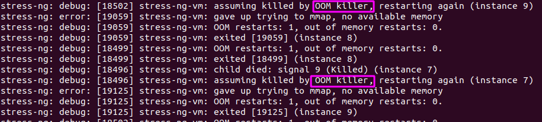
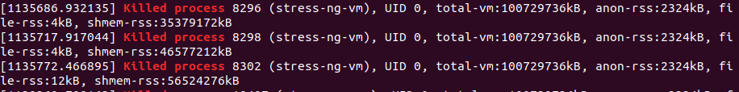
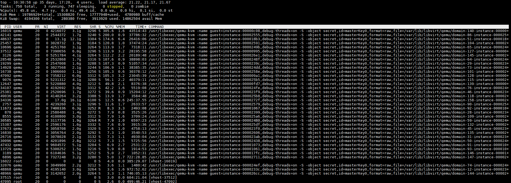
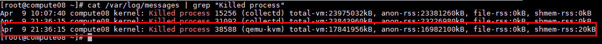
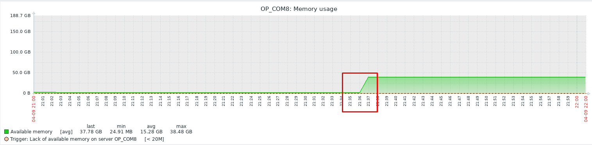

<h1 style="color:orange">OOM-killer</h1>
OOM Killer hoặc Out Of Memory Killer là một quá trình mà kernel linux sử dụng khi hệ thống đang trong tình trạng RAM bị quá tải. Như chúng ta đã biết, hệ thống là tập hợp gồm rất nhiều các process (tiến trình) chạy trên đó. Mỗi process đều sử dụng tài nguyên như RAM, CPU, Disk của hệ thống. Tuy nhiên tài nguyên của mỗi hệ thống đều có những giới hạn nhất định, và khi tài nguyên như RAM bị sử dụng tới mức báp động đỏ thì hệ thống phải có những động tác để ngăn chặn việc này.

<h2 style="color:orange">1. Các tiến trình nào sẽ lựa chọn để bị kill?</h2>
OOM Killer hoạt động bằng cách xem xét tất cả các quy trình đang chạy và gán cho chúng điểm số xấu. Quá trình có số điểm cao nhất là quá trình bị giết. OOM Killer chỉ định điểm xấu dựa trên một số tiêu chí. Nguyên tắc như sau:

- Quá trình và tất cả các tiến trình con của nó đang sử dụng rất nhiều RAM
- Số lượng process tối thiểu bị kill (lý tưởng là một) để giải phóng đủ RAM để giải quyết tình huống
- Root, kernel và các process hệ thống quan trọng được cho điểm thấp hơn nhiều

Các tiêu chí được liệt kê ở trên có nghĩa là khi chọn một tiến trình để tiêu diệt OOM Killer sẽ chọn một quy trình sử dụng nhiều RAM và có nhiều tiến trình con và không phải là các tiến trình hệ thống. Một ứng dụng như apache, mysql, ftp server hoặc mail server sẽ tạo ra một ứng cử viên tốt.

Đối với các máy chủ chạy KVM, các tiến trình ưu tiên bị kill đó sẽ là các tiến trình chạy máy ảo.
<h2 style="color:orange">3. Làm thế nào để biết có tiến trình bị OOM-killer xử lý?</h2>
Bất cứ khi nào OOM Killer được gọi để xử lý 1 tiến trình, nó sẽ ghi thông tin vào nhật ký hệ thống bao gồm tiến trình nào bị giết và tại sao. Chúng ta kiểm tra như sau :

      # dmesg|egrep -i "killed process"

Kết quả sẽ hiển thị như sau:

Ở đây tiến trình bị kill có process ID (PID): 8296, 8298, 8302 của (stress-ng-vm)

Đối với mỗi OS, thông tin về việc tiến trình bị kill bởi OOM sẽ xuất hiện tại các file khác.
<h2 style="color:orange">4. Kiểm tra các VM bị kill do thiếu RAM trên OpenStack</h2>
Các hệ thống Cloud OpenStack có hypervisor là KVM, và các máy ảo chạy trên hypervisor đều được coi như là một tiến trình trong hệ thống.

Khi máy ảo trên OpenStack bị Shutdown đột ngột chưa rõ nguyên nhân. Để kiểm tra xem máy ảo có phải bị kill bởi OOM do thiếu RAM hay không, ta cần thực hiện 3 bước sau:

1. Bước 1 : Giám sát các tiến trình máy ảo đang chạy trong hệ thống. Sử dụng câu lệnh top -c.
 
2. Bước 2 : Kiểm tra thông tin Log về việc OOM kill tiến trình. Kiểm tra ID của tiến trình bị kill có mapping với ID các tiến trình được giám sát ở trên hay không? Nếu có trùng, ta bước đầu xác minh tiến trình bị kill chính là tiến trình của máy ảo.

Tiếp tục kiểm tra lưu lượng sử dụng RAM của hypervisor trong khoảng thời gian tiến trình bị kill.
 
Có thể thấy Log về tiến trình qemu-kvm bị kill vào lúc 21 giờ 36 phút.
3. Bước 3: Thực hiện kiểm tra RAM máy hypervisor tại thời điểm từ 21h - 22h:
 
Có thể thấy trong khoảng thời gian 21 giờ 36 phút, RAM tại hypervisor đã bị hết. Sau thời điểm tiến trình qemu-kvm chạy máy ảo bị OOM kill thì RAM available tại hypervisor đã trở lại ngưỡng ổn định.

Từ những dữ liệu trên, có thể kết luận máy ảo sử dụng RAM nhiều nhất sẽ bị kill bởi OOM Killer nếu hypervisor bị quá tải về RAM.