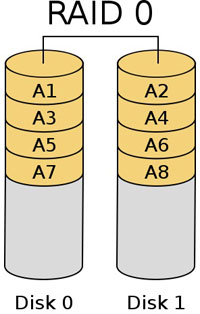

# `RAID`
`RAID (Redundant Array of Independent Disks)` Ban đầu, RAID được sử dụng như một giải pháp phòng hộ vì nó cho phép ghi dữ liệu lên nhiều đĩa cứng cùng lúc Về sau, RAID đã có nhiều biến thể cho phép không chỉ đảm bảo an toàn dữ liệu mà còn giúp gia tăng đáng kể tốc độ truy xuất dữ liệu từ đĩa cứng.

- RAID chỉ nên làm việc với các loại ổ cứng dung lượng bằng nhau. Nếu sử dụng 2 hoặc nhiều ổ khác nhau thì nó sẽ lấy dung lượng ổ thấp nhất làm chuẩn -> lãng phí tài nguyên.
- Sử dụng RAID sẽ tốn số lượng ổ nhiều hơn bình thường, nhưng đổi lại là dữ liệu sẽ an toàn hơn.
- RAID có thể dùng cho bất kỳ hệ điều hành nào, từ Window 98, window 2000, window XP, Window 10, window server 2016, MAC OS X, Linux...vv
- RAID 0 bằng tổng dung lượng các ổ cộng lại.
- RAID 1 chỉ duy trì dung lượng 1 ổ.
- RAID 5 sẽ có dung lượng ít hơn 1 ổ (5 ổ dùng raid 5 sẽ có dung lượng 4 ổ).
- RAID 6 sẽ có dung lượng ít hơn 2 ổ (5 ổ dùng raid 6 sẽ có dung lượng 3 ổ).
- RAID 10 sẽ chỉ tạo được khi số ổ là chẵn, phải có tối thiểu từ ô ổ trở lên. Dung lượng bằng tổng số ổ chia đôi (10 ổ thì dung lượng sử dụng là 5 ổ).

VD:
Ví dụ, với 1 loại ổ 1TB:
- Nếu bạn có 2 ổ cứng: Có thể chọn `RAID 0` (hỏng 1 ổ là mất dữ liệu), tổng dung lượng khi cài Window nhìn thấy sẽ là 1 ổ 2TB. Test thử: Rút 1 ổ => Báo lỗi ngay.
- Nếu bạn có 2 ổ cứng: Có thể chọn `RAID 1` (hỏng 1 ổ dữ liệu vẫn an toàn), tổng dung lượng khi cài Window nhìn thấy sẽ là 1 ổ 1TB. Test thử: Rút 1 ổ cứng ra => Không bị lỗi gì.
- Nếu bạn có 3 ổ cứng: Có thể chọn `RAID 1` (hỏng 2 ổ dữ liệu vẫn an toàn), tổng dung lượng khi cài Window nhìn thấy sẽ là 1 ổ 1TB. Test thử: Rút 2 ổ cứng ra => Không bị lỗi gì.
- Nếu bạn có 3 ổ cứng: Có thể chọn `RAID 5` (hỏng 1 ổ dữ liệu vẫn an toàn), tổng dung lượng khi cài Window nhìn thấy sẽ là 1 ổ 2TB. Test thử: Rút 1 ổ cứng ra => Không bị lỗi gì.
- Nếu bạn có 4 ổ cứng: Có thể chọn `RAID 5` (hỏng 1 ổ dữ liệu vẫn an toàn), tổng dung lượng khi cài Window nhìn thấy sẽ là 1 ổ 3TB. Test thử: Rút 1 ổ cứng ra => Không bị lỗi gì.
- Nếu bạn có 4 ổ cứng: Có thể chọn `RAID 6` (hỏng 2 ổ dữ liệu vẫn an toàn), tổng dung lượng khi cài Window nhìn thấy sẽ là 1 ổ 2TB.  Test thử: Rút 2 ổ cứng ra => Không bị lỗi gì.
- Nếu bạn có 4 ổ cứng: Có thể chọn `RAID 10` (hỏng 2 ổ thuộc 2 cặp RAID khác nhau vẫn an toàn), tổng dung lượng khi cài Window nhìn thấy sẽ là 1 ổ 2TB.  Test thử: Rút 1 ổ cứng ra => Không bị lỗi gì.
- Nếu bạn có 5 ổ cứng: Có thể chọn `RAID 5` (hỏng 1 ổ dữ liệu vẫn an toàn), tổng dung lượng khi cài Window nhìn thấy sẽ là 1 ổ 4TB.  Test thử: Rút 1 ổ cứng ra => Không bị lỗi gì.
- Nếu bạn có 5 ổ cứng: Có thể chọn `RAID 6` (hỏng 2 ổ dữ liệu vẫn an toàn), tổng dung lượng khi cài Window nhìn thấy sẽ là 1 ổ 3TB. Test thử: Rút 1 ổ cứng ra => Không bị lỗi gì.
- Nếu bạn có 6 ổ cứng: Có thể chọn `RAID 5` (hỏng 1 ổ dữ liệu vẫn an toàn), tổng dung lượng khi cài Window nhìn thấy sẽ là 1 ổ 5TB. Test thử: Rút 2 ổ cứng ra => Không bị lỗi gì.
- Nếu bạn có 6 ổ cứng: Có thể chọn `RAID 6` (hỏng 2 ổ dữ liệu vẫn an toàn), tổng dung lượng khi cài Window nhìn thấy sẽ là 1 ổ 4TB. Test thử: Rút 2 ổ cứng ra => Không bị lỗi gì.
- Nếu bạn có 6 ổ cứng: Có thể chọn `RAID 10` (hỏng 2 ổ thuộc 2 cặp RAID khác nhau vẫn an toàn), tổng dung lượng khi cài Window nhìn thấy sẽ là 1 ổ 3TB.  Test thử: Rút 1 ổ cứng ra => Không bị lỗi gì.
# `Các loại RAID`
## `RAID 0`

RAID 0 chia dữ liệu theo phương pháp `Stripping` là xé nhỏ dữ liệu. VD theo hình dữ liệu có 100Mb thì mỗi ổ chứa 50Mb -> gấp đôi tốc độ truy xuất. 
Tuy vậy tính an toàn không cao, khi truy xuất 1 file, máy tính phải lấy từ 2 disk, nếu 1 disk sập -> hỏng luôn dữ liệu. 
Có thể chia như hình hoặc: 
disk 0: A1,A2,A3,A4 
disk 1: A5,A6,A7,A8
## `RAID 1`

RAID 1 sử dụng `mirroring` lưu dữ liệu giống hệt nhau vào 2 ổ khác nhau -> tính an toàn cao, 1 ổ sập vẫn còn dữ liệu. Tuy vậy, RAID 1 chỉ bảo đảm tính an toàn dữ liệu, không tăng tốc độ và phần nào đó lãng phí khi ổ cứng hiếm khi xảy ra lỗi.
## `RAID 5`

RAID 5 được chia dữ liệu như 2 ví dụ trên. Việc chia bản sao lưu (parity) đều và các disk như vậy thay vì 1 ổ  vẫn đảm bảo tốc độ truy xuất và không bị phí tài nguyên. RAID 5 sử dụng ít nhất 3 disk, vừa tăng tốc độ truy xuất, vừa không lãng phí tài nguyên, chịu được tối đa 1 disk bị lỗi -> đây có lẽ là loại RAID mạnh mẽ, tối ưu nhất.

Dung lượng RAID 5 được tính như sau: (dung lượng của ổ đĩa nhỏ nhất) x (số lượng ổ đĩa - 1).
## `RAID 6`

Raid 6 tương tự raid 5 nhưng sử dụng đến 2 khối parity và yêu cầu tối thiểu 4 disk -> chịu được lỗi tối đa 2 disk. 
Tốc độ truy xuất = raid 5, tính an toàn cao hơn. Tuy vậy, trong thực tế ít khi lỗi 2 disk -> phí tài nguyên.
# `RAID 01 và RAID 10`

RAID 01 và RAID 10 là sự kết hợp giữa RAID 0 và 1, cung cấp hiệu suất tổng thể từ tốt đến tuyệt vời.

RAID 10 chủ yếu được dùng trong doanh nghiệp hoặc tổ chức bởi chi phí tốn kém, đòi hỏi số lượng ổ đĩa nhiều hơn so với các cấp độ RAID khác. Đây là cấp độ RAID lý tưởng cho các máy chủ cơ sở dữ liệu được sử dụng với tần suất cao hoặc bất kỳ máy chủ nào phải thực thi nhiều hoạt động ghi.

Một số người cho rằng RAID 01 và RAID 10 có điểm yếu so với RAID 6 (mặc dù rất hiếm gặp): Với RAID 01, khi có hai ổ đĩa chết nằm ở hai bên stripe (như trong hình của RAID 01 là ổ đĩa 0 và 2, hoặc 1 và 3); với RAID 10, khi có hai ổ đĩa chết trong cùng một phía mirror (như trong hình của RAID 10 là ổ đĩa 0 và 1 bên trái, hoặc 2 và 3 bên phải), khi đó dữ liệu bị mất hoàn toàn. Tình huống này không diễn ra với RAID 6, khi có hai ổ đĩa bất kỳ chết cùng một lúc, mảng vẫn hoạt động bình thường.

RAID 01 và RAID 10 đều yêu cầu tối thiểu bốn ổ đĩa và có dung lượng lưu trữ khá thấp, được tính như sau: (dung lượng của ổ đĩa nhỏ nhất) x (số lượng ổ đĩa) / 2.

Ví dụ: Nếu máy chủ có bốn ổ đĩa 1TB được cấu hình RAID 01 hoặc RAID 10, khi đó tổng dung lượng lưu trữ trong mảng sẽ là 1TB x 4 / 2 = 2TB.
## `raid 05 và raid 50`

Dung lượng raid05 = (dung lượng ổ đĩa nhỏ nhất) x (số nhóm RAID 0 - 1) x (số lượng ổ đĩa trong mỗi nhóm RAID 0) 
`Chịu được lỗi 1 nhóm`

`Đặc biệt raid 50 chịu được mỗi nhóm con sập 1 ổ` -> hơn hẳn raid 05 
Dung lượng raid50 = (dung lượng ổ đĩa nhỏ nhất) x (số nhóm RAID 5) x (số lượng ổ đĩa trong mỗi nhóm RAID 5-1)
- Raid 05 và 50 cần tối thiểu 6 ổ đĩa

RAID 05 và RAID 50 có xu hướng thích hợp hơn trong môi trường kinh doanh, nơi sử dụng dữ liệu có kích thước nhỏ, hoặc những ứng dụng yêu cầu khả năng chịu lỗi, dung lượng và hiệu suất truy cập ngẫu nhiên cao. Hai cấp độ này không được sử dụng rộng rãi như nhiều cấp độ RAID khác. Đôi khi được sử dụng thay thế RAID 5 để tăng dung lượng, đôi khi được sử dụng trong các cơ sở dữ liệu lớn.
## `raid 06 và raid 60`
 
 

`RAID 06 cho phép hỏng đến hai mảng con RAID 0 bất kỳ` 
Như hình trên, bạn có thể mất tất cả sáu ổ đĩa trong hai mảng con RAID 0 mà không lo mất dữ liệu
- RAID 06 = (dung lượng ổ đĩa nhỏ nhất) x (số nhóm RAID 0 - 2) x (số lượng ổ đĩa trong mỗi nhóm RAID 0)

`RAID 60 cho phép hỏng tối đa hai ổ đĩa bất kỳ trong mỗi mảng con RAID 6`
 - RAID 60: (dung lượng ổ đĩa nhỏ nhất) x (số lượng ổ đĩa trong mỗi nhóm RAID 6 - 2) x (số nhóm RAID 6)
 ## `Raid 00`
 
 Tốc độ truy xuất hơn raid 0. 
 Tuy vậy không cho phép ổ nào sập.
 ## `Bảng tham khảo các raid`
 
 ## `Cài đặt RAID`
 Việc cài đặt RAID nói chung chủ yếu dựa vào BIOS của mainboard, RAID Controller
 + Chỉ định những ổ cứng sẽ tham gia RAID.

+ Chọn kiểu RAID (0/1/0+1/5).

+ Chỉ định Block Size: Đây là chìa khóa ảnh hưởng rất lớn tới hiệu năng của giàn ổ cứng chạy RAID. Đối với RAID dạng Striping, Block size cũng có nghĩa là Stripe Size. Nếu thông số này thiết lập không phù hợp với nhu cầu sử dụng thì sẽ gây lãng phí bộ nhớ và giảm hiệu năng. Ví dụ nếu Block Size có giá trị là 64KB thì tối thiểu sẽ có 64KB được ghi vào ổ đĩa trong mọi trường hợp, ngay cả khi đó là một file text có dung lượng 2KB. Vì thế giá trị này nên xấp xỉ tương ứng với kích thước trung bình của các file bạn dùng. Nếu ổ cứng chứa nhiều file nhỏ ví dụ tài liệu Word, bạn nên để block size bé, nếu chứa nhiều phim ảnh hoặc nhạc, block size lớn sẽ cho hiệu năng cao hơn (nhất là với hệ thống RAID 0).

Bên cạnh đó, Block size còn có một chức năng khác quyết định việc file sẽ được ghi vào đâu. Quay về với ví dụ Block Size 64KB, nếu như file có kích thước nhỏ hơn 64KB, nó sẽ chỉ được ghi vào một ổ cứng trong hệ thống RAID và như vậy sẽ không có bất cứ sự cải thiện hiệu năng nào. Trong một trường hợp khác, một file có kích thước 150KB sẽ được ghi vào 3 ổ đĩa với các đoạn 64KB + 64KB + 22KB và bộ điều khiển có thể đọc thông tin từ ba ổ cùng lúc cho phép tăng tốc đáng kể. Nếu bạn chọn block size là 128KB thì file đó chỉ được ghi vào 2 ổ 128KB + 22KB mà thôi. Thực tế bạn nên chọn Block Size là 128KB cho các máy tính để bàn trừ khi có nhu cầu riêng.
## `JBOD`
`JBOD (Just a Bunch Of Disks)` thực tế không phải là một dạng RAID chính thống, nhưng lại có một số đặc điểm liên quan tới RAID và được đa số các thiết bị điều khiển RAID hỗ trợ

Ví dụ: cắm vào đó các ổ 10GB, 20GB, 30GB thì thông qua bộ điều khiển RAID có hỗ trợ JBOD, máy tính sẽ nhận ra một ổ đĩa 60GB.