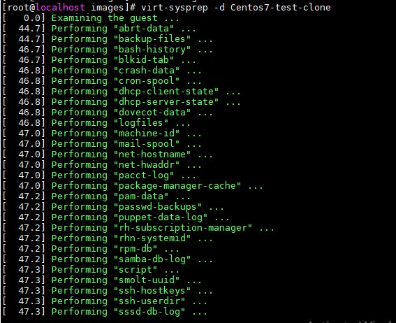

<h1 style="color:orange">Clone KVM</h1>
 Clone VM bằng lệnh:

    # virt-clone -o Centos7-test -n Centos7-test-clone -f /var/lib/libvirt/images/centos7-test-clone.qcow2
Ở đây tên máy đích là Centos7-test, tên máy được clone ra là Centos7-test-clone với disk image là centos7-test-clone.qcow2.
<h1 style="color:orange">Công cụ sysprep</h1>
Công cụ virt-sysprep được dùng để gần như reset lại các thông tin của một máy ảo. Dùng để loại bỏ SSH host keys, config mạng và các tài khoản user. Virt-sysprep còn được dùng để tùy chỉnh vm, ví dụ add SSH keys, users.

Để dùng sysprep, vm phải offline. Lưu ý virt-sysprep thay đổi image disk mà không tạo copy disk image. Nếu muốn bảo toàn trạng thái vm trước khi sysprep, phải tạo snapshot.

sysprep không được khuyến khích sử dụng dưới quyền root, trừ khi phải có quyền root mới có thể access disk image. Tuy vậy, tốt hơn là phân quyền để cho non-root users cũng có thể truy cập disk image.

Để install virt-sysprep

    # yum install /usr/bin/virt-sysprep
<h2 style="color:orange">Sử dụng sysprep</h2>
Để xem các tùy chọn của virt-sysprep

    # virt-sysprep --help
Để xóa vm clone về trạng thái trống khi vừa mới cài OS:

    # virsh shutdown Centos7-test-clone
    # virt-sysprep -d Centos7-test-clone
Với Centos7-test-clone là tên vm 
. option -d là tên máy ảo 

Ngoài ra còn có thể dùng sysprep để tùy chỉnh vm
<h3 style="color:orange">1. Tạo user mới</h3>
Tạo user mới tên Tom và buộc thay đổi mật khẩu lần đầu tiên đăng nhập

    # virt-sysprep -d testvm --firstboot-command 'useradd -s /bin/bash -m -G sudo tom; chage -d 0 tom'
<h3 style="color:orange">2. Set root password</h3>

    # virt-sysprep -d testvm --root-password password:Huy123
Với Huy123 là password root muốn cài