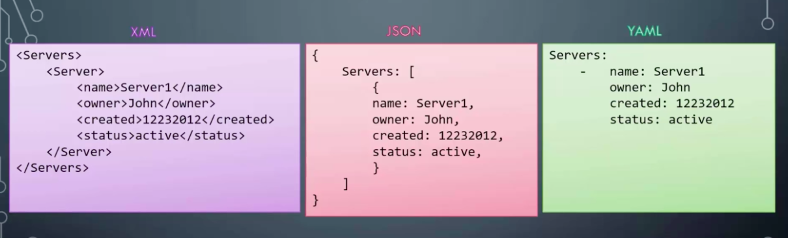
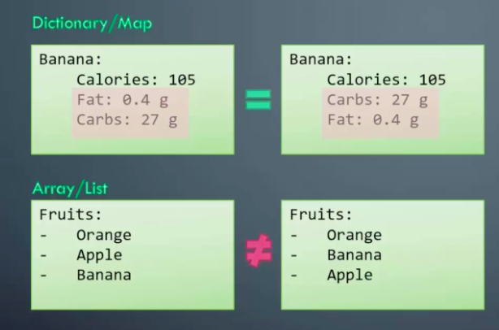
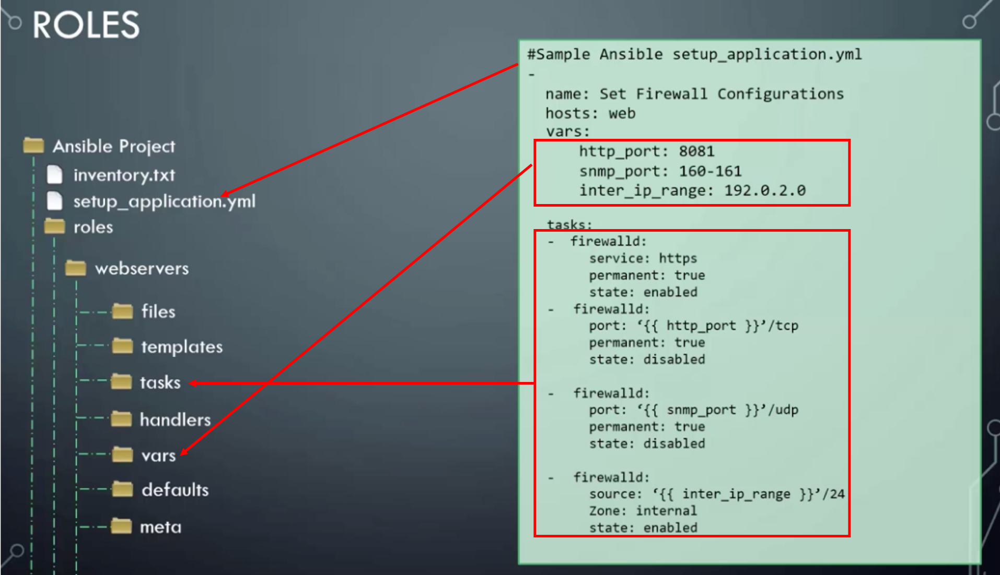

<h1 style="color:orange">Ansible</h1>
Đầu tiên, tôi có một bài toán muốn đặt ra như thế này. Tôi có 10 con server cần setup lên thành web server và 3 con server cần setup thành DB server. Nếu setup một cách thủ công thì chúng ta sẽ cần 10 lần thao tác giống nhau cho việc setup 10 con web server và với DB server cũng thế. Vậy bài toán đặt ra là có thể gõ 1 lệnh mà tổng 13 con server tự động được setup không. Câu trả lời là có. Và để làm được điều thì chúng ta cần đến Ansible.

Hiện nay có rất nhiều tool như vậy trên thị trường cụ thể như: Chef, Puppet, CFEngine, StackStorm, Ansible, SaltStack… Tuy vậy, một công cụ rất mạnh mẽ trong việc quản trị hệ thống, mang tính tự động hóa, đó chính là Ansible.
<h2 style="color:orange">1. Kiến trúc Ansible</h2>
Giống như đa phần các phần mềm quản lý cấu hình tập trung khác. Ansible có 2 loại server là control machine và node. Control machine là máy có trách nhiệm quản lý các node con trong hệ thống. Đây cũng là máy lưu trữ các thông tin về các node, playbook và các script cần dùng để deploy trên các node khác qua giao thức SSH.

Để quản lý các node, Ansible sẽ gởi các module lệnh tới các node con qua SSH. Các module lệnh này sẽ được lưu trữ tạm thời trên các node con và giao tiếp với máy chủ Ansible bằng JSON. Khi đã thực thi xong tác vụ trên các máy này, các module đó sẽ được xóa đi. Các module này thường được lưu ở folder /root/.ansible hoặc /home/<user>/.ansible, tùy theo user mà Ansible dùng để quản lý các node con.

Ansible sử dụng kiến trúc agentless để giao tiếp với các máy khác mà không cần agent. Cơ bản nhất là giao tiếp thông qua giao thức SSH trên Linux, WinRM trên Windows hoặc giao tiếp qua chính API của thiết bị đó cung cấp.

Ansible có thể giao tiếp với rất nhiều platform, OS và loại thiết bị khác nhau. Từ Ubuntu, CentOS, VMware, Windows cho tới AWS, Azure, các thiết bị mạng Cisco và Juniper….vân vân và mây mây….(hoàn toàn không cần agent khi giao tiếp).

Chính cách thiết kế này làm tăng tính tiện dụng của Ansible do không cần phải setup bảo trì agent trên nhiều host. Có thể coi đây là một thế mạnh của Ansible so với các công cụ có cùng chức năng như Chef, Puppet, SaltStack
<h2 style="color:orange">2. Ứng dụng Ansible</h2>
Ansible có rất nhiều ứng dụng trong triển khai phần mềm và quản trị hệ thống.

- `Provisioning:` Khởi tạo VM, container hàng loạt trong môi trường cloud dựa trên API (OpenStack, AWS, Google Cloud, Azure…)
- `Configuration Management`: Quản lý cấu hình tập trung các dịch vụ tập trung, không cần phải tốn công chỉnh sửa cấu hình trên từng server.
- `Application Deployment`: Deploy ứng dụng hàng loạt, quản lý hiệu quả vòng đời của ứng dụng từ giai đoạn dev cho tới production.
- `Security & Compliance`: Quản lý các chính sách về an toàn thông tinmột cách đồng bộ trên nhiều môi trường và sản phẩm khác nhau (deploy policy, cấu hình firewall hàng loạt trên nhiều server…).
<h3 style="color:orange">2.1. Tại sao nên sử dụng Ansible</h3>

- Ansible miễn phí và là 1 opensource
- Được phát triển bởi ngôn ngữ python. Nên nếumuốn tạo thêm module thì cũng sử dụng bằng python.
- Khá nhẹ và dễ setup: Khi Ansible ở chế độ rảnh, ko có task để thực hiện máy chủ Ansible sẽ không chiếm dụng tài nguyên do Ansible không sử dụng trình daemon hoặc program chạy ở chế độ background. Chỉ khi nào thực thi lệnh thì Ansible mới sử dụng tài nguyên của hệ thống.
- Các sciprt thường được dùng định dạng YAML (dễ đọc)
- Và Ansible có một cộng đồng tương tác lớn
<h2 style="color:orange">3. Các thành phần trong ansible</h2>

1. `Controller Machine:` ansible server, chịu trách nhiệm quản lý, điều khiển và gởi task tới các máy con cần quản lý.
2. `Inventory`: Là file chứa thông tin các server cần quản lý. File này thường nằm tại đường dẫn /etc/ansible/hosts.
3. `Playbook:` Là file chứa các task của Ansible được ghi dưới định dạng YAML. Máy controller sẽ đọc các task trong Playbook và đẩy các lệnh thực thi tương ứng bằng Python xuống các máy con.
4. `Task:` Một block ghi tác vụ cần thực hiện trong playbook và các thông số liên quan. Ví dụ 1 playbook có thể chứa 2 task là: yum update và yum install vim.
5. `Module:` Ansible có rất nhiều module, ví dụ như module yum là module dùng để cài đặt các gói phần mềm qua yum. Ansible hiện có hơn ….2000 module để thực hiện nhiều tác vụ khác nhau, bạn cũng có thể tự viết thêm các module của mình nếu muốn.
6. `Role:` Là một tập playbook được định nghĩa sẵn để thực thi 1 tác vụ nhất định (ví dụ cài đặt LAMP stack).
7. `Play:` là quá trình thực thi của 1 playbook
8. `Facts:` Thông tin của những máy được Ansible điều khiển, cụ thể là thông tin về OS, network, system…
9. `Handlers:` Dùng để kích hoạt các thay đổi của dịch vụ như start, stop service.
<h1 style="color:orange">Làm quen với YAML</h1>
Playbook Ansible được viết theo định dạng cụ thể được gọi là YAML. Nếu bạn đã làm việc với các định dạng cấu trúc dữ liệu khác như XML hoặc JSON, bạn sẽ có thể dễ dàng học nó. Cũng đừng lo lắng nếu bạn chưa biết gì, vì nó thật sự rất đơn giản. File YAML được dùng để thể hiện dữ liệu. Dưới đây là so sánh nhanh dữ liệu mẫu ở ba định dạng khác nhau.

 
Bên trái là dạng XML - hiển thị danh sách các máy chủ và thông tin của chúng. Cùng dữ liệu đó thì hình ở giữa được thể hiện dạng JSON và cuối cùng ở định dạng YAML ở bên phải.

Trong YAML có 3 kiểu để biểu diễn giá trị.
 

1. Key Value Pair (Cặp khoá vs giá trị): 
Dữ liệu được thể hiện bởi kiểu khoá và giá trị (key và value). Trong YAML, khóa và giá trị được phân tách bằng dấu hai chấm `(:)`. Luôn phải có khoảng trắng theo sau dấu hai chấm.
2. Array (mảng trong YAML): 
Các phần tử trong mảng sẽ được thể hiện bởi dấu gạch ngang `( - )`. Cần có khoảng trắng trước mỗi mục. Số lượng khoảng trắng cần bằng nhau trước các phần tử của một mảng. Chúng ta hãy xem xét kỹ hơn về các dấu khoảng trắng trong YAML.  
Ví dụ ở đây ta có một object là Banana. Trong đó có 3 thuộc tính là calories, fat và carbs. 

       Banana:
         Calories: 105
         Fat: 0.4 g
         Carbs: 27 g
Lưu ý số lượng khoảng trắng trước mỗi thuộc tính sẽ chỉ ra mối quan hệ cha con. Như ở đây, trước 3 thuộc tính đó có cùng số khoảng trắng, nghĩa là 3 thuộc tính đó nằm trong Banana. Nhưng điều gì sẽ xảy ra nếu chúng ta có thêm không gian cho fat và carbs.
       
    Banana:
      Calories: 105
        Fat: 0.4 g
        Carbs: 27 g
Lúc này fat và crabs sẽ là con của thuộc tính calories và calories là thuộc tính con của Banana. Vì vậy, số lượng khoảng trắng trong YAML rất quan trọng. Đôi lúc bạn có thể chạy script bị báo lỗi nếu nhầm khoảng trắng với dấu tab.
3. Dict (dictionary trong YAML) 
Dạng này chỉ cần biểu diễn khoảng trắng trước các thuộc tính của object. Điểm khác biệt của dạng Dict và Array là các thuộc tính liệt kê dạng dict thì không có thứ tự. Trong khi Array thì ngược lại. Nên là ví dụ bạn khai báo như này trong array:

    Tasks:
      - install httpd
      - start httpd
Sẽ khác với
    
    Tasks:
      - start httpd
      - install httpd
Ví dụ trên được viết theo dạng Array, tức ansible sẽ đọc tuần tự từ trên xuống. Như vậy nếu start httpd trước khi install httpd thì sẽ xảy ra lỗi vì hệ thống không tìm thấy service httpd để start.
 

<h2 style="color:orange">4. Playbook</h2>
Trong playbooks, chúng ta sẽ xác định những gì cần phải làm. Hay nói cách khác là nơi ta sẽ viết kịch bản cho các con server. Playbooks sẽ được viết bằng định dạng YAML. Nên là các bạn cần đảm bảo đọc hiểu được nội dung của cách viết trong YAML nhé. Trong playbooks sẽ chứa một tập hợn các activities (hoạt động) hay các tasks (nhiệm vụ) sẽ được chạy trên một hay một nhóm servers. Trong đó task là một hành động duy nhất được thực hiện trên server, ví dụ như cài gói service nào đó, hay bật tắt service.

Xem thử ví dụ một playbook đơn giản:

    # Simple Ansible Playbook1.yml
    -
      name: Play 1
      hosts: localhost
      tasks:
        - name: Execute command "date"
          command: date
        - name: Execute script on server
          script: test_script.sh
        - name: Install httpd service
          yum:
            name: httpd
            state: present
        - name: Start web server
          service:
            name: httpd
            state: started
Trên đây là một playbook đơn giản chứa một kịch bản có tên Play 1 (name: Play 1).
Kịch bản này sẽ được chạy trên server localhost (hosts: localhost). Nếu bạn muốn thực hiện cùng các nhiệm vụ đó trên nhiều con server thì bạn chỉ cần liệt kê tên server hay tên group server. Khai báo tên server hay group server sẽ nằm trong phần inventory nhé.
Có tổng cộng 4 nhiệm vụ cần được chạy cho server. Nhiệm vụ lần lượt là:
chạy lệnh date
chạy file test_script.sh
cài đặt dịch vụ httpd
start dịch vụ httpd vừa cài trên
Các tasks trong playbooks được liệt kê dạng array. Phần trên đã có nói đến, nếu đổi chỗ thứ tự các tasks thì sẽ gây ảnh hưởng không nhỏ nếu những task đó có mối liên quan với nhau. Như ta thấy task thứ 3 và task thứ 4 có mối liên hệ với nhau. Nếu để task start httpd lên trước task install thì sẽ có lỗi xảy ra nếu server hoàn toàn chưa được cài httpd.

Bạn để ý các thuộc tính command, script, yum, service là những module có sẵn do ansible cung cấp. Module hỗ trợ bạn viết và thực thi các nhiệm vụ  một cách đơn giản hơn. Nếu muốn tự tạo một module riêng thì ansible vẫn hỗ trợ và cho phép bạn viết module riêng để chạy bằng python. Ngoài những module đơn giản trên, ansible còn cung cấp hằng trăm module khác, bạn có thể tham khảo thêm ở document của ansible.

https://docs.ansible.com/

Để hiểu rõ hơn module có nhiệm vụ gì, bạn thử nhìn vào task thứ 3 là task cài đặt dịch vụ httpd. Bình thưởng trong linux, muốn cài dịch vụ httpd, bạn phải gõ:
    
    # yum install httpd

Nhưng trong playbook bạn chỉ cần khai báo tên module và tên dịch vụ, module được khai báo tự khắc sẽ nhận lệnh và tự thực thi việc cài gói httpd theo yêu cầu.
Cuối cùng, khi bạn đã viết xong một playbook, vậy làm cách nào để chạy nó. Rất đơn giản. Ansible cung cấp cho bạn cú pháp như sau:

    # ansible-playbook 

Ví dụ file playbook của bạn tên là my_playbook.yml, bạn sẽ run như sau:

    # ansible-playbook my_playbook.yml

Bên cạnh đó nếu bạn cần trợ giúp gì thì dùng lệnh:

    # ansible-playbook -help
<h2 style="color:orange">5. Modules</h2>
Như đã giới thiệu ở phần trên, ansible cung cấp rất nhiều module, không thể trình bày hết các module trong bài viết này, nên mình sẽ giới thiệu một vài module phổ biến thường dùng cho những thao tác đơn giản.

- `System:` Bao gồm các module như User, Group, Hostname, Systemd, Service, v.v... 
- `Commands:` Thường có module con như Command, Expect, Raw, Script, Shell, v.v...
Files: Các module làm việc với file như Copy, Find, Lineinfile, Replace, v.v...
- `Database`: Ansbile cũng support mạnh mẽ những module làm việc với DB như Mongodb, Mssql, Mysql, Postgresql, Proxysql, v.v...
- `Cloud`: Ansible cũng không quên kết hợp với các dịch vụ clound nổi tiếng như Amazon, Google, Docker, Linode, VMware, Digital Ocean, v.v...
- `Windows`: Mạnh mẽ với những module như win_copy, win_command, win_domain, win_file, win_shell
Và còn hàng trăm module khác đã được ansible cung cấp sẵn.
<h2 style="color:orange">6. Inventory</h2>
Đây là nơi sẽ chứa tên các con server hay địa chỉ ip mà bạn muốn thực thi. Nhìn lại file playbook ở trên, thì trong file playbook sẽ có 1 thuộc tính là hosts, đấy chính là nơi khai báo tên server. Bây giờ thử xem file inventory đơn giản:

    #Sample Inventory File
    Server1.company.com
    Server2.company.com 

    [mail]
    Server3.company.com 
    Server4.company.com 

    [db]
    Server5.company.com 
    Server6.company.com 

    [web]
    Server7.company.com
    Server8.company.com 

    [all_servers:children]
    mail
    db
    web
Bạn để ý cách khai báo với [mail], [db], [web]. Đây là cách khai bao 1 group các server với nhau. [mail] là tên group. Trong playbook, nếu bạn muốn file playbook đó sẽ thực thi group các server liên quan đến web, bạn chỉ cần khai báo:

    hosts: web
Còn `[all_servers:children]` là cách khai báo group các group với nhau.

Bên cạnh đó, Ansible còn cung cấp một số parameters (tham số) phục vụ cho việc truy cập vào server mà bạn đã khai báo trong inventory file dễ dàng hơn. Cụ thể như server nào đó muốn truy cập vào cần cung cấp user và password, hay server đó không phải là linux mà là window, thì việc login vào cũng có phần khác. Xem ví dụ để hiểu thêm về các params mà ansible đã cung cấp nhé.

    #Sample Inventory file

    # Web Servers
    web_node1 ansible_host=web01.xyz.com ansible_connection=winrm ansible_user=administrator ansible_password=Win$Pass
    web_node2 ansible_host=web02.xyz.com ansible_connection=winrm ansible_user=administrator ansible_password=Win$Pass
 
    # DB Servers
    sql_db1 ansible_host=sql01.xyz.com ansible_connection=ssh ansible_user=root ansible_ssh_pass=Lin$Pass
    sql_db2 ansible_host=sql02.xyz.com ansible_connection=ssh ansible_user=root ansible_ssh_pass=Lin$Pass
Đối với server window, Ansible cung cấp kiểu connect là winrm. Bên cạnh đó cách khai báo password cũng khác với Linux. Ở window sẽ sử dụng param ansible_ssh_pass, còn linux là ansible_password. Các bạn lưu ý điều này nhé.
<h2 style="color:orange">7. Variables (các biến)</h2>
Tiếp theo chúng ta sẽ làm quen với biến. Vậy biến là gì? Cũng giống như các ngôn ngữ lập trình khác, biến được sử dụng để lưu trữ các giá trị và có thể thay đổi giá trị được.
Xem ví dụ dưới đây để hiểu rõ cách khai báo biến và sử dụng biến trong ansible như thế nào nhé.

    -
      name: Print car's information
      hosts: localhost
      vars:
        car_model: "BMW M3"
        country_name: USA
        title: "Systems Engineer"
      tasks:
        -
          name: Print my car model
          command: echo "My car's model is {{ car_model }}"

        -
          name: Print my country
          command: echo "I live in the {‌{ country_name }}"
 Để khai báo biến, chúng ta sẽ sử dụng thuộc tính vars mà ansible đã cung cấp.
car_model sẽ là key, "BMW M3" sẽ là value. Bên dưới để sử dụng biến car_model ta sử dụng cặp dấu ngoặc nhọn và tên biến {{ car_model }}
<h2 style="color:orange">8. Conditions (các điều kiện)</h2>
Ansible cũng cho phép bạn điều hướng lệnh chạy hay giới hạn phạm vi để run câu lệnh nào đó. Nói khác đi là nếu điều kiện thoả thì câu lệnh đó mới được thực thi. Bây giờ ta thử giải một đề bài toán như sau: Nếu tuổi trên 22 thì in ra màn hình là "Tôi đã tốt nghiệp" và ngược lại nếu tuổi dưới 22 thì in là "Tôi chưa tốt nghiệp". Lúc này chúng ta sẽ sử dụng thuộc tính when mà ansible cung cấp để giới hạn phạm vi chạy của câu lệnh. Về cơ bản lệnh for phổ biến trong code nhưng thay vì if, ta dùng when.

    #Simple playbook.yml
    -
      name: Toi da tot nghiep chưa
      hosts: localhost
      vars:
        age: 25
      tasks:
        -
          command: echo "Toi chua tot nghiep"
          when: age < 22          
        -                     
          command: echo "Toi da tot nghiep"                when: age >= 22
2. Register  
Ansible còn cung cấp một thuộc tính khá mạnh mẽ là register. Register giúp nhận kết quả trả về từ một câu lệnh. Sau đó ta có thể dùng kết quá trả về đó cho những câu lệnh chạy sau đó.

Ví dụ ta có bài toán như sau: kiểm tra trạng thái của service httpd, nếu start thất bại thì gửi mail thông báo cho admin.

    #Sample ansible playbook.yml
    -
      name: Check status of service and email if its down
      hosts: localhost
      tasks:
        - command: service httpd status
          register: command_output

        - mail:
            to: Admins 
            subject: Service Alert
            body: "Service is down"
          when: command_output.stdout.find("down") != -1
Nhờ vào thuộc tính register, kết quả trả về sẽ được chứa vào biến command_output. Từ đó ta sử dụng tiếp các thuộc tính của biến command_output là stdout.find để tìm chữ "down" có xuất hiện trong nội dung trả về không. Nếu không tìm thấy thì kết quả sẽ là -1.
<h2 style="color:orange">9. LOOP (vòng lặp)</h2>
Bạn còn nhớ module yum không. Module yum trong ansible playbook giúp ta cài đặt hay xoá một gói service nào đó. Trong ví dụ ở phần playbook, chúng ta chỉ có cài một gói service. Nhưng nếu server yêu cầu cài thêm nhiều gói service khác như mysql, php thì sao nhĩ. Như bình thường chúng ta sẽ viết như sau:

    # Simple Ansible Playbook1.yml
    -
      name: Install packages
      hosts: localhost
      tasks:
        - name: Install httpd service
          yum:
            name: httpd
        - name: Install mysql service
          yum:
            name: mysql
        - name: Install php service
          yum:
            name: php
Ở đây mới ví dụ 3 service cần cài mà phải viết lập lại các thuộc tính name, module yum đến 3 lần. Nếu server cần cài lên đến 100 gói service thì việc ngồi copy/paste cũng trở nên vấn đề đấy. Thay vào đó, chúng ta sẽ sử dụng chức năng loops mà ansible đã cung cấp để để viết.

    #Simple Ansible Playbook1.yml
    -
      name: Install packages
      hosts: localhost
      tasks:
        - name: Install all service
          yum: name="{{ item }}" state=present
          with_items:
            - httpd
            - mysql
            - php
with_items là một lệnh lặp, thực thi cùng một tác vụ nhiều lần. Mỗi lần chạy, nó lưu giá trị của từng thành phần trong biến item.
<h2 style="color:orange">10. Roles</h2>
Nếu bạn có nhiều server hay nhiều group server và mỗi server thực thiện những tasks riêng biệt. Và khi này nếu viết tất cả vào cùng một file playbook thì khá là xấu code và khó để quản lý. Ansible đã cung cấp sẵn chức năng roles, về đơn giản nó sẽ giúp bạn phân chia khu vực với nhiệm vụ riêng biệt.

Ví dụ bạn có một kịch bản như bên dưới:
 
    #Simple Ansible setup_application.yml
    -
      name: Set firewall configurations
      hosts: web
      vars:
        http_port: 8081
        snmp_port: 160-161
        inter_ip_range: 192.0.2.0
    
    tasks:
      - firewalld:
          service: https
          permanent: true
          state: enabled
      - firewalld:
          port: "{{ http_port }}"/tcp
          permanent: true
          state: disabled
      - firewalld:
          port: "{{ snmp_port }}"/udp
          permanent: true
          state: disabled
      - firewalld:
          source: "{{ inter_ip_range }}"/24
          zone: internal
          state: enabled
Mục tiêu của file playbook setup_application.yml này là cấu hình tường lửa cho group server về web. Bây giờ chúng ta sẽ cắt nhỏ file playbook này ra thành những file có chức năng riêng biệt như file chỉ chưa định nghĩa biến, hay file chứa định nghĩa tasks. Trước khi cắt file playbook nhỏ gọn lại, ta cần tạo cấu trúc thư mục như sau để ansible nhận biết được các thành phần ta đã khai báo.
 