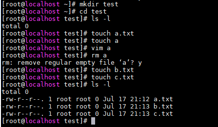
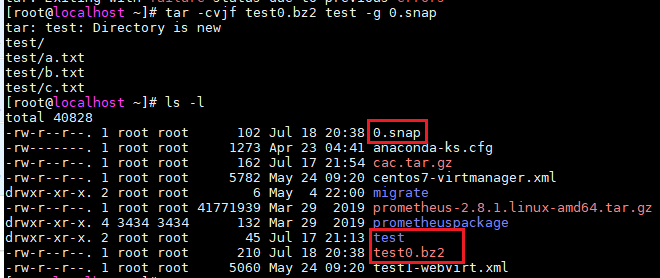

<h1 style="color:orange">Các kiểu back-up dữ liệu</h1>
<h2 style="color:orange">1. Full backup</h2>
Full Backup có nghĩa là backup toàn bộ dữ liệu đang có của bạn

- Ví dụ :
Bạn có một thư mục trong đó có 4 file dữ liệu : 1 2 3 4

Khi bạn cấu hình Full Backup thì phần mềm backup sẽ backup hết cả 4 file dữ liệu đó : 1 2 3 4

1. Ưu điểm của Full Backup :

Dễ dàng phục hồi lại dữ liệu. Khi cần phục hồi lại thì sẽ phục hồi lại toàn bộ dữ liệu của ngày Backup Full.
Tính an toàn cao cho dữ liệu.

2. Nhược điểm của Full Backup:
Thời gian backup lâu. Dữ liệu càng nhiều thì thời gian backup càng lâu 
Tốn dung lượng lưu trữ. Nếu mỗi ngày đều chạy full backup thì rất tốn dung lượng ổ cứng. Ví dụ một ổ cứng 1TB nếu backup full mỗi ngày thì trong 1 tuần sẽ cần 7TB lưu trữ. 
Chi phí đầu tư thiết bị lưu trữ lớn. 
<h2 style="color:orange">2. Differential Backup</h2>
Differential Backup là backup những gì thay đổi so với lần Full Backup gần nhất

Ví dụ : ( Tính trong trường hợp các file dữ liệu không có thay đổi )

Trong thư mục có 4 file dữ liệu : 1 2 3 4

Khi cấu hình backup: Full Backup vào Chủ Nhật, Differential Backup vào Thứ Hai, Thứ Ba, Thứ Tư, Thứ Năm, Thứ Sáu, và Thứ Bảy.

Nếu thứ 2 trong thư mục có thêm một file số 5 : 1 2 3 4 5 thì Differential backup sẽ sao lưu file số : 5

Nếu thứ 3 trong thư mục có thêm file số 6: 1 2 3 4 5 6 –> Differential backup sẽ sao lưu phần thay đổi so với ngày Full Backup gần nhất là chủ nhật nên sẽ sao lưu file số 5 6

Nếu thứ 4 thêm,sửa, xóa file 3 thì Differential backup sẽ sao lưu phần thay đổi so với ngày Full Backup gần nhất là chủ nhật nên sẽ sao lưu file số 5 6 3
Tương tự như vậy cho các ngày tiếp theo.

1. Ưu điểm của Differential Backup :

- Thời gian backup nhanh hơn 
- Dung lượng backup nhỏ hơn so với Full Backup. Tiết kiệm dung lượng lưu trữ 
- Tốc độ phục hồi dữ liệu sẽ nhanh hơn so với Incremental Backup 
2. Nhược điểm của Differential Backup :

- Khi cần khôi phục dự liệu cần có 2 bản backup: 
1 File Full Backup lần gần nhất và 1 File Differential Backup vào thời điểm cần restore

Trường hợp cụ thể như ở ví dụ:

Giả sử bạn cần restore file về thời điểm Thứ Ba – bạn cần có file Full Backup của Chủ Nhật và Differential backup của Thứ Ba
<h2 style="color:orange">3. Incremental Backup</h2>
Incremental Backup là backup những gì thay đổi so với lần Incremental Backup gần nhất

Ví dụ: ( Tính trong trường hợp các file dữ liệu không có thay đổi )

Trong thư mục có 4 file dữ liệu : 1 2 3 4

Khi cấu hình backup: Full Backup vào Chủ Nhật, Incremental Backup vào Thứ Hai, Thứ Ba, Thứ Tư, Thứ Năm, Thứ Sáu, và Thứ Bảy.

Nếu Thứ 2 trong thư mục có thêm một file số 5 : 1 2 3 4 5 thì Incremental Backup sẽ sao lưu file số : 5

Nếu Thứ 3 trong thư mục có thêm file số 6: 1 2 3 4 5 6 –> Incremental Backup sẽ sao lưu phần thay đổi so với ngày Incremental Backup gần nhất là Thứ 2 nên sẽ sao lưu file số 6

Nếu Thứ 3 trong thư mục thêm, sửa, xóa file số 3: 1 2 4 5 6 –> Incremental Backup sẽ sao lưu phần thay đổi so với ngày Incremental Backup gần nhất là Thứ 3 nên sẽ sao lưu file số 3

1. Ưu điểm của Incremental Backup :

- Thời gian backup nhanh nhất
- Dung lượng backup bé nhất
2. Nhược điểm của Incremental Backup :

Khi cần khôi phục dữ liệu phải có đủ các bản backup: 
1 File Full backup lần gần nhất và tất cả các File Incremental  Backup từ thời điểm Full Backup đến thời điểm cần restore 
Thời gian Restore lâu hơn so với Differential Backup.

- Trường hợp cụ thể như ở ví dụ :

Giả sử bạn cần restore file về thời điểm Thứ Ba – bạn cần có file Full Backup của Chủ Nhật và Incremental backup của Thứ Hai và Incremental backup của Thứ Ba

Bảng so sánh:

Vì những ưu điểm và nhược điểm của từng cách backup. Tùy theo hiện trạng hệ thống bạn có thể chọn cho mình giải pháp tối ưu nhất.

Giải pháp được các nhà backup khuyến cáo nên lựa chọn thường như sau :

Full Backup hàng tháng.

Differential Backup hàng tuần.

Incremental Backup hàng ngày.
<h1 style="color:orange">LAB Backup/restore với lệnh tar</h1>
Con trỏ đang ở file /root 
<h2 style="color:orange">1. Tạo full backup</h2>
Tạo thư mục test và tạo file a,b,c.txt 

 
Tạo full back up

    # tar -cvjf test0.bz2 test -g 0.snap
 
Trong đó: option:
-c: create
-v: verbose
-j: định dạng file nén bz2
-f: file
-g: File snapshot 0.snap sẽ chứa thông tin về cấu trúc file/folder của file nén test0.bz2 (hiện đang là full backup)
<h2 style="color:orange">2. Tạo incremental backup</h2>
Thay đổi nội dung file a.txt, thêm file d.txt

 
Backup file 

    # tar -cvjf test1.bz2 test -g 0.snap
 
Tạo file nén test1.bz2 từ snapshot 0.snap, đồng thời cập nhật thông tin mới cho 0.snap 
File nén test1.bz2 chứa cấu trúc cây thư mục lưu trong snapshot0.snap, và có thêm test/a.txt, test/d.txt.

Mỗi lần Incremental Backup ta sẽ tạo 1 file backup mới và dùng lại file snapshot cũ.
<h2 style="color:orange">2.2. Restore</h2>
Xóa file a.txt, b.txt

Khi này restore lại file test1.bz2 thì chỉ restore lại file với lần thay đổi gần nhất là a.txt và b.txt
 

Khi này nếu muốn lấy lại file, b.txt thì ta dùng lệnh

    # tar -xvjf test0.bz2 -g 0.snap
 
Tuy vậy nó sẽ xóa file d.txt vì d.txt không có trong bản back up test0.bz 
Sau đó muốn có lại file d.txt thì phải restore test1.bz2 
------> quy trình chuẩn restore sẽ là restore bản full trước và các bản incremental sau.
<h2 style="color:orange">3. Differental backup</h2>
Với Incremental Backup : dùng 1 snapshot cho nhiều file backup để ghi lại quá trình thay đổi dữ liệu.

Còn với Differential Backup : mỗi file backup sẽ có 1 snapshot riêng (các snapshot này độc lập với nhau, và đều được copy từ snapshot của lần Full Backup)
_Bước 1 : tạo Full Backup + Snapshot
Tạo file nén test0.bz2 và snapshot 0.snap

    # tar -cvjf test0.bz2 test -g 0.snap

_Bước 2 : tạo Differential Backup :
+ Copy file 1.snap từ 0.snap

      # cp 0.snap 1.snap

+ Tạo file nén test1.bz2 từ 1.snapshot

      # tar -cvjf test1.bz2 test -g 1.snap

Mỗi lần Differential Backup ta sẽ copy file snapshot mới từ file snapshot của full backup , và tạo 1 file backup mới từ file snapshot vừa copy đó

Tương tự ví dụ trên ta thêm file d.txt
 
<h2 style="color:orange">3.2. restore</h2>
_ Bước 1 : extract file Full Backup

    # tar –xvjf test0.bz2
_ Bước 2 : extract file Differential Backup tại thời điểm mong muốn (nhớ kèm theo backup của thời điểm đó)

    # tar -xvjf test1.bz2 -g 1.snap
