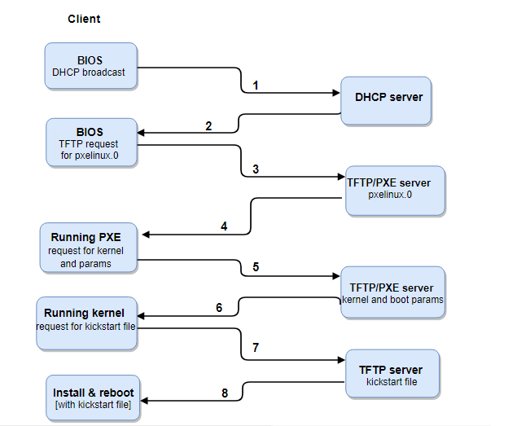

<h1 style="color:orange">PXE</h1>
Theo cách truyền thống khi muốn cài đặt hệ điều hành cho một thiết bị PC, server nào đó thì sẽ nghĩ ngay tới việc tạo một chiếc USB boot, một đĩa CD boot với hệ điều hành mong muốn. Đây là một cách làm chuẩn nhưng mang tính chất thủ công khi muốn cài đặt cho số lượng máy nhiều thì bắt buộc phải làm lần lượt tốn nhiều thời gian và công sức hoặc chuẩn bị số lượng lớn các ổ đĩa CD, USB…

Vậy liệu có phương pháp nào cho phép cài đặt hệ điều hành cho số lượng lớn các thiết bị PC, server một cách tự động mà không cần tấn USB, ở đĩa CD? Quả là một câu hỏi khó nhưng hoàn toàn có câu trả lời đó là triển khai một PXE server (Preboot eXecution Environment) cài đặt hệ điều hành qua mạng LAN. Biến NIC thành một boot server.
<h1 style="color:orange">1. PXE là gì?</h1>
PXE đặc tả môi trường thực thi preboot mô tả môi trường server – client được tiêu chuẩn hóa để khởi động một tổ hợp phần mềm, được truy xuất từ ​​một mạng, trên các máy client hỗ trợ PXE. Trên máy client bắt buộc phải có card mạng PXE-capable NIC (network interface controller) và sử dụng một số giao thức chuẩn như DHCP và TFTP

Hiểu một cách đơn giản PXE là cơ chế cho phép khởi động một phần mềm lấy qua mạng. Trong ngữ cảnh server vật lý để có thể khởi động PXE thì phía máy client cần NIC card mạng hỗ trợ PXE và hệ thống mạng có máy chủ DHCP và TFPT để cấp IP và phân bổ các image hệ điều hành xuống client. Đa số các thiết bị ngày này đều hỗ trợ cho chế boot PXE. Quá trình cài đặt OS xuống client hoàn toàn tự động.
<h1 style="color:orange">2. Mô hình PXE</h1>
PXE được phát triển bởi một số các nhà sản xuất phần mềm và phần cứng lớn. Được thiết kế ban đầu bởi Intel, cùng với sự tham gia của các nhà sản xuất như HP, 3Com, Dell, Phoenix Technologies. PXE làm việc với network card (NIC) trong client, biến NIC thành một boot device. PXE boot hệ điều hành cho các client từ network bằng cách lấy một boot image từ server. File này có thể là một OS hay pre-OS cho client. Bởi PXE làm việc cùng với NIC nên yêu cầu NIC phải có PXE-enable. Cơ bản PXE sẽ dùng BIOS điểu khiển card mạng để boot (internet sẽ không phải do hệ điều hành điều khiển như thường thấy)

 
- PXE bao gồm 2 thành phần: PXE client và PXE server
- Trên PXE client phải có card NIC (card mạng) hỗ trợ PXE
- `PXE Server` là thành phần triển khai chạy trên một thiết bị nào đó trong mạng LAN. Phần mềm này hỗ trợ các giao thức TFTP, DHCP. DHCP cấp phát địa chỉ IP để các máy client có thể liên lạc với các máy khác và với TFTP server để lấy các file boot và file cấu hình cần thiết. TFTP cung cấp dịch vụ truyền các file boot và file cấu hình cần thiết cho client.
- `PXE client` nằm trên card mạng. Các server, PC hầu hết đều cho phép khởi động máy tính qua mạng với PXE boot code. Các mainboard có card mạng onboard cũng hầu hết có thành phần này.
<h1 style="color:orange">3. Sự hoạt động của PXE</h1>

 
1. Bước 1: Máy client được khởi động NIC của client gửi đi bản tin broadcast DHCPDISCOVER dùng giao thức UDP đến cổng 67.
2. Bước 2: DHCP server nhận được bản tin của client và gửi lại bản tin DHCPOFFER các thông tin cần thiết cho client.
Khi client nhận được các thông tin này, client gửi DHCPREQUEST đến máy chủ DHCP để nhận thông tin boot image.
3. Bước 3: Client gửi request boot đến TFTP server, TFTP server gửi lại boot image (pxelinux.0), và client sẽ xử lý.
4. Bước 4: Mặc định boot image tìm được thư mục pxelinux.cfg trên TFTP server để lấy các file cấu hình.
Các bước còn lại client tải tất cả các file cần thiết (filesystem, kickstart, …) và tải về và tự động cài đặt.