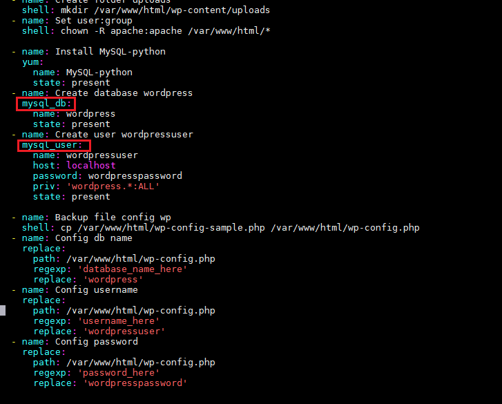

<h1 style="color:orange">Cài Wordpress trên LAMP bằng ansible</h1>
Chuẩn bị: 

- ansible server: 192.168.1.70/24
- client: 192.168.1.79/24 
client nằm trong group centos7 
 
<h2 style="color:orange">1. Các công việc cần làm</h2>
Việc nắm được các công việc, các bước cần phải làm là điều cần thiết. Sẽ vô cùng khó khăn khi muốn tự động hóa một việc gì đó trong khi chính bản thân chúng ta còn chưa nắm bắt được quy trình công việc hay thậm chí là còn chưa thực hành nó theo hướng thủ công một lần nào.

- Cài đặt LAMP
- Đảm bảo các service bật và các port được thông.
- Cài đặt WordPress
- Tạo cơ sở dữ liệu, người dùng cho WordPress
<h2 style="color:orange">2. Các module của ansible liên quan</h2>
Trong bài sẽ sử dụng những module sau của ansible và list tài liệu tham khảo:

- yum: https://docs.ansible.com/ansible/latest/modules/yum_module.html
- service: https://docs.ansible.com/ansible/latest/modules/service_module.html
- firewalld: https://docs.ansible.com/ansible/latest/modules/firewalld_module.html
- get_url: https://docs.ansible.com/ansible/latest/modules/get_url_module.html
- unarchieve: https://docs.ansible.com/ansible/latest/modules/unarchive_module.html
- shell: https://docs.ansible.com/ansible/latest/modules/shell_module.html
- mysql_db: https://docs.ansible.com/ansible/latest/modules/mysql_db_module.html
- mysql_user: https://docs.ansible.com/ansible/latest/modules/mysql_user_module.html
- replace: https://docs.ansible.com/ansible/latest/modules/replace_module.html

Bạn chỉ cần lên Google search: 
ansible module + keyword bước công việc

Lưu ý: trong hướng dẫn module của ansible; ví dụ module firewalld; trong hướng dẫn người ta sẽ ví dụ viết module: "ansible.posix.firewalld" 
 
nhưng thực tế khi viết trong file playbook centos7 chỉ cần khai module là "firewalld", nếu khai đầy đủ như trong ví dụ sẽ bị lỗi.
 
tương tự:  
 
 
<h1 style="color:orange">3. Viết playbook</h1>
Playbook tên: /root/wordpress.yml
<h2 style="color:orange">3.1. Khai báo</h2>

    - hosts: centos7
      remote_user: root
<h2 style="color:orange">3.2. Cài đặt LAMP</h2>
<h3 style="color:orange">3.2.1. Cài đặt PHP</h3>

      tasks:
      - name: install php repo
        yum:
          name: '{{item}}'
          state: installed
        with_items:
        - https://dl.fedoraproject.org/pub/epel/epel-release-latest-7.noarch.rpm
        - http://rpms.remirepo.net/enterprise/remi-release-7.rpm
      - name: install php
        yum:
          name: '{{item}}'
          enablerepo: "remi-php73"
          state: latest
        with_items:
        - php
        - php-mysql
        - php-gd
        - php-pear
        - php-fpm
Ở đây ta không cài php thông thường vì sẽ ra phiên bản 5.4.x, đã lỗi thời không sử dụng được.

Vì vậy ta phải cài repo php 7.x cho client trước rồi mới tiến hành cài php theo repo vừa cài 
 
Link repository php 7.x 
Lưu ý việc cách dòng vì YAML là ngôn ngữ nhạy cảm với dấu cách.
<h3 style="color:orange">3.2.2. Cài đặt apache và mariadb</h3>

      - name: Install LAMP
        yum:
          name: '{{item}}'
          state: present
        with_items:
        - httpd
        - mariadb-server
        - mariadb
      - name: Ensure service enabled and started
        service:
          name: '{{item}}'
          state: started
          enabled: yes
        with_items:
        - mariadb
        - httpd
Đồng thời start httpd và mariadb 
 
<h2 style="color:orange">3.3. Cấu hình firewalld</h2>

      - name: Ensure HTTP and HTTPS can pass the firewall
        firewalld:
          service: '{{item}}'
          state: enabled
          permanent: yes
          immediate: yes
        become: yes
        with_items:
        - http
        - https
      - name: open port
        firewalld:
          port: '{{item}}/tcp'
          state: enabled
          permanent: yes
          immediate: yes
        with_items:
        - 80
        - 443
        - 3306
Cấu hình firewall mở dịch vụ lẫn port.
 
<h2 style="color:orange">3.4. Tải, giải nén wordpress</h2>

      - name: Install rsync
        yum:
          name: rsync
          state: present
      - name: Restart httpd
        service:
          name: httpd
          state: restarted

      - name: Down wordpress
        get_url:
          url: http://wordpress.org/wordpress-5.8.tar.gz
          dest: /root
      - name: extract wordpress
        unarchive:
          src: /root/wordpress-5.8.tar.gz
          dest: /root
          remote_src: yes
      - name: rsync wordpress
        shell: rsync -avP /root/wordpress/ /var/www/html/
      - name: Create folder uploads
        shell: mkdir /var/www/html/wp-content/uploads
      - name: Set user:group
        shell: chown -R apache:apache /var/www/html/*
Lưu ý: ở đây ta tải package là http://wordpress.org/wordpress-5.8.tar.gz thay vì latest.tar.gz vì khi tải xuống file sẽ không phải tên latest.tar.gz ----> không giải nén được. 
Ở đây ansible khuyến khích dùng module `unarchive` thay vì `tar -xzvf`, tuy vậy có thể thay thế module archieve bằng:

      - name: extract wordpress
        shell: tar -xzvf wordpress-5.8.tar.gz
 
<h2 style="color:orange">3.5. Tạo cơ sở dữ liệu, người dùng cho wordpress</h2>

      - name: Install MySQL-python
        yum:
          name: MySQL-python
          state: present
      - name: Create database wordpress
        mysql_db:
          name: wordpress
          state: present
      - name: Create user wordpressuser
        mysql_user:
          name: wordpressuser
          host: localhost
          password: wordpresspassword
          priv: 'wordpress.*:ALL'
          state: present

      - name: Backup file config wp
        shell: cp /var/www/html/wp-config-sample.php /var/www/html/wp-config.php
      - name: Config db name
        replace:
          path: /var/www/html/wp-config.php
          regexp: 'database_name_here'
          replace: 'wordpress'
      - name: Config username
        replace:
          path: /var/www/html/wp-config.php
          regexp: 'username_here'
          replace: 'wordpressuser'
      - name: Config password
        replace:
          path: /var/www/html/wp-config.php
          regexp: 'password_here'
          replace: 'wordpresspassword'
 
Ở đây chúng ta thực hiện tạo:

database: wordpress
username: wordpressuser
password: wordpresspassword
Sau đó tiến hành sửa file config: wp-config.php của WordPress theo các thông tin vừa tạo phía trên.

Và cuối cùng restart httpd để các cài đặt được thực thi.

      - name: Restart Apache
        service:
          name: httpd
          state: restarted
 
<h2 style="color:orange">4. Chạy playbook</h2>

    - hosts: centos7
      remote_user: root
      tasks:
      - name: install php repo
        yum:
          name: '{{item}}'
          state: installed
        with_items:
        - https://dl.fedoraproject.org/pub/epel/epel-release-latest-7.noarch.rpm
        - http://rpms.remirepo.net/enterprise/remi-release-7.rpm
      - name: install php
        yum:
          name: '{{item}}'
          enablerepo: "remi-php73"
          state: latest
        with_items:
        - php
        - php-mysql
        - php-gd
        - php-pear
        - php-fpm
      
      - name: Install LAMP
        yum:
          name: '{{item}}'
          state: present
        with_items:
        - httpd
        - mariadb-server
        - mariadb
      - name: Ensure service enabled and started
        service:
          name: '{{item}}'
          state: started
          enabled: yes
        with_items:
        - mariadb
        - httpd
      
      - name: Ensure HTTP and HTTPS can pass the firewall
        firewalld:
          service: '{{item}}'
          state: enabled
          permanent: yes
          immediate: yes
        become: yes
        with_items:
        - http
        - https
      - name: open port
        firewalld:
          port: '{{item}}/tcp'
          state: enabled
          permanent: yes
          immediate: yes
        with_items:
        - 80
        - 443
        - 3306
      
      - name: Install rsync
        yum:
          name: rsync
          state: present
      - name: Restart httpd
        service:
          name: httpd
          state: restarted

      - name: Down wordpress
        get_url:
          url: http://wordpress.org/wordpress-5.8.tar.gz
          dest: /root
      - name: extract wordpress
        unarchive:
          src: /root/wordpress-5.8.tar.gz
          dest: /root
          remote_src: yes
      - name: rsync wordpress
        shell: rsync -avP /root/wordpress/ /var/www/html/
      - name: Create folder uploads
        shell: mkdir /var/www/html/wp-content/uploads
      - name: Set user:group
        shell: chown -R apache:apache /var/www/html/*
      
      - name: Install MySQL-python
        yum:
          name: MySQL-python
          state: present
      - name: Create database wordpress
        mysql_db:
          name: wordpress
          state: present
      - name: Create user wordpressuser
        mysql_user:
          name: wordpressuser
          host: localhost
          password: wordpresspassword
          priv: 'wordpress.*:ALL'
          state: present

      - name: Backup file config wp
        shell: cp /var/www/html/wp-config-sample.php /var/www/html/wp-config.php
      - name: Config db name
        replace:
          path: /var/www/html/wp-config.php
          regexp: 'database_name_here'
          replace: 'wordpress'
      - name: Config username
        replace:
          path: /var/www/html/wp-config.php
          regexp: 'username_here'
          replace: 'wordpressuser'
      - name: Config password
        replace:
          path: /var/www/html/wp-config.php
          regexp: 'password_here'
          replace: 'wordpresspassword'
      
      - name: Restart Apache
        service:
          name: httpd
          state: restarted
Chạy file playbook

    # ansible-playbook -i /etc/ansible/hosts wordpress.yml
 
 
Sau 5p cài thành công. Lưu ý: DEPRECATION WARNING chỉ là ansible không khuyến khích dùng module loop `{{item}}`; dùng vẫn được.
<h2 style="color:orange">5. Kiểm tra</h2>
Vào trình duyệt web google: http://192.168.1.79/ kiểm tra

 
------> thành công