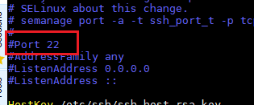
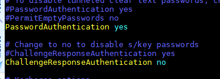

<h1 style="color:orange">1. Đăng nhập bằng public-private key</h1>
Đứng tại node AnsibleServer tạo SSH Key, sau đó copy các sang node còn lại. Mục tiêu là sử dụng keypair để không phải nhập password mỗi khi đăng nhập vào các client.

Đứng tại user root của node AnsibleServer và thực hiện bước tạo key

    # ssh-keygen
 
Thực hiện các thao tác Enter và để mặc định các tùy chọn khi lab.

Thực hiện copy file key sang các node còn lại

    # ssh-copy-id root@192.168.1.79
    # ssh-copy-id root@192.168.1.80
Ấn Yes và nhập mật khẩu root của node client1
<h1 style="color:orange">2. Vô hiệu hóa client đăng nhập bằng password</h1>

    # vim /etc/ssh/sshd_config
sửa các dòng sau 
 
 
Trong đó: 
- bỏ comment "Port 22" và thay thành 1 port nào đó chẳng hạn port 125 (bởi vì ai cũng biết ssh mặc định port 22). Khi đăng nhập vào client dùng lệnh:

       # ssh root@192.168.xx.xx -p 125
-p chỉ ra ssh bằng port nào

Tuy nhiên nhớ mở port 125 với firewalld

    # firewall-cmd --add-port=125/tcp --permanent
 
- PasswordAuthentication yes ---> no: chỉ có máy nào có cặp public, private key mới có thể ssh.
<h1 style="color:orange">3. Vô hiệu hóa ping</h1>
Nhiều trường hợp client dùng ip public. Ta vô hiệu hóa ping để hacker không biết client có đang up hay không. Để vô hiệu hóa ping:

    # echo "1" > /proc/sys/net/ipv4/icmp_echo_ignore_all
    # vim /etc/sysctl.conf
paste vào 

    # Ignore all to ICMP (ping)
    net.ipv4.icmp_echo_ignore_all = 1
để cài đặt áp dụng sau reboot
