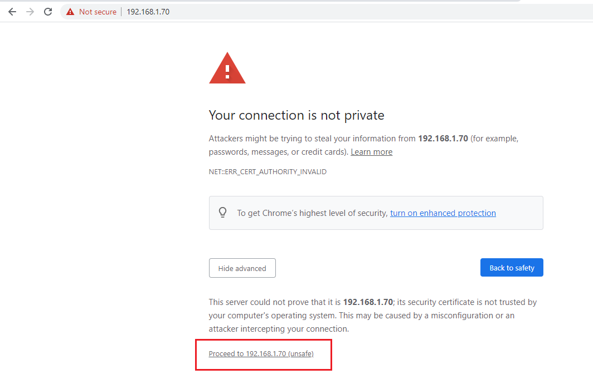

<h1 style="color:orange">Cài đặt Cobbler trên centos7</h1>
Cobbler là chương trình mã nguồn mở Linux dùng để tụ động hóa việc cài hệ điều hành trong mạng LAN (hoặc internet)

Chuẩn bị:
- 1 server centos7: 2 card mạng: 
192.168.91.128/24 (host-only) 
192.168.1.70(bridge - thông ra mạng internet) 
Tuy vậy trong thực tế chỉ cần 1 card cũng có thể vừa cấp DHCP, vừa thông ra internet để tải các packages.
<h2 style="color:orange">1. Tải các package cần thiết</h2>

    # yum install epel-release
    # yum install cobbler cobbler-web dnsmasq syslinux pykickstart xinetd fence-agents debmirror dhcp bind git -y
Enable các daemon
    
    # systemctl start cobblerd
    # systemctl start tftp
    # systemctl start rsyncd
    # systemctl start httpd
    # systemctl enable cobblerd
    # systemctl enable tftp
    # systemctl enable rsyncd
    # systemctl enable httpd
Sửa file /etc/xinetd.d/tftp

    # vim /etc/xinetd.d/tftp

    Sửa từ disable = yes
    ------> disable = no
  
<h2 style="color:orange">2. Cấu hình SELinux và firewalld</h2>
Cấu hình SElinux

    # getsebool -a|grep cobbler
để xem các service bị chặn của cobbler
  
Sau đó on chúng lên

    # setsebool -P cobbler_can_network_connect 1
    # setsebool -P httpd_can_network_connect_cobbler 1
    # setsebool -P httpd_serve_cobbler_files 1

Tuy vậy đến bước cobbler sync sẽ fail -----> phải disable selinux

    # setenforce 0
    # vim /etc/selinux/config
    Enforcing -----> disabled
Firewall

    # firewall-cmd --add-port={80,443,69}/tcp --permanent
    # firewall-cmd --add-port={69,4011}/udp --permanent
    # firewall-cmd --add-service=dhcp --permanent
    # firewall-cmd --reload
Vào trình duyệt như google.com kiểm tra cobbler. 
1. Đầu tiên phải vào kiểm tra apache trước: https://192.168.1.70 
 
Cho phép quyền truy cập: sau đó vào https://192.168.1.70/cobbler_web/

 
Đăng nhập user/pass mặc định: cobbler/cobbler
 
Phiên bản 2.8.5 ---> thành công
<h2 style="color:orange">3. Cấu hình cobbler</h2>
 
    # openssl passwd -1 "Huy123"
Trong đó "Huy123" là mật khẩu cho cobbler setting 
 
Hệ thống sẽ gen ra 1 đoạn mã hóa mật khẩu vừa tạo.

Sửa file /etc/cobbler/settings

    # vim /etc/cobbler/settings
sửa những dòng sau thành:

    default_password_crypted: "$1$k/LlL8M0$2V8s/Yx6n6lqnHwGPlrPo1"
    manage_dhcp: 1
    manage_dns: 1
    pxe_just_once: 1
    next_server: 192.168.91.128
    server: 192.168.91.128
Trong đó, next server là dhcp server; server là cobbler server. Tuy vậy vì ở đây ta gộp chung 2 tiện ích vào 1 máy nên dùng 1 ip. 
password là đoạn mã được gen ra ở trên
<h2 style="color:orange">4. Cấu hình dhcp</h2>

    # vim /etc/cobbler/dhcp.template
sửa những đoạn sau:
 
Trong đó, 192.168.91.140 ---> 192.168.91.160 là dhcp range.

Khai báo dhcp range

    # vim /etc/cobbler/dnsmasq.template

    dhcp-range=192.168.91.140,192.168.1.160
    # systemctl restart cobblerd
    # cobbler check (để xem lỗi)
    # cobbler get-loaders
 
Lưu ý khi cobbler get-loaders chắc chắn sẽ lỗi. Để fix lỗi ta làm các bước sau:
    
    # yum install grub2-efi-x64-modules grub2-pc-modules 
    # cd /
    # git clone https://github.com/hbokh/cobbler-loaders.git
    # mv cobbler-loaders/files/cobbler-loaders.tar.gz /
 
    
    # rm -rf cobbler-loaders
    # tar -xzvf cobbler-loaders.tar.gz
Khi này cobbler get-loaders sẽ thành công

    # cobbler get-loaders
 
Sounds out to: https://www.gitmemory.com/issue/cobbler/cobbler/2660/859766544

Sửa file /etc/debmirror.conf

    # vim /etc/debmirror.conf
comment 2 dòng 28 và 30

    #@dists="sid";
    #@arches="i386";
 

    # systemctl restart cobblerd
    # systemctl restart xinetd
    # cobbler check
    # cobbler sync
<h2 style="color:orange">5. Import file ISO</h2>

    # mkdir /mnt/iso
    # wget http://mirrors.nhanhoa.com/centos/7.9.2009/isos/x86_64/CentOS-7-x86_64-Minimal-2009.iso
    # mount -o loop CentOS-7-x86_64-Minimal-2009.iso /mnt/iso/
Import ISO vào cobbler với lệnh:

    # cobbler import --arch=x86_64 --path=/mnt/iso --name=CentOS7
Update signature

    # cobbler signature update
Yêu cầu xuất hiện "TASK COMPLETE" trong đầu ra của cả hai lệnh trên

Kiểm tra distro

    # cobbler distro list
    CentOS7-x86_64
    # cobbler distro report --name=CentOS7-x86_64
 
<h2 style="color:orange">6. Tạo file kickstart cho centos7</h2>
Thư mục chứa các file kickstart là /var/lib/cobbler/kickstarts

    # vim /var/lib/cobbler/kickstarts/centos7.ks
paste vào cấu hình kickstart tham khảo

    #platform=x86, AMD64, or Intel EM64T
    #version=DEVEL
    # Firewall configuration
    firewall --disabled
    # Install OS instead of upgrade
    install
    # Use HTTP installation media
    url --url="http://192.168.91.128/cblr/links/CentOS7-x86_64/"
    # Root password
    rootpw --iscrypted "$1$4QcjYGEw$PDrJUHfA93L7DJsV/xHVS/"
    # Network information
    network --bootproto=dhcp --device=eth0 --onboot=on
    # Reboot after installation
    reboot
    # System authorization information
    auth useshadow passalgo=sha512
    # Use graphical install
    graphical
    firstboot disable
    # System keyboard
    keyboard us
    # System language
    lang en_US
    # SELinux configuration
    selinux disabled
    # Installation logging level
    logging level=info
    # System timezone
    timezone Asia/Ho_Chi_Minh
    # System bootloader configuration
    bootloader location=mbr
    clearpart --all --initlabel
    part swap --asprimary --fstype="swap" --size=1024
    part /boot --fstype xfs --size=500
    part pv.01 --size=1 --grow
    volgroup root_vg01 pv.01
    logvol / --fstype xfs --name=lv_01 --vgname=root_vg01 --size=1 --grow
    %packages
    @^minimal

    @core
    %end
    %addon com_redhat_kdump --disable --reserve-mb='auto'
    %end
Sync thay đổi với cobbler

    # cobbler profile edit --name=CentOS7-x86_64 --kickstart=/var/lib/cobbler/kickstarts/centos7.ks
    # cobbler sync
    # systemctl restart cobblerd
<h2 style="color:orange">6. Tạo máy client</h2>
Vì đây là môi trường lab nên khi tạo máy ảo trên wmware, ta cài sẽ cấu hình ISO như sau

 
Bật máy lên: 

 
Đầu tiên máy sẽ xin DHCP ----> sau đó có thể boot được. Việc cài OS hoàn toàn tự động.