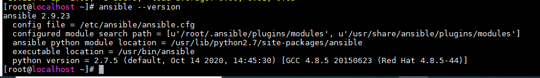
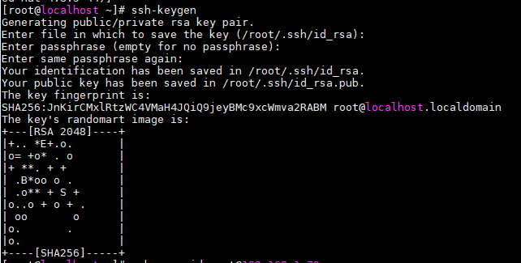
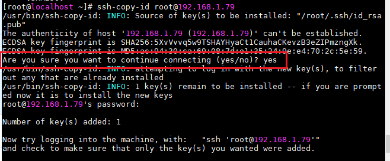
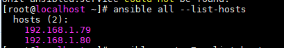
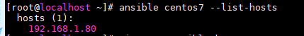
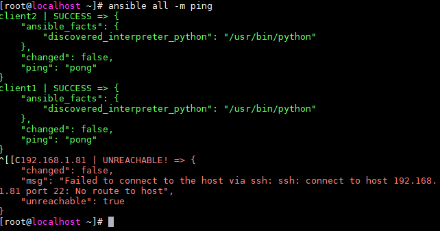
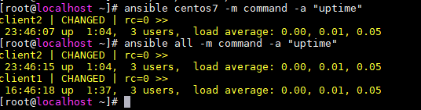
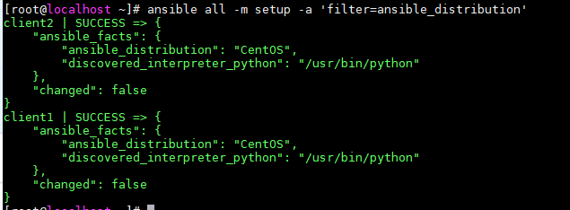
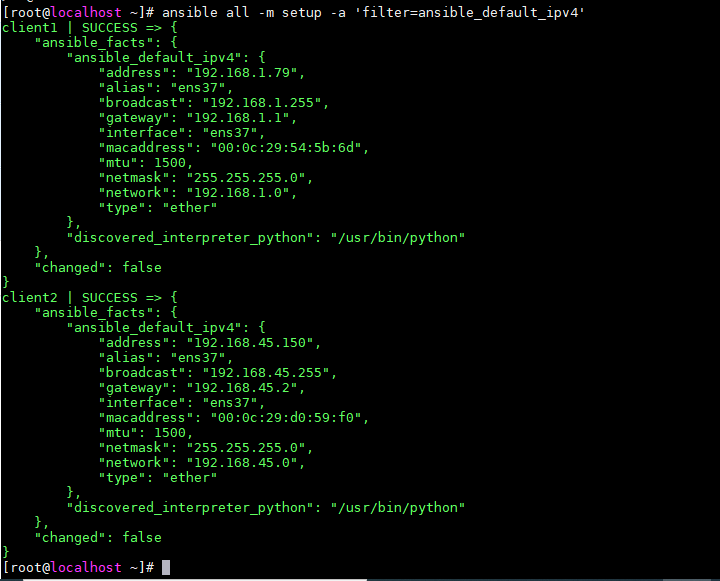

<h1 style="color:orange">Cài đặt ansible</h1>
<h2 style="color:orange">1. Mô hình ansible</h2>
Trong mô hình sử dụng 3 máy: 

- ansible server: 192.168.1.70/24 
- client 1 centos7: 192.168.1.79/24 
- client 2 centos7: 192.168.1.80/24
<h2 style="color:orange">2. Cài đặt ansible trên ansible server</h2>

    # yum install -y epel-release
    # yum install -y ansible
    # ansible --version
để kiểm tra phiên bản ansible

 
<h3 style="color:orange">2.2. Cấu hình SSH Key và khai báo file inventory</h3>
Ansible hoạt động theo cơ chế agentless, có nghĩa là không cần cài agent vào các máy client để điều khiển, thay vào đó ansible sẽ sử dụng việc điều khiển các client thông qua SSH. Do vậy, tới bước này ta có thể dùng 2 cách để ansible có thể điều khiển được các máy client.

- `Cách 1`: Sử dụng usename, port của ssh để khai báo trong inventory. Cách này không được khuyến cáo khi dùng trong thực tế vì việc password dạng clear text sẽ hiện thị, hoặc nếu dùng cách này thì cần phải secure cho file inventory này bằng ansible-vault
- `Cách 2`: Sử dụng ssh keypair. Có nghĩa là ta sẽ tạo ra private key và public key trên node Anisble Server và copy chúng sang các node client (hay còn gọi là các host).
Trong hướng dẫn này sẽ sử dụng cách 2.
<h3 style="color:orange">2.3. Tạo SSH key cho các node</h3>
Đứng tại node AnsibleServer tạo SSH Key, sau đó copy các sang node còn lại. Mục tiêu là sử dụng keypair để không phải nhập password mỗi khi đăng nhập vào các client.

Đứng tại user root của node AnsibleServer và thực hiện bước tạo key

    # ssh-keygen
 
Thực hiện các thao tác Enter và để mặc định các tùy chọn khi lab.

Thực hiện copy file key sang các node còn lại

    # ssh-copy-id root@192.168.1.79
    # ssh-copy-id root@192.168.1.80
Ấn Yes và nhập mật khẩu root của node client1
 

Làm tương tự với node client2

    # ssh-copy-id root@192.168.1.80
Sau đó đứng từ node AnsibleServer, thử ssh sang các node client1 & client2, nếu không bị hỏi mật khẩu thì ta đã sử dụng ssh key thành công.

Lưu ý nhớ dùng lệnh exit sau khi đăng nhập ở từng node. Tiếp tục chuyển sang bước khai báo file inventory để chứa danh sách các host cần thiết.
<h2 style="color:orange">3. Khai báo file inventory</h2>
Mặc định thì danh sách các host mà AnsibleServer điều khiển sẽ nằm ở file /etc/ansible/host. File mặc định này sẽ chứa các khai báo mẫu, ta sẽ thực hiện sao lưu lại và khai báo file theo bài LAB này.

    # mv /etc/ansible/hosts /etc/ansible/hosts.org
Tạo file mới để khai báo các host

    # vim /etc/ansible/hosts
Nội dung của file sẽ có dạng như sau

    192.168.1.79

    [centos7]
    192.168.1.80
Ở đây tuy 2 máy đều là centos7 nhưng tôi chỉ khai báo 1 máy vào group [centos7]
Sau khi thêm các dòng trên, ta lưu file trên lại. Chú ý rằng ta có thể sử dụng cặp thẻ [ ] để khai báo các group. Các group này sẽ do ta quy hoạch sao cho phù hợp với hệ thống, với ứng dụng của chúng ta. Ở đây tôi tạm tạo group là [centos7]

Thực hiện kiểm tra danh sách host đã đươc khai báo trong file inventory ở trên bằng lệnh ansible all --list-hosts. Trong đó all là một tùy chọn của lệnh trên, mục tiêu là liệt kê tất cả các hosts nằm trong file inventory, bất kể các host đó nằm ở group nào.

    # ansible all --list-hosts
 
Nếu chúng ta chỉ muốn kiểm tra các host trong group [centos7] ta thực hiện với tùy chọn lệnh như sau 

    # ansible centos7 --list-host
 

Tới bước này chúng ta mới dừng lại việc khai báo danh sách các host. Trong thực tế các ta cần khai báo thêm các tùy chọn về mật khẩu, về port thậm chí cả về user mà AnsibleServer được phép sử dụng để điều khiển các host.

Một file inventory tương đối hoàn chỉnh sẽ có định đạng như sau. Đây cũng là cú pháp của file inventory từ bản Ansible 2.0 trở lên. Hãy sửa lại file inventory của bạn để có định dạng như bên dưới, sẽ bổ sung thêm các tùy chọn

    client1 ansible_host=192.168.1.79 ansible_port=22 ansible_user=root

    [centos7]
    client2 ansible_host=192.168.1.80 ansible_port=22 ansible_user=root
Trong đó:
 - client1, client2,... : Tương ứng là các hostname của các node
ansible_host: Địa chỉ IP của node client tương ứng
- ansible_port: Port của SSH phía client, nếu ta thay đổi thì sẽ chỉnh lại cho đúng.
- ansible_user: Là username của client mà AnsibleServer sẽ dùng để tương tác, trong bước trên tôi sử dụng là user root và thông qua SSH Key.
<h2 style="color:orange">4. Sử dụng 1 số lệnh kiểm tra cơ bản</h2>
Để kiểm tra xem việc khai báo này đã đúng và bắt đầu tiếp các bài lab tiếp theo hay chưa, hãy sử dụng tùy chọn -m trong lệnh dưới, đây là dấu hiệu nhận biết về việc sẽ sử dụng module có tên là ping (-m là viết tắt của module). Trong bài này sẽ giới thiệu thêm một số moudle khác ngoài module ping này.

    # ansible all -m ping
 
Giả sử khai báo thêm 1 host không tồn tại vào file /etc/ansible/hosts: 192.168.1.81/24. Ta thấy không ping được.

Ta có thể lựa chọn các group để thực hiện tương tác thông qua Ansible, ví dụ tôi sẽ thực hiện module ping với group là centos7 đã khai bào ở trên bằng lệnh 

    # ansible centos7 -m ping
<h2 style="color:orange">5. Sử dụng các module cơ bản</h2>
Chế độ tương tác của ansible tạm hiểu là chế độ dùng các lệnh đơn, ngay sau khi thực hiện lệnh thì sẽ có output để quan sát.
<h2 style="color:orange">5.1. module command</h2>
Sử dụng một trong các câu lệnh dưới để thực hành moulde command, ta sẽ kiểm tra uptime của toàn bộ các node hoặc một số node thuộc group nào đó bằng lệnh 

    # ansible all -m command -a "ten_cau_lenh_module_command_ho_tro"
vd:

    # ansible centos7 -m command -a "uptime"
 

Ta quan sát thấy trong các output trên là thông tin trả về khi module command thực hiện lệnh uptime trong linux. Với module này ta có thể thay thế bằng nhiều lệnh khác. Ví dụ ta có thể thực hiện lệnh dưới

    # ansible all -m command -a "ls -alh"
    # nsible all -m command -a "lsblk"
Lệnh trên sẽ trả về kết quả của lệnh ls -alh ở từng node client.
<h2 style="color:orange">5.2. module setup</h2>
Ta có thể sử dụng module setup để kiểm tra các thông tin tổng quát về hệ điều hành của các node, ví dụ kiểm tra phiên bản, kiểm tra thông tin card mạng, tên host, thông số về phần cứng ….

Ví dụ ta có thể sử dụng lệnh sau để kiểm tra xem distro của các host là gì 

    # ansible all -m setup -a 'filter=ansible_distribution'
 

    # ansible all -m setup -a 'filter=ansible_default_ipv4
Để liệt kê ra các địa chỉ IPv4 trên các node.
  
