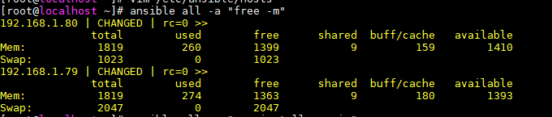
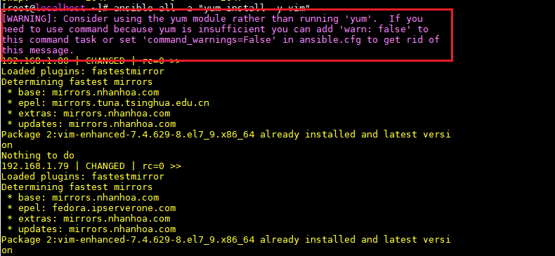

<h1 style="color:orange">Sử dụng command ad-hoc trong ansible</h1>
<h2 style="color:orange">1. Lệnh ad-hoc là gì?</h2>
Lệnh Ad-Hoc ansible cho phép bạn có thể nhập vào để thực hiện tác vụ thật nhanh mà không muốn lưu lại sau này.

Với chế độ ad-hoc command mà ansible cung cấp, chúng ta sẽ thực hiện các task đơn (các yêu cầu thực hiện độc lập) để ra lệnh cho hạ tầng (các client được quản lý bởi ansible) thực hiện các yêu cầu rời rạc khi quản lý các client. Tại sao lại dùng ad-hoc command và dùng nó khi nào? Trong phần tiếp theo sẽ lấy các ví dụ cho trường hợp này.
<h2 style="color:orange">2. Tại sao lại dùng ad-hoc command trong ansible?</h2>
Khi vận hành hệ thống, bạn thường xuyên phải lặp đi các thao tác rất cơ bản ví dụ như:

- Cần phải khởi động lại OS
- Cần phải khởi động lại mysql hoặc đơn giản là cần phải update các gói phần mềm phổ thông (VIM, WGET ….) trên hàng loạt các máy chủ khác nhau (CentOS, Ubuntu …).
- Hoặc phải kiểm tra trạng thái của các services chẳng hạn.
Hoặc phải thực hiện thao tác copy một file nào đó.
- Hoặc xem nội dung của file log nào đó.
- Nếu ta có 1 vài máy chủ thì các thao tác này rất đơn giản, nhưng giả sử ta cần thực hiện trên hàng chục máy chủ một lúc thì chế độ ad-hoc command của ansible bắt đầu phát huy tác dụng ở đây. Nó sẽ giúp tiết kiệm được thời gian và công sức khi thực hiện các task này trên hàng loạt các máy trong hạ tầng của chúng ta.
<h2 style="color:orange">3. Thực hiện các câu lệnh ad-hoc</h2>
Cú pháp chung cho lệnh ad-hoc:

    # ansible [pattern] -m [module] -a "[module options]"
Để làm ví dụ, ta sử dụng 3 máy:

- ansible server: 192.168.1.70/24
- client 1: 192.168.1.79/24
- client 2: 192.168.1.80/24
Dưới đây là 1 số ví dụ cho ad-hoc command:
<h3 style="color:orange">3.1. Thực hiện các câu lệnh ad-hoc</h3>

    # ansible all -a "free -m"
câu lệnh có đầu ra tương tự với 

    # ansible all -m command -a "free -m"
 
<h3 style="color:orange">3.2. Thực hiện reboot hàng loạt các client</h3>

    # ansible all -a "init 6"
    # ansible centos7 -a "init 6"
<h3 style="color:orange">3.3. Thực hiện cài đặt gói ứng dụng hàng loạt</h3>

    # ansible all -m yum -a "name=httpd state=latest"
Đầu ra câu lệnh tương tự

    # ansible all -m command -a "yum install -y httpd"
Tuy vậy, ở đây ta sử dụng module `yum` mà ansible support. Lưu ý module yum chỉ support đối với Centos, RHEL hay apt chỉ support Ubuntu, debian. Và khi sử dụng câu lệnh thứ 2 thì ansible sẽ không khuyến khích
 

Hoặc đối với ubuntu có thể là

    # ansible ubuntu -m apt -a "name=apache2 state=latest"
<h3 style="color:orange">3.4. Sử dụng ad-hoc thu thập thông tin client</h3>

    # ansible all -m setup