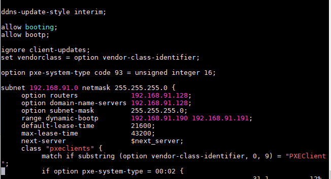
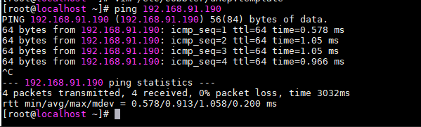
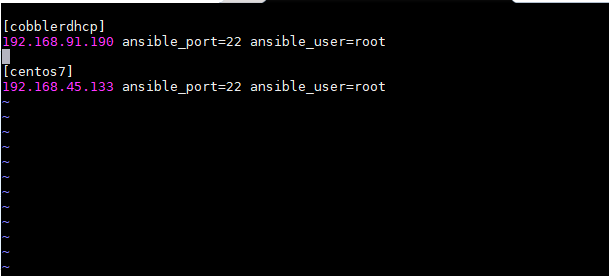
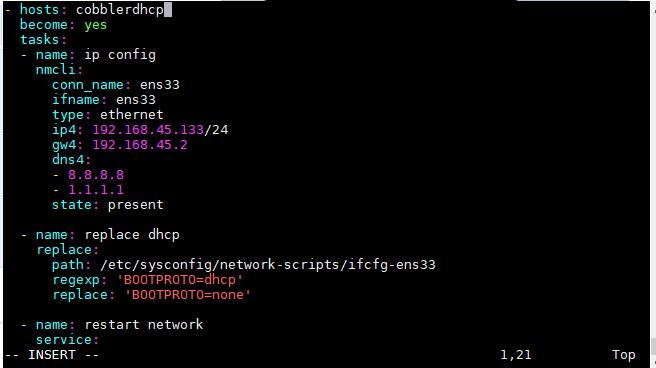
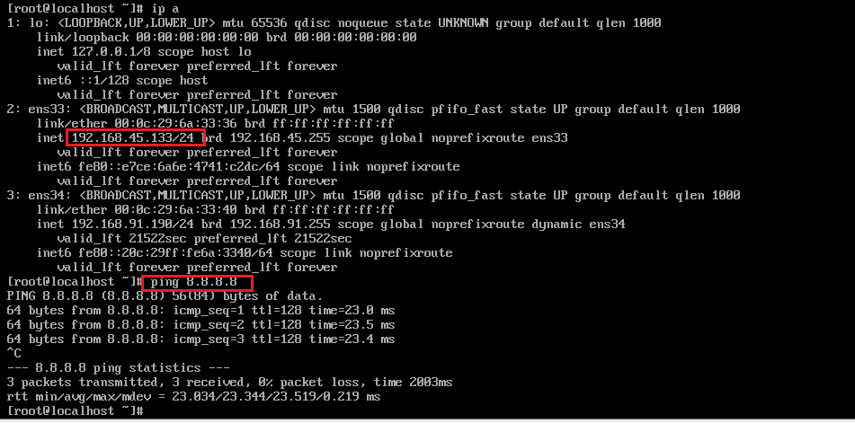
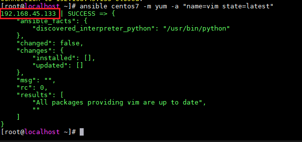

<h1 style="color:orange">Kết hợp cobbler và ansible thành 1 tool tự động hóa</h1>

Vấn đề thực tế đặt ra là khi cài OS bằng cobbler xong, muốn sử dụng ansible thì phải cấu hình ip tĩnh cho máy client -----> để ansible có thể ssh vào client và tự động hóa mà không cần phải truy cập trực tiếp vào client để cấu hình ip tĩnh

Bài toán được giải quyết khi cài đặt máy client, chúng ta cài 2 card mạng: 
- 1 NAT hoặc bridge, thông ra internet
- 1 đường nối giữa ansible server và máy client, không có dhcp. Ở đây vì là môi trường lab, nên tôi sẽ sử dụng card mạng chế độ host-only vô hiệu hóa dhcp của vmware cho host-only. Tuy vậy, trong thực tế ansible thường dùng cho các máy ảo như KVM,docker nên lab cũng nhiều khi áp dụng được thực tế.
<h2 style="color:orange">1. Chuẩn bị</h2>

- Cobbler server, ansible server chung 1 máy: 
   + card host-only: 192.168.91.128/24
- máy client chưa cài os: 
   + có card host-only cùng LAN cobbler server (không có dhcp)
   + 1 card NAT dùng để thông ra internet
<h2 style="color:orange">2. Cài và cấu hình cobbler</h2>

Cài và cấu hình cobbler như bình thường. đến đoạn cài dhcp:

    # vim /etc/cobbler/dhcp.template
 
range từ 192.168.91.190 -> 192.168.91.191/24

-----> boot OS như bình thường. Bình thường, nếu không vô hiệu hóa dhcp cho card host-only thì sau khi cài OS và reboot thì host-only sẽ lấy địa chỉ dhcp được cấp; cobbler dhcp ko có tác dụng sau reboot 
-------> vì đã vô hiệu hóa dhcp; dhcp cobbler là duy nhất nên host-only sẽ lấy địa chỉ dhcp cobbler, lúc này là 192.168.91.190/24. Từ cobbler server ping client.

 
ping thành công ----> client nhận địa chỉ

Tiến hành gửi keygen để ssh cho client.

    # ssh-keygen
    # ssh-copy-id root@192.168.91.190
<h2 style="color:orange">3. Cấu hình ansible</h2>
Cấu hình file /etc/ansible/hosts

    # vim /etc/ansible/hosts
 
Lưu ý: ở đây 2 địa chỉ đều là máy client:
+ 192.168.45.133/24 là địa chỉ NAT tôi định cấu hình cho client
+ 192.168.91.190/24 là địa chỉ dhcp mà cobbler cấp cho client

Cấu hình file để cài NAT:
  
    # vim /root/thu.yml
file thu.yml là file YAML ansible. File tham khảo các module của ansible: 
nmcli: https://docs.ansible.com/ansible/latest/collections/community/general/nmcli_module.html 
replace: https://docs.ansible.com/ansible/latest/collections/ansible/builtin/replace_module.html

    - hosts: cobblerdhcp
      become: yes
      tasks:
      - name: ip config
        nmcli:
        conn_name: ens33
        ifname: ens33
        type: ethernet
        ip4: 192.168.45.133/24
        gw4: 192.168.45.2
        dns4:
        - 8.8.8.8
        - 1.1.1.1
        state: present

      - name: replace dhcp
        replace:
          path: /etc/sysconfig/network-scripts/ifcfg-ens33
          regexp: 'BOOTPROTO=dhcp'
          replace: 'BOOTPROTO=none'

      - name: restart network
        service:
          name: network
          state: restarted
 
Lưu ý: khi cài máy ảo, card NAT phải là card đầu tiên - mặc định sau khi cài OS file cấu hình sẽ là file ens33: /etc/sysconfig/network-scripts/ifcfg-ens33.

Chạy playbook ansible:

    # ansible-playbook -i /etc/ansible/hosts thu.yml
 
<h2 style="color:orange">4. Kiểm tra</h2>
Vào máy client kiểm tra ip:

    # ip a
    # ping 8.8.8.8
 
Máy đã nhận địa chỉ và ping ra internet bình thường.
-----> có thể tiến hành ssh từ server ansible bình thường.

Từ ansible-server thực hiện ra lệnh cho client qua ssh:

    # ansible centos7 -m yum -a "name=vim state=latest"
 
----> Thành công