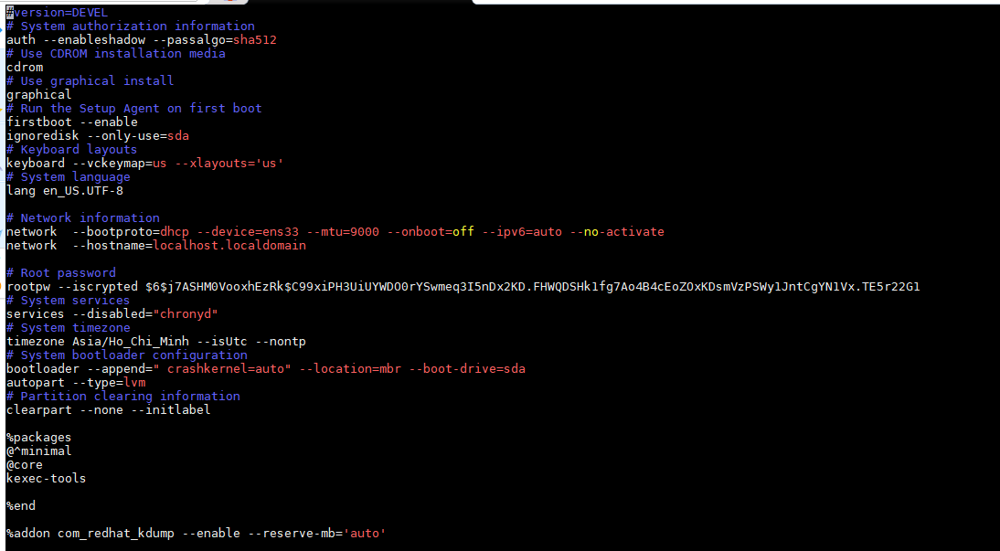
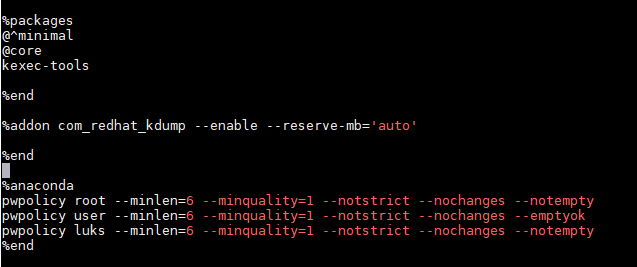

<h1 style="color:orange">Tổng quan về Kickstart</h1>
Rất nhiều system administrator hiện nay ưa thích sử dụng những phương pháp tự động hóa trong vận hành hệ thống, trong đó có việc tự động hóa cài đặt OS. Để phục vụ cho điều này, các hãng đã đưa ra giải pháp gọi là Kickstarts Installation.
<h2 style="color:orange">1. Kickstart Installtion là gì?</h2>
Trước tiên ta hiểu rằng việc cài đặt hệ điều hành lên thiết bị là quá trình đi trả lời các câu hỏi mà hệ điều hành yêu cầu khi cài đặt.

Với giải pháp Kickstart Installtion đơn giản là việc người quản trị sẽ tạo ra một file đơn, nội dung của file đó sẽ ghi sẵn những câu trả lời cho các câu hỏi mà hệ điều hành yêu cầu khi cài đặt. Tóm lại, Kickstart là giải pháp giúp tự động hóa việc cài đặt hệ điều hành.

Ngoài ra, Kickstart được phát triển mạnh mẽ bởi Red Hat, một ông lớn trong thế giới Opensource.
<h2 style="color:orange">2.Làm thế nào để thực hiện Kickstart Installation</h2>
Để thực hiện Kickstart ta cần có các điều kiện như sau:

1. Tạo một file kickstart
2. Tạo một boot media với kickstart file hoặc tạo kickstart file available trong network
3. Tạo Installation tree có sẵn
4. Chạy kickstart
<h2 style="color:orange">3. Tạo file kickstart</h2>
File Kickstart đơn giản là một file text thông thường. Nội dung của file sẽ chứa danh sách các items được định ra bởi các keyword có sẵn.

Các file Kickstart thường được lưu trong một server riêng biệt (thường trong cùng PXE hoặc TFTP server). Trong mô hình client server, các client sẽ lấy ra một file kickstart trong quá trình cài đặt hệ điều hành.

Ví dụ về file kickstart, đây là file anaconda-ks.cfg trong centos 7 sau khi cài OS thủ công:

 
 
File anaconda-ks.cfg lưu lại những cấu hình mà ta cài đặt OS.
<h2 style="color:orange">4. Một số tính năng khác của kickstart</h2>

- Cấu hình cho các input device
- Cài đặt boot loader
- Phân vùng ổ cứng.
- Cấu hình network
- Cấu hình các gói phần mềm cần thiết
- Cấu hình hệ thống X Window.
- Chạy script tạo sẵn sau khi cài đặt xong hệ thống.