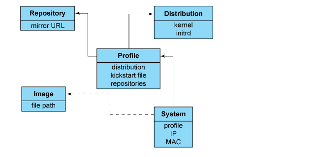

<h1 style="color:orange">Cobbler là gì?</h1>
Trong linux cobbler là một gói các công cụ cài đặt một cách dễ dàng cho phép triển khai một PXE server với đầy đủ các thành phần bắt buộc. Chức năng chính hỗ trợ cài đặt tự động các bản hệ điều hành linux thông quan mạng, sử dụng kickstart file để tự động hóa các bước cài đặt.
<h2 style="color:orange">1. Các thành phần trong Cobbler</h2>
Như các bạn đã thiết để cài được hệ điều hành linux cho một thiết bị cần phải trải qua rất nhiều bước như chọn ngôn ngữ, thời gian, chia phân vùng, đặt password…nếu muốn cài số cho số lượng lớn các thiết bị thì tốn rất nhiều thời gian. Cobbler đã xuất hiện để tự động hóa nhiều công đoạn khác nhau trong quá trình cài đặt hệ điều hành linux, dễ dàng hơn trong việc cài đặt số lượng lớn hệ điều hành linux với những cấu hình khác nhau.

Các thành phần trong Cobbler

1. `Kickstart file:` Là file quy định, định nghĩa nên các bước cho việc cài đặt các distro linux do có file này mà toàn bộ quá trình cài đặt sẽ được tự hóa hoàn toàn (chọn ngôn ngữ, timezone, phân vùng…).
2. `TFTP, FTP(Transfer protocol)`: Là các giao thức mà cobbler sử dụng để truyển tải các file cài đặt từ cobbler server đến các client để cài linux (hiểu đơn giản là sử dụng giao thức truyền file trong linux để đẩy các bản cài đặt xuống client).
3. `DHCP server`: Đáp ứng cho việc cài đặt qua môi trường mạng client phải kết nối được đến server và được cấp 1 địa chỉ IP. Quá trình cấp địa chỉ này được thực hiện bởi DHCP server trải qua các bước cấp DHCP thông thường.
4. `DNS server`: Giúp thể gán địa chỉ IP với 1 tên miền (là thành phần không bắt buộc).
5. `Web server:` Cobbler cung cấp giao diện web cho phép người quản trị thông qua đó, quản lý các profile cũng như các máy trạm được cài đặt.
<h2 style="color:orange">2. Các đối tượng chính trong Cobbler</h2>

+ `Distribution` : Chứa các thông tin về kernel và initrd nào được sử dụng,các dữ liệu dùng để cài đặt, các thông số kernel (đơn giản như file ISO cài đặt).
+ `Profile`: Bao gồm distribution, kickstart file, các package cài đặt.
+ `System`: Gồm profile và MAC address. Đại diện cho các máy client được cung cấp, chỉ tới một profile hoặc một image và chứa thông tin về IP và địa chỉ MAC, quản lý tài nguyên và nhiều loại data chuyên biệt.
+ `Repository`: Giữ thông tin về các mirror repo cho quá trình cài đặt và cập nhật phần mềm của các máy client.
 

Ta có thể hình dung quá trình khởi tạo OS cho client của cobbler: Tạo distribution -> profile -> repo -> system -> boot client.