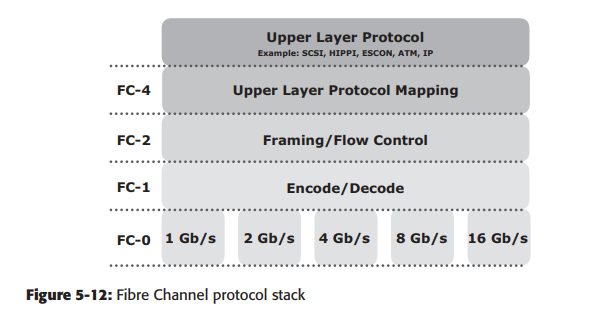
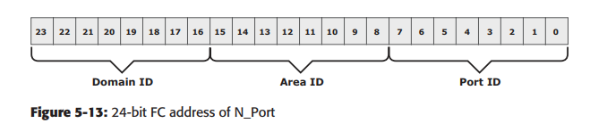
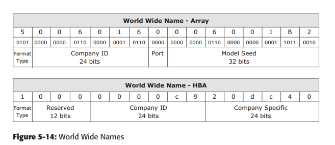
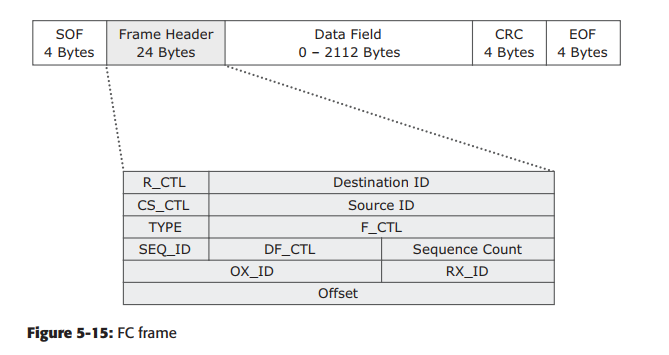

<h1 style="color:orange">Giao thức Fibre channel</h1>
FC SAN sử dụng fibre channel protocol (FCP) cung cấp cả tốc độ truyền dữ liệu lẫn giảm thiểu giao thức truyền và khả năng mở rộng của network. FCP là cấu trúc thiết yếu của hạ tầng SAN. FC dùng được với cả cáp quang và đồng.
<h2 style="color:orange">1. Giao thức truyền Fibre channel</h2>
Fibre channel protocol (FCP) định nghĩa giao thức truyền qua 5 layer: 

 

`FC-4 Layer` 
Là tầng cao nhất trong FCP stack, định nghĩa các giao diện ứng dụng và đường Upper layer protocol (ULP) được map tới các tầng FC thấp hơn. Một vài giao thức được chạy trên tầng FC-4 bao gồm SCSI, HIPPI, ESCON, ATM và IP.

`FC-2 Layer` 
Tâng FC-2 cung cấp Fibre channel addressing, cấu trúc và tổ chức dữ liệu (frames, chuỗi). Nó cũng định nghĩa fabric service, classes của service và routing.

`FC-1 Layer` 
Tầng FC-1 mã hóa truyền và giải mã khi nhận được, qua đó phát hiện lỗi khi truyền.

`FC-0 Layer` 
Là tầng thấp nhất trong FCP stack, là tầng vật lý.
<h2 style="color:orange">2. Địa chỉ fibre channel</h2>
Một địa chỉ FC được cấp động cho một node port khi join vào fabric. Địa chỉ FC có format riêng. Công thức đánh địa chỉ liên quan mật thiết với switch.

 
Trường đầu tiên của địa chỉ FC chứa domain ID của switch. `Domain ID là số duy nhất được cấp cho mỗi switch trong fabric. Mặc dù trường có 8 bit nhưng chỉ có thể cấp 239 địa chỉ bởi có 1 số được mặc định cho dịch vụ quản trị fabric. Ví dụ, FFFFFC được giữ cho name server, FFFFFE giữ cho fabric login service. Trường area ID dùng để định danh 1 nhóm switch port dùng cho kết nối node. Một ví dụ của group port với area ID là port card trên switch. Trường cuối cùng, port ID, định nghĩa port giữa group. Do đó, số node port tối đa trong 1 fabric là:  
239 x 256 x 256 = 15,663,104

<h2 style="color:orange">3. World wide name</h2>
Mỗi thiết bị trong FC được cấp 64-bit duy nhất được gọi World Wide Name (WWN). Môi trường FC dùng 2 kiểu của WWN: World wide node name (WWNN) và world wide port name (WWPN). Không như địa chỉ FC, WWN là địa chỉ tĩnh. WWN tương tự MAC sử dụng định tuyến IP. WWN gắn với chân HBA, cũng tương tự như MAC gắn liền với cổng NIC. Name servẻ trong FC giữ sự liên quan giữa WWN với địa chỉ FC động cấp cho port. Hình 5-14 thể hiện cấu trúc WWN với array (ổ đĩa) và HBA.

 
<h2 style="color:orange">4. FC frame</h2>
FC frame chứa 5 phần: start of frame (SOF), frame header, data field, cyclic ređunancy check (CRC), và end of frame (EOF)

 

SOF và EOF là những bit chặn 2 đầu. Frame header dài 24 byté và chứa những thông tin cho frame. Bao gồm những thông tin: Source ID (S_ID), Destination ID (D_ID),...

Trường data bao gồm data payload, chứa tới 2,112 bytes data thực tế với 36 bytes overhead cố định.

CRC checksum kiểm tra lỗi khi chuyền. CRC checksum được tính toán bởi người gửi trước khi mã hóa ở layer FC-1. Tương tự được tính toán sau khi giải mã ở FC-1 ở người nhận.