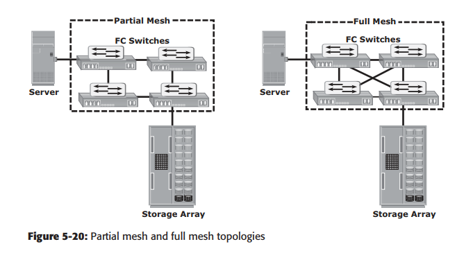
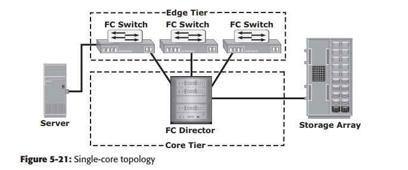
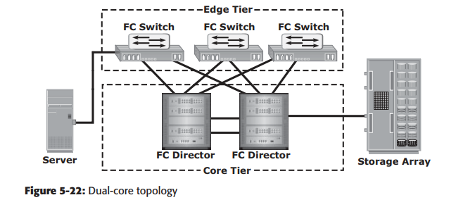
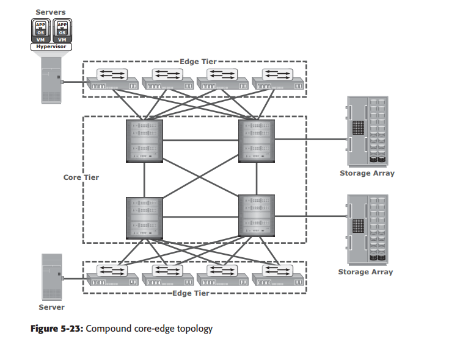

<h1 style="color:orange">Mô hình SAN</h1>
Mô hình SAN có 2 kiểu chính là dạng lưới (Mesh topology) và dạng core-edge. Trong đó, core-edge là topo phổ biến hơn trong thiết kế fabric. Các biến thể của core-edge fabric và mesh được triển khai trong FC SAN.
<h2 style="color:orange">1. Mesh topology</h2>
Mesh topology lại chia làm 2 kiểu: dạng lưới toàn bộ (full mesh) hoặc lưới 1 phần (partial mesh)

- `Full mesh:` Tất cả switch đều nối với các switch còn lại trong fabric. Full mesh thích hợp khi số switch trong fabric nhỏ. 1 full mesh điển hình có 4 switch và mỗi switch đều cấu hình chỉ 1 hop từ host-to-storage. Tuy vậy, khi tăng số switch, số sw port dùng cho ISL cũng tăng lên. Gỉảm số port kết nối đến các node.
-  `partial mesh:` Host-to-storage cần vài hop. Partial mesh cung cấp khả năng mở rộng cao. Tuy vậy, phải đặt các node thích hợp nếu không 1 ISL có thể chịu tải quá lớn vì gánh nhiều traffic.

 
<h2 style="color:orange">2. Core-edge fabric</h2>
Core-edge fabric có 2 tầng.

- `Tầng edge` bao gồm những switch edge và nối đến switch core qua ISL.
- `Tầng core` thường bao gồm những director (switch xịn). Tất cả traffic đều phải đi qua hoặc bị loại bỏ ở tầng này. Với cấu hình này, tất cả storage đều nối trực tiếp đến tầng core, cho phép tất cả đường host-to-storage đi qua một ISL ------> đảm bảo hiệu năng cho host.

Trong core-edge topolgy, switch tầng edge không kết nối với nhau. core-edge fabric tăng lượng kết nối trong SAN trong khi vẫn đảm bảo không lấy thêm sw port. Nếu cần mở rộng thêm topo, các switch edge sẽ được thêm vào switch core. Tầng core cũng có thể mở rộng khi nối thêm switch hoặc director vào tầng core.

Dựa trên số lượng switch core, core-edge topology có vài biến thể: single-core, dual-core topology. Để biến single-core thành dual-core, mỗi switch edge phải kết nối với switch core được thêm vào.
<h3 style="color:orange">2.1. Lợi ích và hạn chế của core-edge fabric</h3>

- Core-edge fabric cho phép tối đa 1 hop từ host-to-storage vì traffic di chuyển 1 đường định sẵn (từ host đến edge đến core và ngược lại), core-edge cho phép tính toán dễ dàng tải ISL và đường traffic. Trong topo, vì mỗi tầng sw port đều kết nối với chỉ host hoặc storage nên dễ dàng xác định tài nguyên mạng nào, đi thế nào.

 
 

Core-edge fabric có thể mở rộng lớn bằng việc thêm core switch và nối chúng với nhau. Tuy vậy, khi mạng quá lớn vẫn có thể ảnh hưởng hiệu năng khi tăng số hop (số hop là số ISL mà bản tin phải đi từ host-to-storage). Nếu có quá nhiều switch core thì cũng sẽ đắt đỏ để duy tri tất cả ISL từ switch edge đến các switch core.

 
Một cấu trúc core-edge phức tạp.