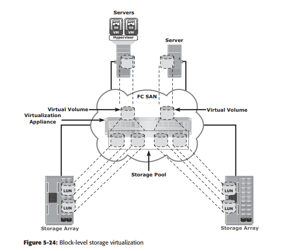
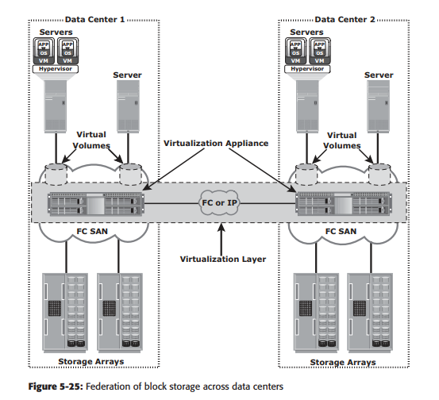

<h1 style="color:orange">Ảo hóa trong SAN</h1>
<h2 style="color:orange">1. Ảo hóa lưu trữ block-level</h2>
Block-level storage virtualization kết hợp block storage devices (LUN) thành 1 ổ ảo và cấp phát chúng, độc lập hoàn toàn với ổ vật lý bên dưới. 1 layer ảo, trong SAN, trìu tượng hóa các ổ vật lý và tạo 1 storage pool từ các ổ khác nhau. Các volume ảo được tạo từ storage pool này và mount tới host. Thay vì nối trực tiếp với LUN trên ổ đĩa, các host được nối với những virtual volume được tạo bởi virtualization layer từ LUN.

 
Đối với host và ổ đĩa, tầng virtualization này trong SAN tương tự như thiết bị initiator và  thiết bị target. 

Tầng virtualization map virtual volume tới LUN trên ổ đĩa. Host không hề biết tới tiến trình này và coi những virtual volume như những ổ thật. Thông thường, virtualization layer được quản lý qua thiết bị mà cả ổ vật lý lẫn host đều được nối tới (core switch).

Block-level storage virtualization còn cung cấp khả năng không nghẽn dữ liệu khi thực hiện migrate, đặc biệt trong môi trường nhiều vendor. Với block-level storage virtualization, virtualization layer xử lý phần back-end của migration data, cho phép LUN giữ trạng thái online và có thể truy cập khi đang migrate. Host sẽ vẫn trỏ tới virtual volume trên virtulization layer. Tuy vậy, việc mapping thông tin tới ổ vật lý cần phải được thực hiện.

Trước đây, block-level storage virtualization chỉ cung cấp migration không nghẽn trong 1 datacenter. Thế hệ mới của block-level storage virtualization cho phép migration cả trong và ngoài datacenter. Tầng virtulization layer được quản lý tập trung và hoạt động như 1 tầng virtualization trải dài qua cả 2 datacenter. Virtual volume lúc này có thể tạo từ LUN của ổ vật lý ở cả 2 datacenter.

 
<h2 style="color:orange">2. Virtual SAN</h2>
Virtual SAN (hay còn gọi là virtual fabric) là một fabric logic trên FC SAN, cho phép giao tiếp giữa những group node mà không cần quan tâm tới vị trí vật lý trong SAN. Trong VSAN, một nhóm host port hay storage port giao tiếp với nhau trong VSAN được định nghĩa trên SAN vật lý (switch core). Mỗi VSAN đóng vai trò như 1 fabric độc lập với fabric service riêng như name server và zoning. Cấu hình trong VSAN không ảnh hưởng tới các VSAN khác. (tương tự vlan).

VSAN tăng tính sẵn sàng, tính bảo mật và tính mở rộng cho SAN. Sự cố xảy ra trong VSAN sẽ chỉ ảnh hưởng rong VSAN mà không làm ảnh hưởng tới các VSAN khác. VSAN cho giải pháp đơn giản, rẻ để quản lý mạng SAN.