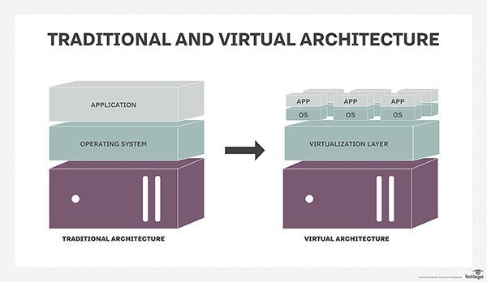
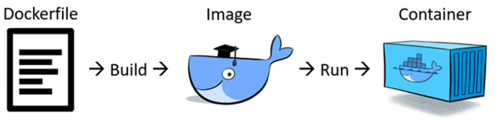
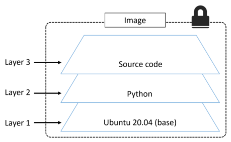
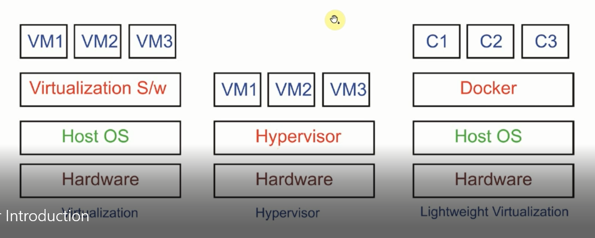
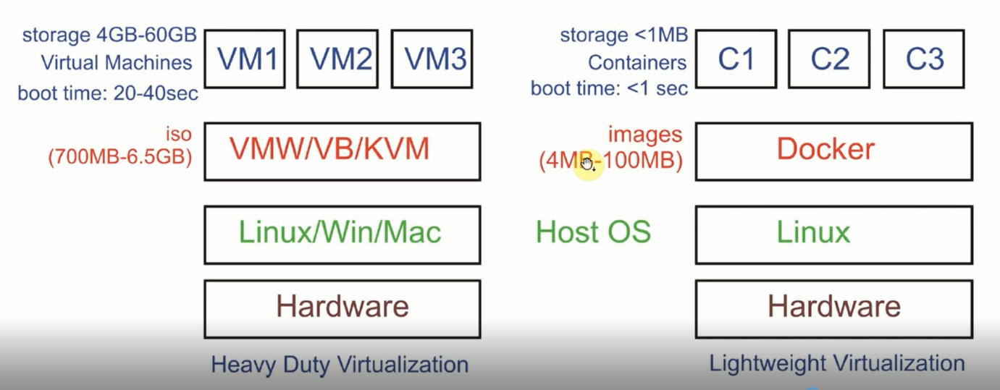

<h1 style="color:orange">Docker</h1>
<h2 style="color:orange">1. Khái niệm container</h2>
Nói về sự ra đời của Containerlization - ảo hóa mức container thì chắc phải kể từ những vấn đề mà loài người gặp phải trong giai đoạn đầu của cuộc cách mạng công nghệ.

Khi đó chưa có khái niệm VM hay VPS, mỗi máy chủ là một máy vật lý, đặt trên DC hay nhà riêng nào đó. Vấn đề gặp phải ở đây là nó chỉ chạy được một hệ điều hành duy nhất, không tận dụng được hết công suất. Trừ khi có thánh nào tính toán để tận dụng được khoảng 98% tài nguyên hệ thống thì mình không nói, nhưng chắc đa số chúng ta chỉ là người phàm mà thôi.

Chưa kể quá trình nâng cấp, mở rộng vô cùng phức tạp và mất thời gian cộng với việc tốn thêm cả đống tiền thuê diện tích ở DC nữa. Điều này làm đau đầu các doanh nghiệp khi vừa muốn giảm thiểu chi phí lại vừa muốn nâng cao chất lượng dịch vụ.

Và ảo hóa ra đời..

Ảo hóa ra đời cho phép những người quản trị chạy được nhiều hệ điều hành, nhiều máy chủ trên cùng một máy chủ duy nhất. Giúp giảm thiểu chi phí, dễ dàng trong việc triển khai và vận hành. Tận dụng tốt hơn tài nguyên hệ thống. Thay vì trước đây server vật lý 64GB ram chỉ để chạy một dịch vụ web thì giờ đây nó có thể chạy thêm cả dịch vụ mail nữa chẳng hạn. Anh em giờ lab cũng dễ dàng hơn chứ không phải mua máy thật về lab nữa.

 
Tuy nhiên ảo hóa vẫn chưa phải là giải pháp tối ưu nhất. Chẳng hạn bạn tạo một máy ảo 5GB RAM thì trên máy vật lý sẽ mất 5GB RAM cho máy ảo đó. Nếu không tận dụng tốt thì đâu đó vẫn có sự lãng phí tài nguyên ở đây.

Và ở bước tiến tiếp theo, nhân loại đã nghĩ ra `Containerlization`.

`Containerlization - ảo hóa container`. Phương pháp ảo hóa này gần giống với phương pháp ảo hóa trước đó ở trên (đều sinh ra các hệ điều hành con nằm trên cùng một hệ điều hành bố). Nhưng nó tối ưu hơn hơn chỗ , các máy con này cùng sử dụng kernel của máy bố nhưng lại hoàn toàn độc lập với nhau như ảnh phía dưới.
 
<h2 style="color:orange">2. Lịch sử docker</h2>
Đọc đến đây thì chắc các bạn cũng đã có một cái nhìn tổng quan cũng như lý tưởng mà docker hướng tới rồi đó. Giờ sẽ đến phần chính của bài viết - đó là Docker

Docker là một ứng dụng mã nguồn mở cho phép đóng gói các ứng dụng, các phần mềm phụ thuộc lẫn nhau vào trong cùng một container. Container này sau đó có thể mang đi triển khai trên bất kỳ một hệ thống Linux phổ biến nào. Các container này hoàn toàn độc lập với các container khác.

Docker dựa vào tính năng LXC, được phát triển bởi dotCloud. dotCloud Ban đầu là một công ty cung cấp PaaS (Platform as a service). Tháng 3 năm 2013 họ sử dụng Docker để cung cấp các platform cho những nhà phát triển khác, nhưng sau đó họ nhận thấy tốc độ phát triển nhanh chóng của Docker cũng như hệ sinh thái bao quanh nó. Công ty đã đổi luôn tên của mình thành Docker.

Những lợi ích mà Docker đem lại:

- Sử dụng ít tài nguyên: Thay vì phải ảo hóa toàn bộ hệ điều hành thì chỉ cần build và chạy các container độc lập sử dụng chung kernel duy nhất.
- Tính đóng gói và di động: Tất cả các gói dependencies cần thiết đều được đóng gói vừa đủ trong container. Và sau đó có thể mang đi triển khai trên các server khác.
- Cô lập tài nguyên: server bố không biết ở trong container chạy gì và container cũng không cần biết bố nó là CentOs hay Ubuntu. Các container độc lập với nhau và có thể giao tiếp với nhau bằng một interface
- Hỗ trợ phát triển và quản lý ứng dụng nhanh: Đối với Dev, sử dụng docker giúp họ giảm thiểu thời gian setup môi trường, đóng gói được các môi trường giống nhau từ Dev - Staging - Production
- Mã nguồn mở: Cộng đồng support lớn, các tính năng mới được release liên tục.
<h2 style="color:orange">3. Các khái niệm quan trọng trong docker</h2>

1. Docker file: 
- Docker image có thể được tạo ra tự động bằng cách đọc các chỉ dẫn trong Dockerfile.
- Dockerfile mô tả ứng dụng và nó nói với docker cách để xây dựng nó thành 1 image.
- Dockerfile bắt đầu bằng chữ D và được đặt tên là Dockerfile, ngoài tên này ra các tên khác đều không hợp lệ.
 

2. Docker image
- Image trong docker còn được gọi là mirror, nó là 1 đơn vị đóng gói chứa mọi thứ cần thiết để 1 ứng dụng chạy.
- Ta có thể có được image docker bằng cách pulling từ image registry. Thao tác pulling sẽ tải image xuống máy chủ docker, nơi docker có thể sử dụng nó để chạy 1 hoặc nhiều container.
- Image được tạo thành từ nhiều layer xếp chồng lên nhau, bên trong image là 1 hệ điều hành bị cắt giảm và tất cả các phụ thuộc cần thiết để chạy 1 ứng dụng.
- Cơ quan registry phổ biến nhất là Docker Hub, nhưng vẫn tồn tại các cơ quan khác
 

3. Docker registry:  
Là một kho chứa các image. Bạn có thể dựng riêng một con Docker Registry cho riêng mình. Hoặc up lên Docker Hub để đóng góp ngược lại cho cộng đồng.
<h2 style="color:orange">4. So sánh docker với các loại ảo hóa khác</h2>

 
Ngoài cùng bên trái là các loại phần mềm ảo hóa như VMware, Virtualbox. 
Ở giữa là các loại bare-metal như KVM, VMware Esxi, Hyper-V 
Ngoài cùng bên phải là docker.

 
Như hình trên có thể thấy docker có tốc độ boot nhanh hơn nhiều. Thay vì có thể chạy 1 máy ảo, ta có thể đóng 60 image chạy docker với việc sử dụng dung lượng tương đương.
<h2 style="color:orange">5. Hạn chế của docker</h2>

- Docker base trên Linux 64bit và các tính năng cgroup, namespaces. Vì thế Linux 32bit hoặc môi trường Window không thể chạy được docker (đối với phiên bản CE).
- Sử dụng container tức là bạn sử dụng chung kernel của hệ điều hành. Trong trường hợp bạn download image có sẵn và trong đó có một số công cụ có thể kiểm soát được kernel thì server của bạn có thể bị mất kiểm soát hoàn toàn.
- Các tiến trình chạy container một khi bị stop thì sẽ mất hoàn toàn dữ liệu nếu không được mount hoặc backup. Điều này có thể sẽ gây ra một số bất tiện…
Tuy nhiên Docker nói riêng hay Containerlization nói chung vẫn sẽ là tương lai và là xu hướng chung của hầu hết các doanh nghiệp trên toàn thế giới.