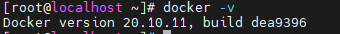
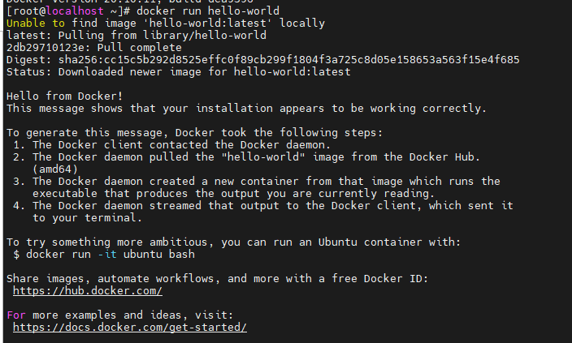

<h1 style="color:orange">Cài đặt Docker trên centos7</h1>
<h2 style="color:orange">1. Các phiên bản Docker</h2>
Có hai phiên bản chính của Docker.

- Docker EE (Docker Enterprise Edition): bản trả phí, Docker EE được support bởi Alibaba, Canonical, HPE, IBM, Microsoft…
- Docker CE (Docker Community Edition): Docker CE, đúng như tên gọi, nó là một phiên bản Docker do cộng đồng support và phát triển, hoàn toàn miễn phí.

Có hai phiên bản của Docker CE là Edge và Stable. Bản Edge sẽ được release hàng tháng với các tính năng mới nhất, còn Stable sẽ release theo quý.

Cả hai bản docker không có nhiều sự khác biệt.
<h2 style="color:orange">2. Cài đặt Docker trên Centos7</h2>
Cài đặt các gói cần thiết

    # sudo yum install -y yum-utils device-mapper-persistent-data lvm2
Thêm Docker repo

    # sudo yum-config-manager --add-repo https://download.docker.com/linux/centos/docker-ce.repo
Cài đặt bản lastest của Docker CE

    # sudo yum install -y docker-ce docker-ce-cli containerd.io
docker-ce là docker daemon 
docker-cli là docker client 

Kiểm tra lại cài đặt

    # sudo systemctl start docker
    # sudo systemctl enable docker
    # docker -v
 

Chạy container đầu tiên với Docker

    # sudo docker run hello-world
 
Bản chất của câu lệnh trên, Docker sẽ pull một image là hello-world trên Docker hub về server và chạy container với image đó.