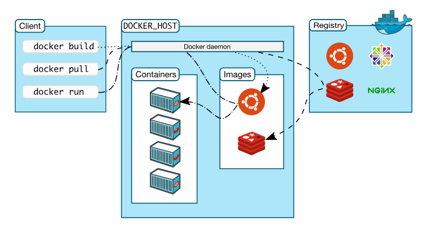
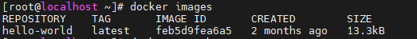
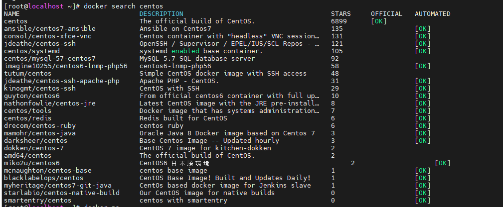
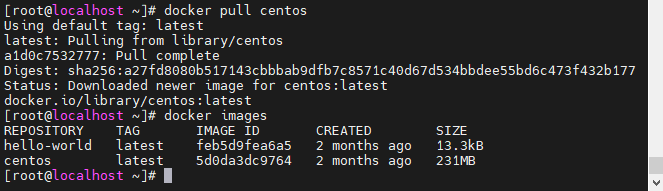
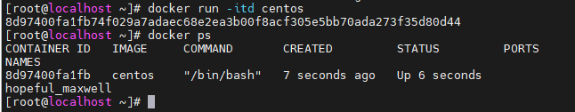
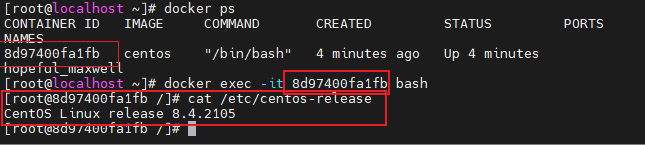

<h1 style="color:orange">Kiến trúc và thành phần Docker</h1>
<h2 style="color:orange">1. Docker engine</h2>
Docker Engine là một ứng dụng client-server. Có hai phiên bản Docker Engine phổ biến là:

- Docker Community Edition (CE)
- Docker Enterprise edition (EE)

Các thành phần chính của Docker Engine gồm có:
- Server hay còn được gọi là `docker daemon` (dockerd): chịu trách nhiệm tạo, quản lý các Docker objects như images, containers, networks, volume.
- REST API: docker daemon cung cấp các api cho Client sử dụng để thao tác với Docker.
- Client là thành phần đầu cuối cung cấp một tập hợp các câu lệnh sử dụng api để người dùng thao tác với Docker. (Ví dụ docker images, docker ps, docker rmi image v.v..)

 
<h2 style="color:orange">2. Kiến trúc Docker</h2>
Docker sử dụng kiến trúc client-server. Docker server (hay còn gọi là daemon) sẽ chịu trách nhiệm build, run, distribute Docker container. Docker client và Docker server có thể nằm trên cùng một server hoặc khác server. Chúng giao tiếp với nhau thông qua REST API dựa trên UNIX sockets hoặc network interface.
<h3 style="color:orange">2.1. Docker daemon</h3>
Docker daemon (dockerd) là thành phần core, lắng nghe API request và quản lý các Docker object. Docker daemon host này cũng có thể giao tiếp được với Docker daemon ở host khác.
<h3 style="color:orange">2.2. Docker client</h3>
Docker client (docker) là phương thức chính để người dùng thao tác với Docker. Khi người dùng gõ lệnh docker run imageABC tức là người dùng sử dụng CLI và gửi request đến dockerd thông qua api, và sau đó Docker daemon sẽ xử lý tiếp.

Docker client có thể giao tiếp và gửi request đến nhiều Docker daemon.
<h3 style="color:orange">2.3. Docker registry</h3>
Docker registry là một kho chứa các Image. Nổi tiếng nhất chính là Docker Hub, ngoài ra bạn có thể tự xây dựng một Docker registry cho riêng mình.
<h3 style="color:orange">2.4. Docker object</h3>
Các object này chính là các đối tượng mà bạn thường xuyên gặp phải khi sử dụng Docker gồm có

- Image: Image là một template read-only sử dụng để chạy container. 
Một image có thể base trên một image khác. Ví dụ bạn muốn tạo một image nginx, tất nhiên nginx phải chạy trên linux ubuntu chẳng hạn. Khi đó image nginx trước hết sẽ phải base trên ubuntu trước đã. 
Bạn có thể tự build image cho riêng mình hoặc tải các image có sẵn của người khác trên Docker registry.
- Container: Container được chạy dựa trên 1 image cụ thể. Bạn có thể tạo, start, stop, move, delete container. 
Bạn cũng có thể kết nối các container với nhau hoặc attach storage cho nó, thậm chí là tạo lại một image từ chính state hiện tại của container
 
Container cô lập tài nguyên với host và các container khác.

 
Ví dụ quá trình chạy 1 container:

Bước 1: Docker client (CLI) dùng lệnh sau để chạy một container centos trắng:

    # docker run -itd centos
Bước 2: Docker daemon sẽ kiểm tra xem nó có image centos nào không. Nếu có nó sẽ chạy container luôn. Nếu không nó sẽ pull image centos (tag mặc định là lastest) về từ Registry và sau đó mới chạy container. Kiểm tra xem container đang chạy sử dụng lệnh:

    # docker ps
<h2 style="color:orange">3. Ví dụ</h2>
Ví dụ chạy 1 `container centos` trắng.

Trước tiên phải cài docker.

Theo lý thuyết, để chạy một container thì cần có một image tương ứng. Để kiểm tra image đã có chưa ta sử dụng lệnh

    # docker images
 

`2. Tìm image để pull` 
Ở đây mình chưa có image nào cả, giờ phải tìm được một image centos trên mạng thôi.

Tìm xem có image repository nào trên mạng có tên là centos không

    # docker search images
 

Repository là tập hợp các image có cùng tên nhưng khác tag (tag ở đây có thể là centos6, centos7, centos7.6.1810, 7.6.1810, lastest …)

`3. Download image` 

    # docker pull centos
 
Mặc định nếu không chỉ rõ phiên bản thì docker sẽ pull image lastest từ phía Registry về.

`4. Chạy container` 
Để chạy container có thể sử dụng tên image hoặc ImageID đều được.

    # docker run -itd centos
sau đó

    # docker ps
để kiểm tra container chạy chưa
 

`5. Kiểm tra sâu hơn trong container` 

    # docker exec -it a28f720381b4 bash
    # cat /etc/centos-release
 

Như vậy là mình đã thực hiện chạy một container với image được pull về (nằm trên Docker host rồi). Trong trường hợp các bạn biết tên image cần chạy thì chỉ cần chạy container luôn và ngay thôi.

Ví dụ: 

    # docker run -itd ubuntu
Khi này Docker sẽ tự pull image về host cho bạn rồi sau đó nó mới chạy container.

Lưu ý: container ID khác image ID; khi ta stop 1 container, container đấy vẫn tồn tại. Xem tất cả container bằng câu lệnh:

    # docker ps -a