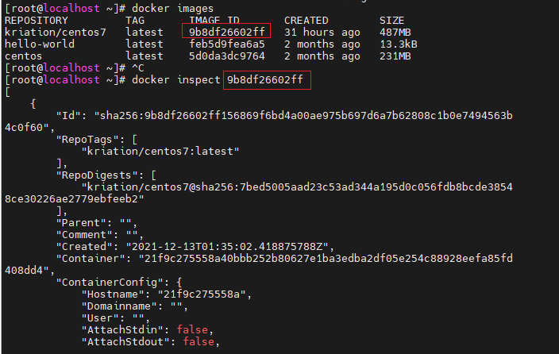
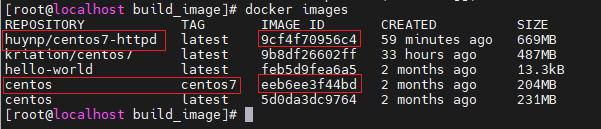
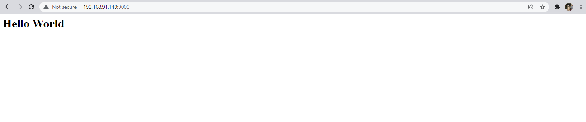

<h1 style="color:orange">Tạo 1 image từ Dockerfile</h1>
<h2 style="color:orange">1. Dockerfile là gì?</h2>

- Dockerfile là một file dạng text không có extension, và tên bắt buộc phải là Dockerfile
- Dockerfile là một file kịch bản sử dụng để tạo mới một image
<h2 style="color:orange">2. Các command cơ bản trong Dockerfile</h2>

`FROM`

    FROM centos:centos7
FROM chỉ định rằng image build này sẽ base trên image gốc nào. Ở đây là image centos với tag centos7. 
`LABEL`

    LABEL "image-type"="huy-test"
    LABEL "image-type1"="huy-test1"
    LABEL "image-type2"="huy-test2"
LABEL: Chỉ định label metadata của image. Để xem được các label này sử dụng câu lệnh 
     
    # docker inspect <IMAGE ID>
 
`MAINTAINER`

    MAINTAINER huynp
MAINTERNER là author (tác giả) build image đó.

`RUN`

    RUN yum update -y
RUN thực hiện một câu lệnh Linux. Tùy vào image gốc mà có các câu lệnh tương ứng (ví dụ Ubuntu sẽ là `RUN apt-get update -y)`

`COPY`

    COPY start.sh /start.sh
COPY Copy một file từ Dockerhost vào image trong quá trình build image

`ENV`

    ENV source /var/www/html/
    COPY index.html ${source}
ENV là biến môi trường sử dụng trong quá trình build image.

ENV chỉ có thể được sử dụng trong các command sau:
- ADD
- COPY
- ENV
- EXPOSE
- FROM
- LABEL
- STOPSIGNAL
- USER
- VOLUME
- WORKDIR

`CMD`

    CMD ["./start.sh"]
CMD dùng để truyền một Linux command khi khởi tạo container từ image

`VOLUME`

    VOLUME ["/etc/http"]
VOLUME Tạo một volume nằm trong folder /var/lib/docker/volumes của docker host và mount với folder chẳng hạn /etc/http khi khởi chạy container

`EXPOSE`

    EXPOSE 80 443
EXPOSE Chỉ định các port sẽ Listen trong container khi khởi chạy container từ image.

Tham khảo thêm các command Dockerfile tại: https://docs.docker.com/engine/reference/builder/
<h2 style="color:orange">3. Tạo images httpd với Dockerfile</h2>
Giả định môi trường lý tưởng, các câu lệnh sau đều chạy dưới quyền root

1. Tạo 1 folder làm việc với Dockerfile

       # mkdir build_image && cd build_image
2. Tạo Dockerfile để build image

       vim Dockerfile
Lưu ý: Filename phải là Dockerfile và không có phần mở rộng. paste vào:

     FROM centos:centos7

    LABEL "image-type"="huy-test"
    MAINTAINER huynp

    RUN yum update -y
    RUN yum install httpd -y

    ENV source /var/www/html/

    VOLUME ["/var/log/httpd"]

    COPY index.html ${source}
    COPY start.sh /start.sh

    RUN chmod +x /start.sh
    CMD ["/start.sh"]

    EXPOSE 80 443
Giải thích các trường:
- `FROM centos:centos7`: Build image dựa trên image gốc là centos 7.
- `RUN yum update -y` và `RUN yum install httpd -y`: Thực hiện các command của centos để update và cài đặt httpd
- `LABEL “image-type”=”huy-test”` : Metadata của image có thể có hoặc không.
- `MAINTAINER huynp`: Tác giả viết Dockerfile để build image có thể có hoặc không.
- `ENV source /var/www/html/`: Khai báo một biến môi trường tên là source và có giá trị là /var/www/html/. Biến này sẽ được sử dụng ở bước COPY index.html ${source}
- `COPY index.html ${source}`: Copy file index.html từ Dockerhost vào đường dẫn biến - được khai báo ở bước trên.
- `COPY start.sh /start.sh`: Copy một bash script file vào đường dẫn / để thực hiện một số Linux command khi khởi tạo container từ image này.
- `RUN chmod +x /start.sh`: Cho phép quyền thực thi đối với script vừa copy từ bước trên.
- `CMD [“/start.sh”]`: Thực thi script khi khởi chạy container từ image này.
- `EXPOSE 80`: Chỉ ra rằng container khi khởi chạy từ image này sẽ LISTEN port 80
- `VOLUME [“/var/log/httpd”]`: Chỉ định một phân vùng trên Docker host mount với container khi chạy. Ở đây mount theo dạng volume. Mount folder /var/log/httpd của container với volume nằm tại /var/lib/portal/volume/ của Docker host
3. Tạo các file cần thiết bổ trợ cho Dockerfile

Vì ở trên có sử dụng COPY để COPY các file script start.sh và file source code index.html nên sẽ tạo tiếp hai file này.

    [build_image]#: vim start.sh
paste vào

    #!/bin/bash
	rm -rf /run/httpd/* /tmp/httpd*
	exec /usr/sbin/apachectl -DFOREGROUND

    [build_image]#: vim index.html
    paste vào
    "<h1>Hello World</h1>"
4. Tạo image từ Dockerfile

       # docker build -t huynp/centos7-httpd .
5. Kiểm tra lại image vừa build

       # docker images
 
Docker trước khi tạo image huynp sẽ pull cả image centos tag centos7

6. Chạy container với image vừa build

       # docker run -itd -p 9000:80 --name huynp huynp/centos7-httpd
Câu lệnh chuyển port 80 trên container chạy trên port 9000 của docker host.

7. Truy cập vào browser với địa chỉ `http://<Docker_host_ip>:9000`

 