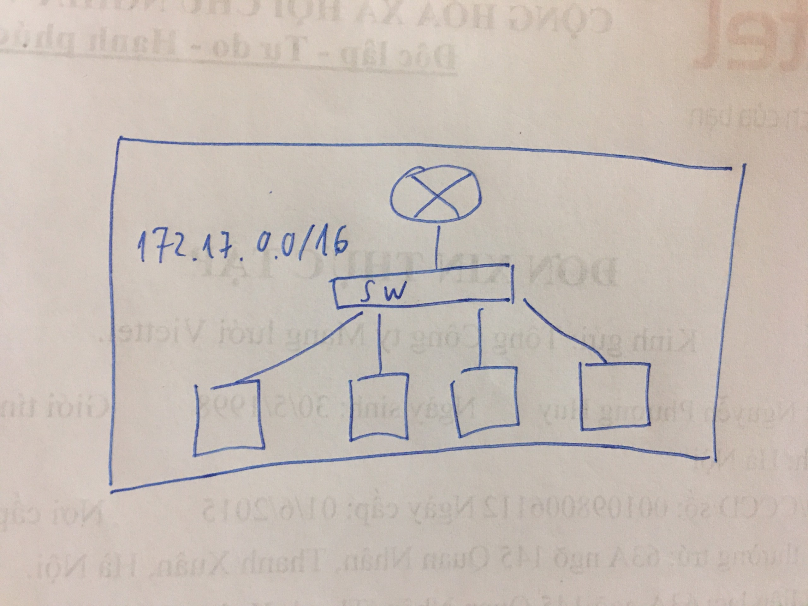
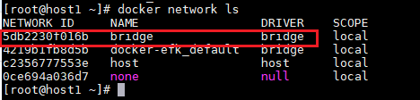
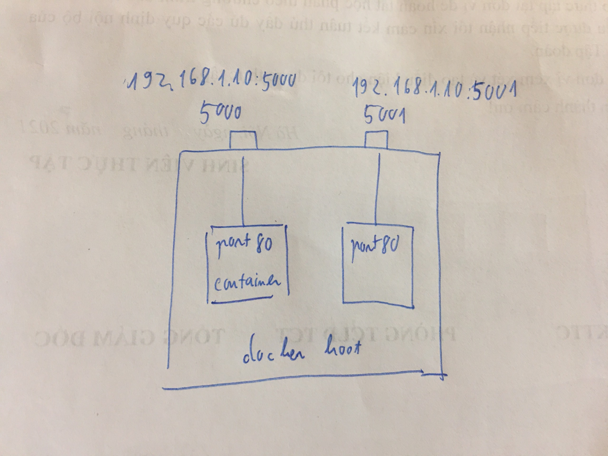
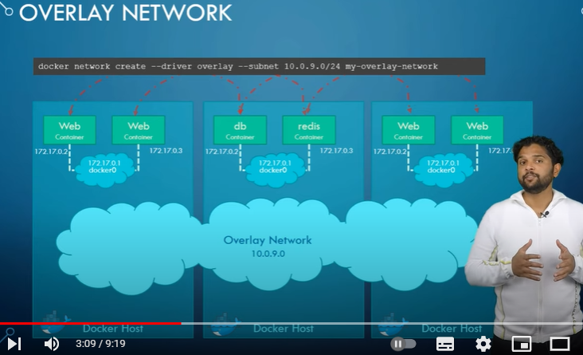
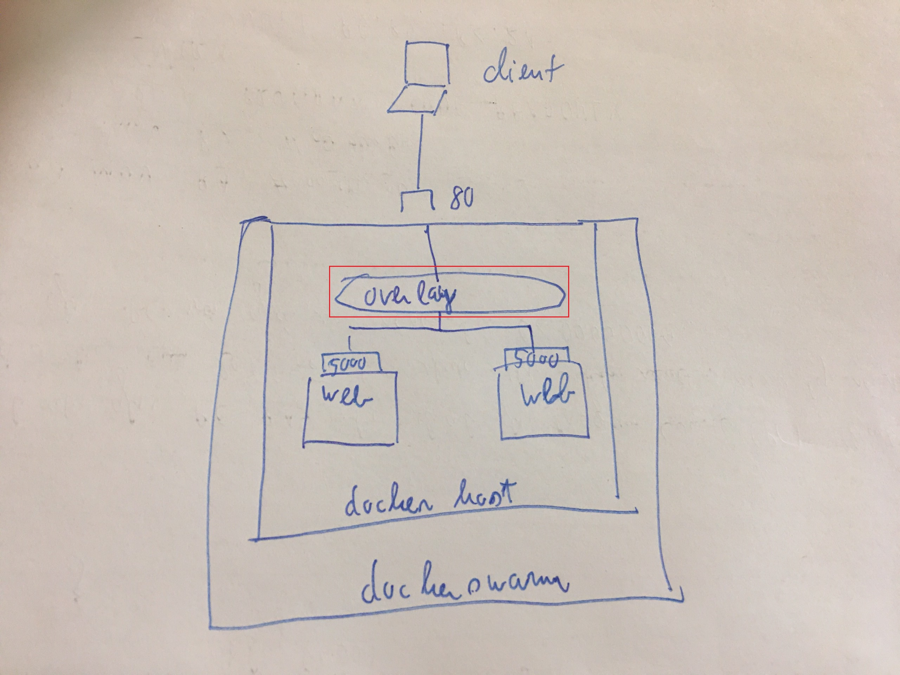
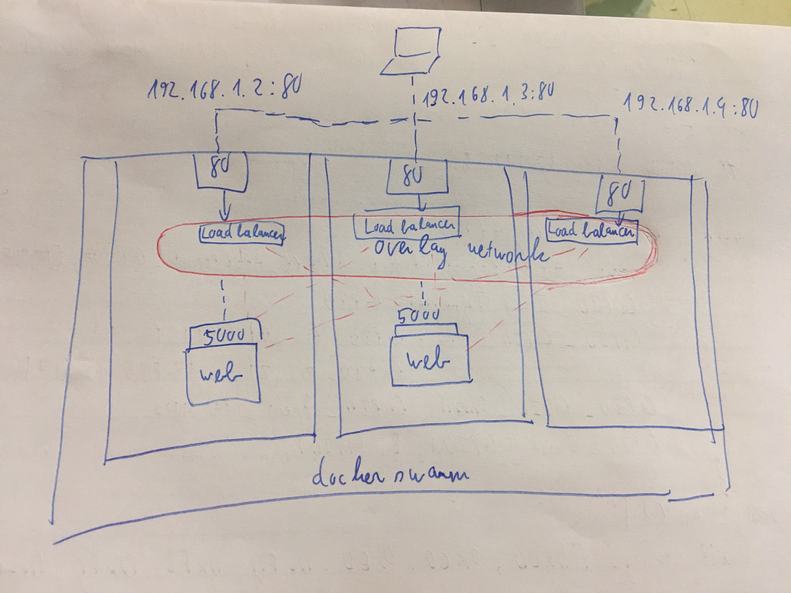
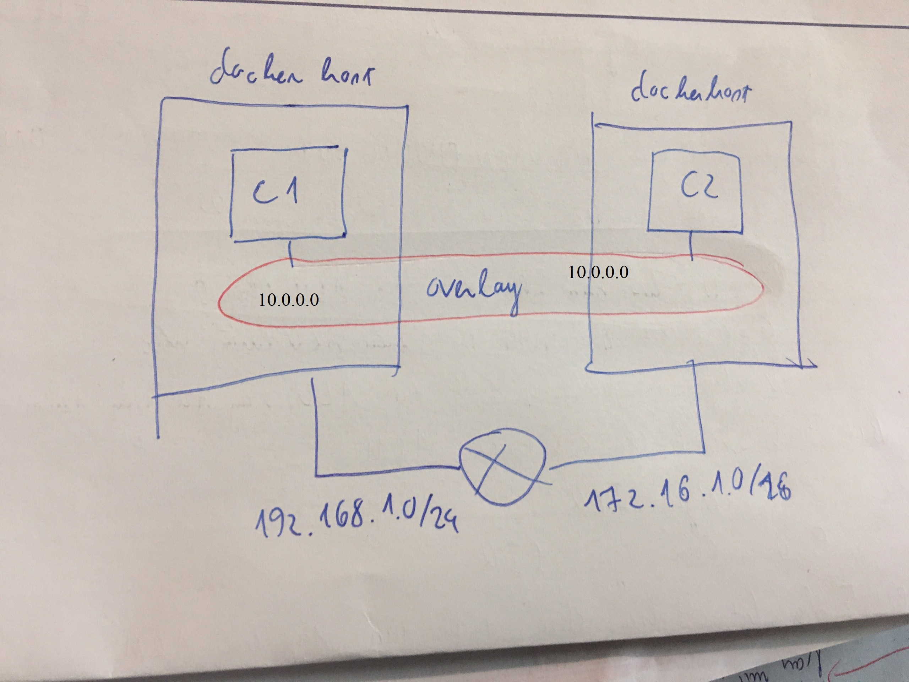
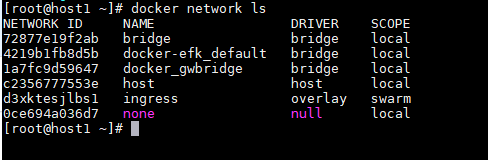

<h1 style="color:orange">Docker Network</h1>
<h2 style="color:orange">1. Bridge</h2>
Khi chúng ta khởi động docker deamon (thông qua sudo service docker start chẳng hạn) thì những step dưới đây sẽ diễn ra

- Virtual bridge docker0 sẽ được tạo ra
- Docker tự dộng tìm ra một khoảng ip range còn trống từ trong route của máy host
- Chọn ra random một khoảng ip bất kì (thường là 172.17.0.0/16)
- Assign khoảng ip đó cho docker0

Sau đó khi chúng ta khởi động một container bất kì, thì container đó sẽ được assign những thứ dưới đây:
- veth (Virtual Eithernet) interface gắn với docker0
- Một ip bất kì trong range mà docker0 vừa thu được ở trên

 
Khái niệm bridge trong docker là tất cả các container đều nối với 1 switch, switch này được 1 router cấp dhcp.

Mặc định khi tạo và chạy container mà không thêm option định nghĩa network. Container sẽ được gán vào network bridge mặc định mà docker tạo

    # docker network ls
 
Các container cùng mạng bridge có thể thấy và ping cho nhau (cùng nối với 1 switch)

Network bridge thường được dùng khi chỉ chạy các container trên 1 host
<h2 style="color:orange">2. Host</h2>
host network mode không hề tách biệt network stack của container với network của host chạy docker có nghĩa là các container chạy mode này và docker host sẽ cùng chia sẻ một network. Ví dụ, nếu bạn chạy một container và bind nó với cổng 80 và sử dụng host mode networking hay là host driver, ứng dụng trong container đó thực tế sẽ có thể truy cập thông qua cổng 80 với IP của docker host.

Chính vì container share cùng network namespace với nên khi bạn sử dụng host network, bạn sẽ không thể sử dụng port mapping khi chạy docker run hay sử dụng docker-compose.

host mode có thể sử dụng để tối ưu hóa hiệu suất làm việc của hệ thống vì nó không cần sử dụng cơ chế NAT để giao tiếp giữa container với request từ bên ngoài docker host.

host mode chỉ có thể được sử dụng trên host chạy Linux
 
Gỉa sử có docker host có địa chỉ 192.168.1.10. Docker host chạy 2 web service đều là port 80 trên container.

Vậy để truy cập 2 service này riêng biệt trên cùng 1 địa chỉ, ta gán 1 port container (port trong) với 1 port của docker host. Ví dụ:
- Muốn truy cập web service máy 1 ta vào địa chỉ: 192.168.1.10:5000
- Muốn truy cập web service máy 1 ta vào địa chỉ: 192.168.1.10:5001

Khi chạy 1 container, ta phải gán port cho nó

    # docker run -itd -p 9000:80 --name huynp centos:centos7
9000: port ngoài; 80 port trong.

Host network thường được sử dụng khi 1 máy bên ngoài muốn truy cập vào container trong docker host.
<h2 style="color:orange">3. Overlay network</h2>
Overlay network có thể hoạt động trên multi-hosts. Nó cho phép một network có thể trải rộng trên nhiều docker host khác nhau, vì vậy các container trên các docker hosts đó có thể giao tiếp với nhau thông qua layer 2.

Ovelay network là network mặc định khi chúng ta chạy docker với swarm mode (chạy một cluster gồm nhiều docker host), và nó có thể scale một cách rất dễ dàng, bằng việc chỉ cần chạy một vài command đơn giản.

Để tạo một network overlay, chúng ta chỉ cần chạy lệnh docker network create với options driver là -d overlay.
 

 
Ví dụ nếu có 2 container web service giống nhau cùng forward vào port 80. Mạng overlay sẽ hỗ trợ cân bằng tải cho 2 container (Nếu 1 container chết, mạng overlay sẽ điều hướng vào container còn lại).

 
3 docker host có địa chỉ lần lượt:
- 192.168.1.2 
- 192.168.1.3
- 192.168.1.4 
Trong đó, máy .2 và .3 chứa 1 web service giống nhau đều chạy trên port 5000 forward vào port 80. Các container host đều join vào 1 docker swarm. Client đẩy request vào 192.168.1.4. Mặc dù không có service web chạy trên host 1.4, nhưng mạng overlay tự động đẩy vào 2 con còn lại để query. Mạng overlay tự động mà không cần cấu hình.  
 

 
Mạng overlay chạy trong docker swarm, mặc định mạng overlay khi tạo mới có tên là ingress. Tương tự mạng bridge mặc định; các node trong swarm ko chỉ định mạng overlay nào sẽ kết nối đến mạng overlay này.
<h2 style="color:orange">4. MACVLAN</h2>
Mạng Macvlan cho phép chúng ta gán địa chỉ MAC cho container, điều này làm cho mỗi container như là một thiết bị vật lý trong mạng. Docker daemon định tuyến truy cập tới container bởi địa chỉ MAC. Sử dụng driver macvlan là lựa chon tốt khi các ứng dụng khác cần phải connect đến theo địa chỉ vật lý hơn là thông qua các lớp mạng của máy chủ.
<h2 style="color:orange">5. Các lệnh xem network</h2>
Kiểm tra xem container c1 đang trong network nào, có địa chỉ IP như thê nào:

    # docker inspect c1 -f "{{json .NetworkSettings.Networks }}"
Kiểm tra network test-net có những container nào đang sử dụng

    # docker network inspect test-net -f "{{json .Containers }}"
Gán và gỡ gán network

    # docker network disconnect test-net c1
    # docker network connect test-net-2 c1
