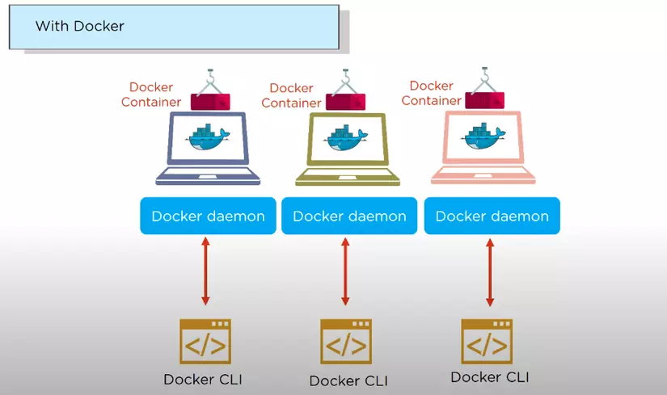
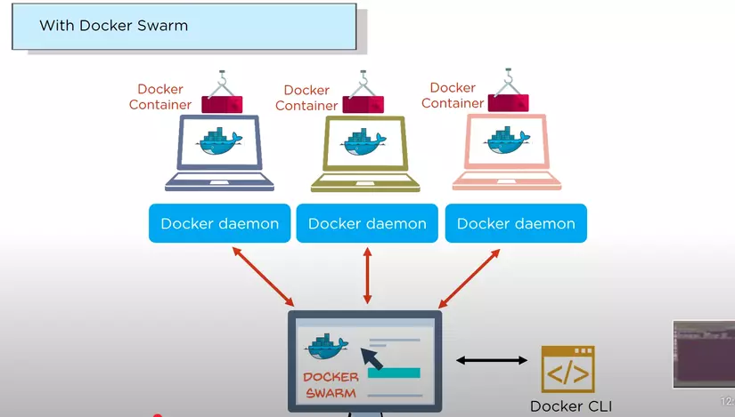
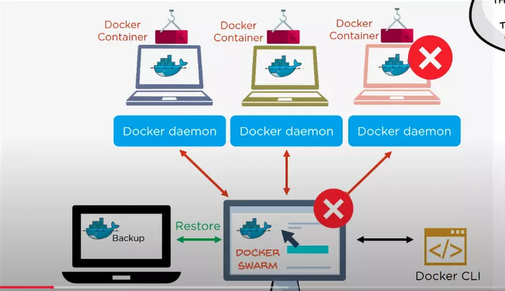
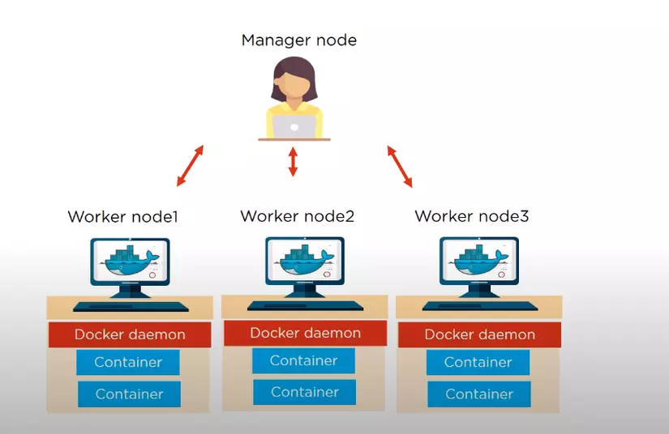
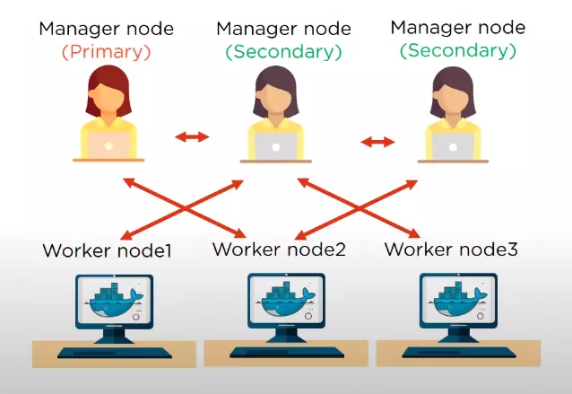

<h1 style="color:orange">Docker Swarm</h1>
<h2 style="color:orange">1. Docker Swarm là gì?</h2>
"Docker Swarm: là một service cho phép người dùng có thể tạo, quản lý tập chung cho Docker nodes và lịch trình cho các containers"

Mỗi node của một Docker Swarm là một Docker daemon và tất cả các Docker daemons đều sử dụng docker API. Các services có thể được deploy và có thể truy cập vào các nodes như nhau. 
 
Với việc quản lý bằng docker cơ bản, mỗi container sẽ được quản lý bằng các Docker CLI riêng biệt. 

 
Tuy nhiên khi sử dụng Docker Swarm các containers sẽ được quản lý bằng một Docker CLI chung.

 
Khi một node worker bị build lỗi, thì với một backup folder sẵn có trong node ta có thể sử dụng để restore data trên một node worker mới.
<h2 style="color:orange">2. Kiến trúc Docker Swarm</h2>

- Truy cập phi tập trung
- Tính bảo mật cao
- Auto load balancing
- Khả năng mở rộng cao
- Có khả năng rollback tiến trình

 
Kiến trúc docker swarm bao gồm:
1. Manage Node
2. Worker node
3. Docker daemon
4. Container

Các container được quản lý bởi các Docker daemon trong các Worker node đã được chia nhỏ và quản lý tập trung bởi Manage node. Mỗi khi chạy 1 service hay chạy 1 cụm service từ docker-compose sẽ thực thi lệnh trên swarm manager; swarm manager sẽ tạo container và chạy service trên các node worker.
<h2 style="color:orange">3. Docker Swarm hoạt động như thế nào?</h2>

- Manage node được hiểu node quản lý trạng thái của tất cả các Worker node trong cụm.
- Worker node chấp nhận các task được gửi từ Manage node.
- Mọi Worker node như một agent, tự động báo cáo trạnh thái task của node đến Manage node.
- Tất cả các Worker node giao tiếp với Manager node sử dụng API qua HTTP.

Các Manager node cũng được phân quyền theo từng cấp độ.
 

Các node secondary manager được dự phòng mỗi khi node manager primary down
<h2 style="color:orange">4. Thực hành với Docker Swarm</h2>

https://xuanthulab.net/tim-hieu-ve-docker-swarm-khoi-tao-va-su-dung.html