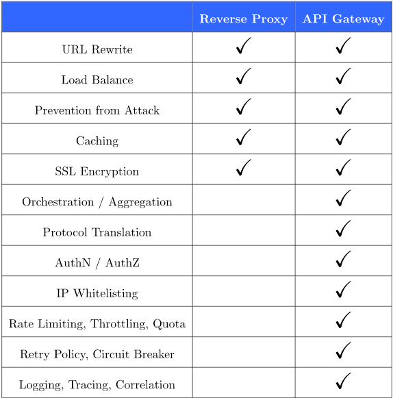

<h1 style="color:orange">So sánh API gateway và Reverse proxy</h1>

Link tham khảo: https://www.baeldung.com/cs/api-gateway-vs-reverse-proxy 
https://stackoverflow.com/questions/35756663/api-gateway-vs-reverse-proxy

<h2 style="color:orange">Reverse proxy</h2>
Lý do sử dụng reverse proxy là trung gian giữa client và backend servers. 
Tác dụng khi sử dụng reverse proxy:

- `Load balancing:` nó có vai trò phân phối request tới nhiều backend server, giảm tải cho các server. Ngoài ra, khi 1 backend server chết, reverse proxy đẩy request tới các server còn lại.
- `Bảo vệ khỏi tấn công:` thường được cài chương trình antivirus hoặc packet filter, chặn tấn công giữa internet và mạng nội bộ.
- `Caching:` khả năng cache dữ liệu -> giảm tải cho backend. CLient cũng lấy dữ liệu nhanh hơn.
- `SSL Encryption:` có thể được cấu hình để giải mã tất cả request tới và mã hóa các dữ liệu đầu ra, giải phóng tài nguyên cho backend.
Đến thời điểm này, nếu các khả năng này chưa đủ, API Gateway cung cấp nhiều hơn.
<h2 style="color:orange">API Gateway</h2>
Có thể coi API gateway như là bản nâng cấp của Reverse Proxy.

API Gateway giấu cách partition được sắp xếp khỏi client. Không chỉ forward request mà còn `tổng hợp` chúng (ví dụ API gateway gọi tới nhiều microservice rồi tổng hợp chúng lại rồi mới gửi cho client, thay vì chỉ đẩy đi thông thường với reverse proxy). Điều này đơn giản hóa client code và giảm đường đi của API (từ client đến từng microservice 1 và ngược lại). Thay vì client giao tiếp với nhiều backend, client chi giao tiếp với API gateway.

Tính năng nữa là `protocal translation`. API gateway có thể chuyển đổi giữa giao thức và giao thức (vd: XML to JSON, gRPC to JSON) để thuận tiện tích hợp giữa client và server

Với security"
- Aothentication và Authorization: giới hạn chỉ cho request gì
- IP Whitelisting: giới hạn IP truy cập 
Tiếp tục về hiệu năng:
- Rate limiting, throttling và quota: giới hạn tốc độ truy vấn, và dung lượng sử dụng -> chống tấn công ddos và thường sử dụng trong việc kinh doanh (giới hạn khả năng truy xuất dữ liệu của client)
- Retry policy và circuit breaker: gia tăng độ tin cậy và chắc chắn của dịch vụ 
Circuit breaker: ví dụ thông thường khi client gọi vào nhiều microservice, client sẽ đợi phản hồi của toàn bộ microservice rồi mới đánh giá success hay error. Khi gọi qua API gateway thì chỉ cần request fail -> các request khác ko gọi nữa mà trả về cho client fail luôn.
<h2 style="color:orange">Bảng so sánh</h2>

 