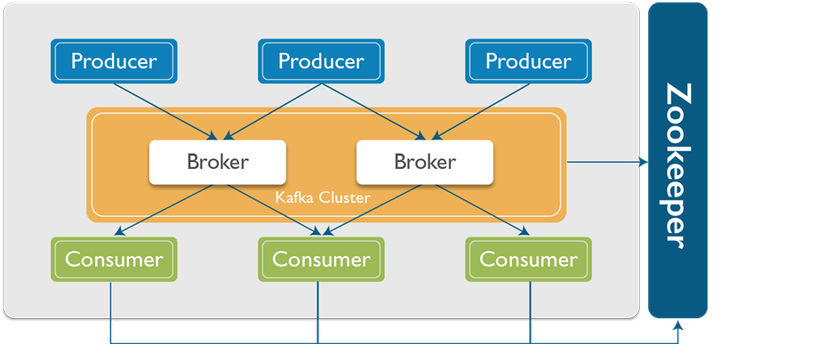
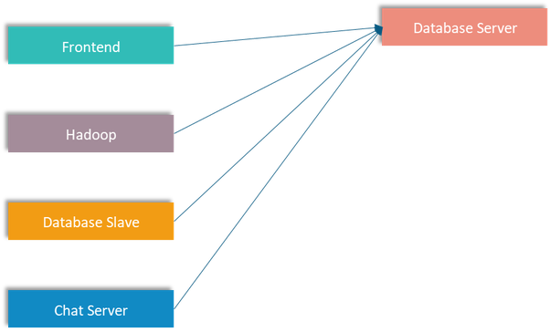
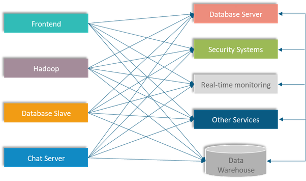
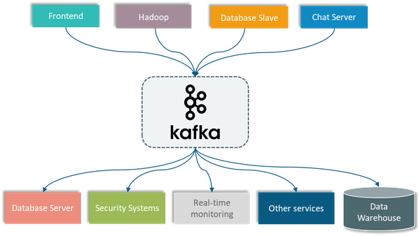

<h1 style="color:orange">Kafka là gì?</h1>
Apache Kafka là một hệ thống phân tán message – distributed messaging system, Kafka được phát triển và duy trì bởi Apache, vì thế Kafka (message broker) có tên là Apache Kafka. 

Kafka stream là một nền tảng streaming phân tán sự kiện – distributed event streaming platform. Được phát triển dựa trên nền tảng Apache Kafka distributed messaging system bởi Linkedin vào năm 2011, sau đó trở thành dự án mã nguồn mở của Apache. Cho đến thời điểm hiện tại, Apache Kafka được phân phối chính thức và đầy đủ nhất bởi Confluent thông qua Confluent Platform.

Nền tảng Kafka stream được viết bởi ngôn ngữ Scala và Java nhằm mục đích cung cấp dịch vụ xử lý sự kiện dựa trên thời gian thực với độ trễ thấp và thông lượng cao. Vì thế, Kafka được hơn 80% doanh nghiệp trong top 100 của Fortune tin dùng

Bên public dữ liệu được gọi là producer, bên subscribe nhận dữ liệu theo topic được gọi là consumer. Kafka có khả năng truyền một lượng lớn message theo thời gian thực, trong trường hợp bên nhận chưa nhận message vẫn được lưu trữ sao lưu trên một hàng đợi và cả trên ổ đĩa bảo đảm an toàn. Đồng thời nó cũng được replicate trong cluster giúp phòng tránh mất dữ liệu.

 
<h2 style="color:orange">1. Các khái niệm trong kafka</h2>

- `PRODUCER`: Kafka lưu, phân loại message theo `topic`, sử dụng `producer` để publish message vào các topic. Dữ liệu được gửi đển partition của topic lưu trữ trên Broker.
- `CONSUMER`: Kafka sử dụng `consumer` để subscribe vào topic, các `consumer` được định danh bằng các group name. Nhiều `consumer` có thể cùng đọc một topic.
- `TOPIC`: Dữ liệu truyền trong Kafka theo topic, khi cần truyền dữ liệu cho các ứng dụng khác nhau thì sẽ tạo ra các topic khác nhau.
- `PARTITION`: Đây là nơi dữ liệu cho một topic được lưu trữ. Một topic có thể có một hay nhiều partition. Trên mỗi partition thì dữ liệu lưu trữ cố định và được gán cho một ID gọi là offset. Trong một Kafka cluster thì một partition có thể replicate (sao chép) ra nhiều bản. Trong đó có một bản leader chịu trách nhiệm đọc ghi dữ liệu và các bản còn lại gọi là follower. Khi bản leader bị lỗi thì sẽ có một bản follower lên làm leader thay thế. Nếu muốn dùng nhiều consumer đọc song song dữ liệu của một topic thì topic đó cần phải có nhiều partition.
- `BROKER`: Kafka cluster là một set các server, mỗi một set này được gọi là 1 broker
- `ZOOKEEPER`: được dùng để quản lý và bố trí các broker. 
Để một producer/consumer ghi/đọc message từ một partition, chắc chắn chúng cần phải biết leader là ai phải không? Thông tin này cần phải có sẵn ở một vị trí nào đó. 
Kafka lưu trữ những thông tin như vậy là metadata trong một dịch vụ gọi là Zookeeper.
<h2 style="color:orange">2.  Lợi ích của kafka</h2>
Kafka là dự án opensoure, đã được đóng gói hoàn chỉnh, khả năng chịu lỗi cao, hiệu năng rất tốt và dễ dàng mở rộng mà không cần dừng hệ thống.

Một vài use case của kafka:
- Sử dụng như một hệ thống message queue thay thế cho ActiveMQ hay RabbitMQ
- Website Activity Monitoring: theo dõi hoạt động của website
- Stream Processing: Kafka là một hệ thống rất thích hợp cho việc xử lý dòng dữ liệu trong thời gian thực. Khi dữ liệu của một topic được thêm mới ngay lập tức được ghi vào hệ thống và truyền đến cho bên nhận. Ngoài ra Kafka  còn là một hệ thống có đặc tính duribility dữ liệu có thể được lưu trữ an toàn cho đến khi bên nhận sẵn sàng nhận nó.
- Log Aggregation: tổng hợp log
Metrics Collection: thu thập dữ liệu, tracking hành động người dùng như các thông số như page view, search action của user sẽ được publish vào một topic và sẽ được xử lý sau
- Event-Sourcing: Lưu lại trạng thái của hệ thống để có thể tái hiện trong trường hợp system bị down.
<h2 style="color:orange">3.  Mô hình hoạt động thường thấy của kafka</h2>
Một hệ thống thương mại điện tử có nhiều server thực hiện các tác vụ khác nhau. Tất cả các server này đều sẽ giao tiếp với database server để đọc ghi dữ liệu.

Vì vậy sẽ có rất nhiều data pipeline kết nối từ rất nhiều server khác đến database server này. Cơ cấu như sau:

 
Nhưng trong thực tế, hệ thống thương mại điện tử sẽ còn phải kết nối đến một vài server khác nữa như là

 
Lúc này data pipeline sẽ phức tạp khủng khiếp do gia tăng lượng hệ thống server. Lúc này nếu ta sử dụng Kafka tách rời các data pipeline giữa các hệ thống để làm cho việc giao tiếp giữa các hệ thống trở nên đơn giản hơn và dễ quản lý hơn.
 
<h2 style="color:orange">4. Zookeeper</h2>
Zookeeper đóng vai trò là nơi lưu trữ dữ liệu phân tán dạng key-value. Nó được tối ưu hóa cho tác vụ đọc nhanh nhưng ghi chậm. Kafka sử dụng Zookeeper để thực hiện việc bầu chọn leader của Kafka broker và topic partition. Zookeeper cũng được thiết kế cho khả năng chịu lỗi cao, do đó Kafka phụ thuộc khá nhiều vào Zookeeper.

Nó cũng được sử dụng để lưu trữ tất cả metadata như là:

Offset cho mỗi partition của consumer groupACL (Access control list) – được sử dụng cho việc giới hạn truy cập/ủy quyềnQuota của consumer/producer – số lượng message tối đa mỗi giâyPartition Leader và trạng thái của chúng
Producer và consumer không tương tác trực tiếp với Zookeeper để biết leader của partition hay những metadata khác, thay vào đó chúng sẽ truy vấn metadata tới Kafka broker – sau đó Kafka tương tác với Zookeeper và gửi phản hồi metadata về lại cho chúng.