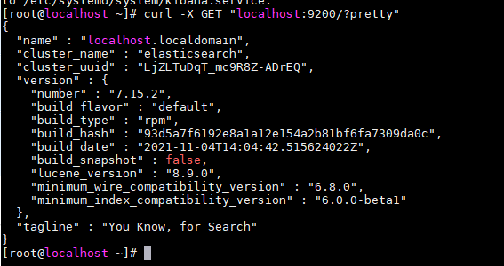
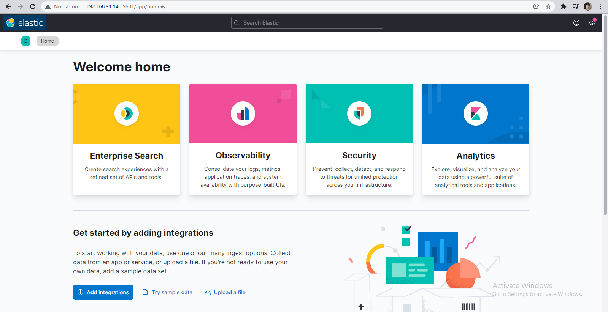
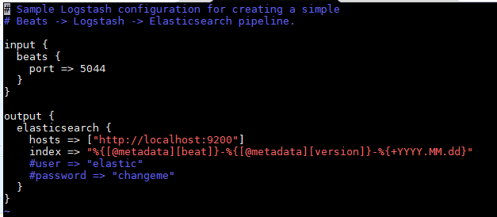
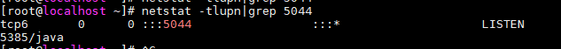

<h1 style="color:orange">Cài đặt ELK stack</h1>
Chuẩn bị: 

- elk host: 192.168.45.153/24
- client host: 192.168.45.153/tcp

<h1 style="color:orange">Trên elk host</h1>
<h2 style="color:orange">1. Cài đặt Elasticsearch</h2>
Cài đặt và install public key

    # rpm --import https://artifacts.elastic.co/GPG-KEY-elasticsearch
Tạo repository của elasticsearch

    # vim /etc/yum.repos.d/elasticsearch.repo
paste vào

    [elasticsearch]
    name=Elasticsearch repository for 7.x packages
    baseurl=https://artifacts.elastic.co/packages/7.x/yum
    gpgcheck=1
    gpgkey=https://artifacts.elastic.co/GPG-KEY-elasticsearch
    enabled=0
    autorefresh=1
    type=rpm-md
Cài elasticsearch

    # yum install --enablerepo=elasticsearch elasticsearch -y
Chỉnh sửa file cấu hình elasticsearch

    # vim /etc/elasticsearch/elasticsearch.yml
chỉnh sửa

    bootstrap.memory_lock: true
    network.host: 0.0.0.0
    http.port: 9200
    transport.host: localhost
    transport.tcp.port: 9300
    action.auto_create_index: .monitoring*,.watches,.triggered_watches,.watcher-history*,.ml*
Cấu hình firewalld

    # firewall-cmd --permanent --add-port=9200/tcp
    # firewall-cmd --reload
Bật elasticsearch

    # systemctl start elasticsearch
    # systemctl enable elasticsearch
Để kiểm tra sử dụng lệnh

    curl -X GET "localhost:9200/?pretty"
 
kết quả ra như trên là thành công
<h2 style="color:orange">2. Cài đặt Kibana</h2>
Tạo repository của kibana

    # vim /etc/yum.repos.d/kibana.repo
paste vào

    [kibana-7.x]
    name=Kibana repository for 7.x packages
    baseurl=https://artifacts.elastic.co/packages/7.x/yum
    gpgcheck=1
    gpgkey=https://artifacts.elastic.co/GPG-KEY-elasticsearch
    enabled=1
    autorefresh=1
    type=rpm-md
Cài kibana

    # yum install -y kibana
Chỉnh sửa file cấu hình kibana

    # vim /etc/kibana/kibana.yml
paste vào

    server.port: 5601
    server.host: 0.0.0.0
    elasticsearch.hosts: "http://localhost:9200"
Ở đây localhost là địa chỉ IP của elasticsearch host. Tuy vậy, ta thường cài elasticsearch và kibana trên cùng 1 host.

Cấu hình firewall

    # firewall-cmd --permanent --add-port=5601/tcp
    # firewall-cmd --reload
Mặc định kibana hoạt động trên port 5601

    # systemctl start kibana
    # systemctl enable kibana

Để kiểm tra

    # netstat -apn|grep 5601
 
Vào trình duyệt 
 
    http://192.168.45.131:5601
 
<h2 style="color:orange">3. Cài đặt logstash</h2>

    # yum install -y logstash
Cấu hình logstash

    # cp /etc/logstash/logstash-sample.conf /etc/logstash/conf.d/logstash.conf
    # vim /etc/logstash/conf.d/logstash.conf
Cấu hình 

    input {
      beats {
        port => 5044
      }
    }

    output {
      elasticsearch {
        hosts => ["http://localhost:9200"]
        index => "%{[@metadata][beat]}-%{[@metadata][version]}-%{+YYYY.MM.dd}"
        #user => "elastic"
        #password => "changeme"
      }
    }
 
Cấu hình firewall

    # firewall-cmd --permanent --add-port=5044/tcp
    # firewall-cmd --reload

    # systemctl start logstash
    # systemctl enable logstash
Đợi 1 lúc để kiểm tra

    # netstat -tlupn|grep 5044
 