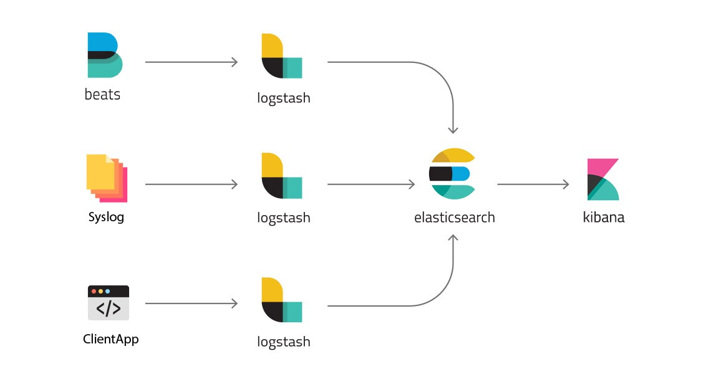
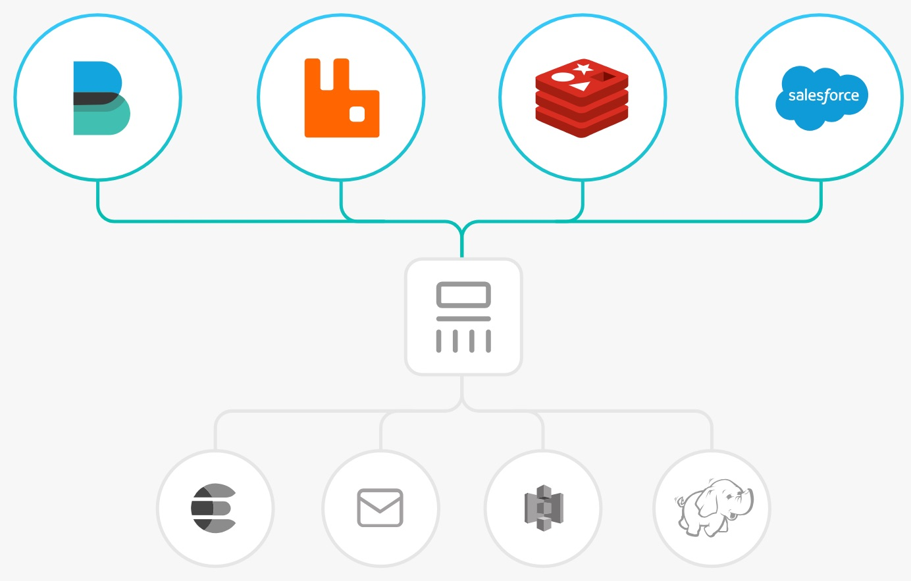
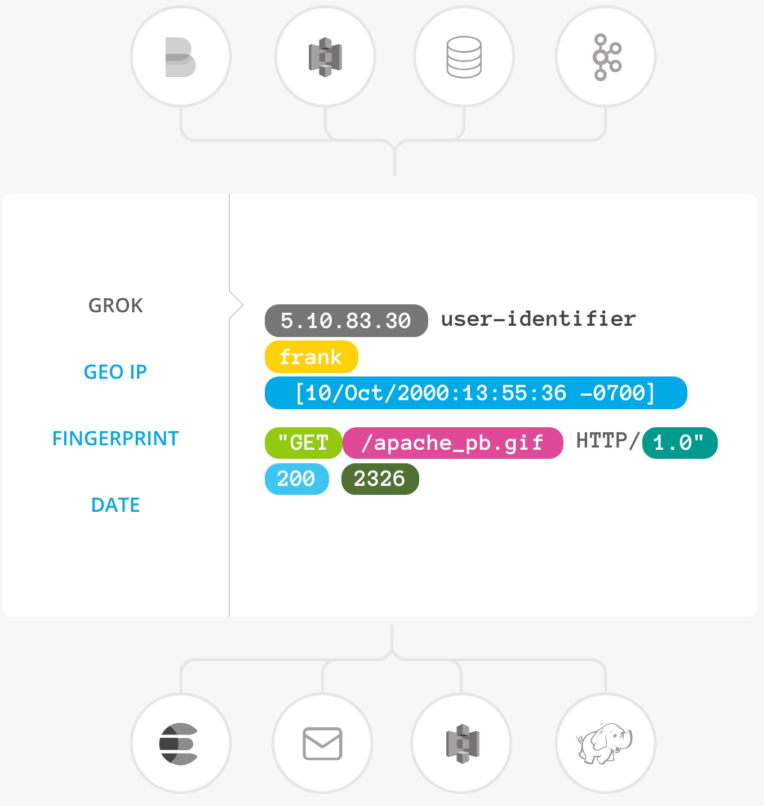
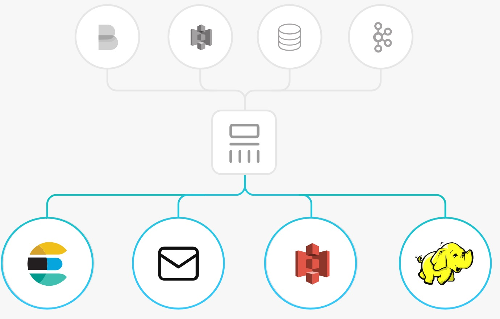
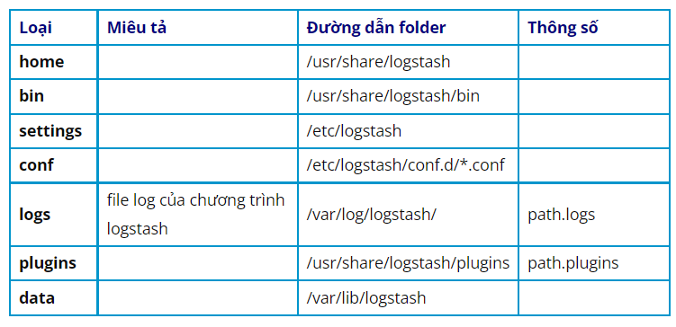

<h1 style="color:orange">Tổng quan Logstash</h1>

 
Logstash là một chương trình mã nguồn mở, nằm trong hệ sinh thái của bộ sản phẩm ELK Stack, với nhiệm vụ rất quan trọng bao gồm ba giai đoạn trong chuỗi xử lý sự kiện log (pipeline) tương ứng ba module:

- `INPUT:` tiếp nhận/thu thập dữ liệu sự kiện log ở dạng thô từ các nguồn khác nhau như file, redis, rabbitmq, beats, syslog,….
- `FILTER:` Sau khi tiếp nhận dữ liệu sẽ tiến hành thao tác dữ liệu sự kiện log (như thêm, xoá, thay thế,.. nội dung log) theo cấu hình của quản trị viên để xây dựng lại cấu trúc dữ liệu log event theo mong muốn.
- `OUTPUT:` Sau cùng sẽ thực hiện chuyển tiếp dữ liệu sự kiện log về các dịch vụ khác như Elasticsearch tiếp nhận lưu trữ log hoặc hiển thị log,...
<h2 style="color:orange">2. Workflow xử lý pipeline</h2>

 
Ở bước INPUT, Logstash sẽ được cấu hình lựa chọn hình thức tiếp nhận log event hoặc đi lấy dữ liệu log ở dịch remote theo nhu cầu. Sau khi lấy được log event thì , khâu INPUT sẽ ghi dữ liệu event xuống hàng đợi tập trung ở bộ nhớ RAM hoặc trên ổ cứng.

Mỗi pipeline worker thread sẽ tiếp tục lấy một loạt sự kiện đang nằm trong hàng đợi này để xử lý FILTER giúp tái cấu trúc dữ liệu log sẽ được gửi đi ở phần OUTPUT. Số lượng sự kiện được xử lý một loạt và số lượng pipeline worker thread có thể được cấu hình tinh chỉnh tối ưu hơn.

Mặc định Logstash sử dụng hàng đợi nằm trong bộ nhớ RAM giữa các giai đoạn (input -> filter và filter -> output) để làm bộ đệm lưu trữ dữ liệu event trước khi xử lý. Nếu mà chương trình dịch vụ Logstash của bạn vì một lý do nào đó bị dừng hoạt động giữa chừng, thì các dữ liệu event đang nằm trong buffer sẽ bị mất.
<h3 style="color:orange">2.1. INPUT</h3>

 
Bạn sẽ sử dụng phần cấu hình block ‘INPUT’ để quy định cơ chế nhận/lấy log vào chương trình Logstash. Một số Input plugin phổ biến thường được sử dụng để nhận/lấy log như:

- file: đọc dữ liệu từ file trên filesystem, giống lệnh ‘tail -f’ trên UNIX.
- syslog: chương trình Logstash sẽ lắng nghe trên port 514 để tiếp nhận dữ liệu syslog.
- redis: đọc dữ liệu log từ redis server, sử dụng cả 2 cơ chế redis channel và redis lists.
- beats: xử lý các dữ liệu thông tin được gửi từ chương trình Beats (một sản phẩm nổi tiếng trong hệ thống ELK)

Logstash có hỗ trợ khá nhiều loại plugin input khác nhau giúp bạn linh động trong việc nhận nguồn dữ liệu log.
<h3 style="color:orange">2.2. Filter</h3>

 
Có thể kết hợp filter với các điều kiện so sánh nhằm thực hiện 1 tác vụ hành động (action) khi một sự kiện thoả mãn khớp với các tiêu chí do bạn đưa ra. Một số filter plugin hữu ích như:

- grok: Nếu bạn gặp một dữ liệu sự kiện log với cấu trúc văn bản không phổ biến hoặc là phức tạp, thì Grok hiện là plugin filter tốt nhất để phân tích cú pháp dữ liệu log không được cấu trúc văn bản thành một thứ có cấu trúc và có thể truy vấn được.
- mutate: thực hiện sự thay đổi trên thông tin sự kiện log như: đổi tên, xoá, thay thế, tinh chỉnh các trường (field) thông tin của sự kiện log.
- drop: dừng xử lý sự kiện ngay lập tức, ví dụ các ‘debug event’.
- clone: tạo một bản copy của sự kiện.
- geoip: thêm thông tin về vị trí địa lý của địa chỉ IP (thường để hiển thị biểu đồ trên Kibana).
<h3 style="color:orange">2.3. Outputs</h3>

 
Output là bước cuối cùng trong chuỗi các bước xử lý của Logstash. Một sự kiện có thể đưa qua nhiều output khác nhau, tiếp đây là các Output plugin hay sử dụng.

- Elasticsearch: gửi dữ liệu sự kiện đến hệ thống Elasticsearch. Tất nhiên đầu cuối của hệ thống logging ELK thường là Elasticsearch giúp bạn lưu trữ log, tìm kiếm log, …
- file: nếu bạn chả cần bất kì sự lưu trữ log cho việc tìm kiếm, hiển thị,… thì có thể lưu ra file trên hệ thống.
- graphite: gửi dữ liệu tới graphite, một trong những tool mã nguồn mở hỗ trợ việc lưu trữ và tạo biểu đồ metric.
- statsd: gửi dữ liệu tới dịch vụ ‘statsd’.
<h2 style="color:orange">3. Cấu trúc thư mục logstash</h2>
cấu trúc thư mục mặc định của Logstash khi được cài đặt từ file .rpm (RHEL/CentOS)

 
<h2 style="color:orange">4. Cấu trúc thư mục logstash</h2>
Logstash có 2 loại file cấu hình : pipeline config file dùng để định nghĩa quá trình xử lý log pipeline ; setting file dùng để cấu hình các thông số liên quan đến hoạt động và khởi động của Logstash.
<h3 style="color:orange">4.1. Pipeline configuration file</h3>
Thư mục chứa cấu hình xử lý pipeline bởi Logstash nằm ở thư mục : /etc/logstash/conf.d/ . Mặc định Logstash sẽ chỉ load cấu hình của các file có đuôi extension là ‘.conf‘

 
<h3 style="color:orange">4.2. File tinh chỉnh dịch vụ Logstash</h3>
Các file cấu hình của dịch vụ Logstash nằm ở thư mục : /etc/logstash/ . Dưới đây là vài file cơ bản quan trọng khi cấu hình chạy Logstash.

- logstash.yml : file này chứa các cấu hình chung dành cho dịch vụ Logstash.
- pipelines.yml : file này cấu hình thư mục chạy pipeline, số lượng pipeline chạy đồng thời, hình thức chạy pipeline,..
- jvm.options : chứa cấu hình Java Virtual Machine (JVM). Sử dụng file này để thay đổi các thông số liên quan đến heap space, thường quan trọng trong việc tối ưu hoá dịch vụ logstash.
<h3 style="color:orange">4.3. Log của Logstash</h3>

Nếu bạn cài Logstash theo ‘.rpm‘ hoặc ‘.deb‘ đã được đóng gói, thì file log của dịch vụ Logstash nằm ở : `/var/log/logstash/`

Nếu bạn chỉ download logstash source và chạy thì nó nằm ở thư mục tương ứng biến môi trường: `$LS_HOME/logs/`