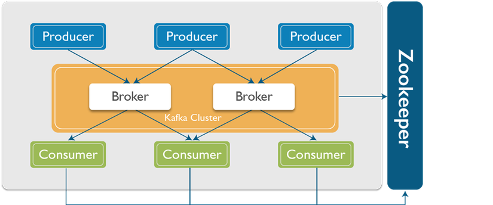
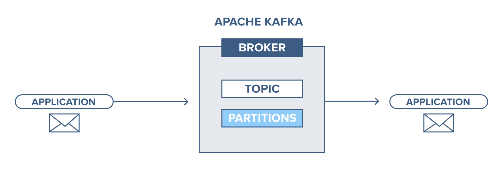
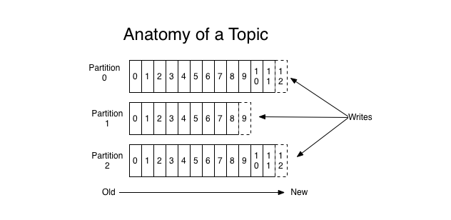
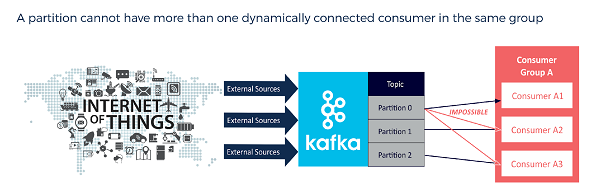
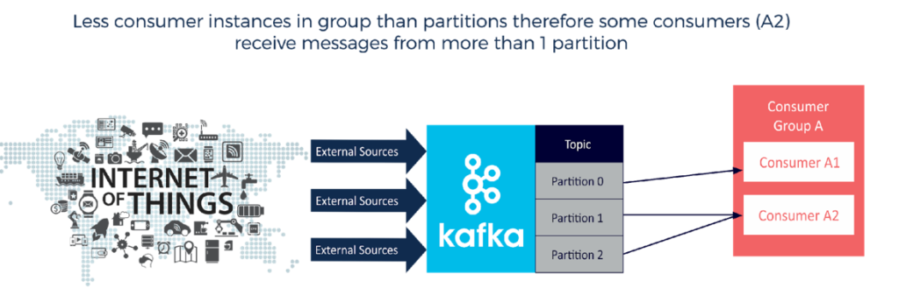
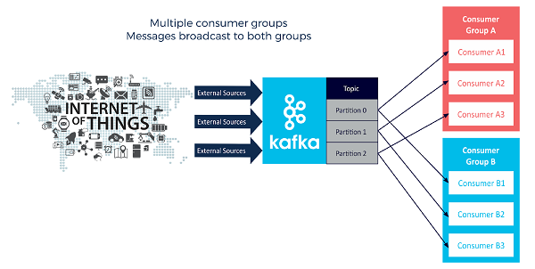
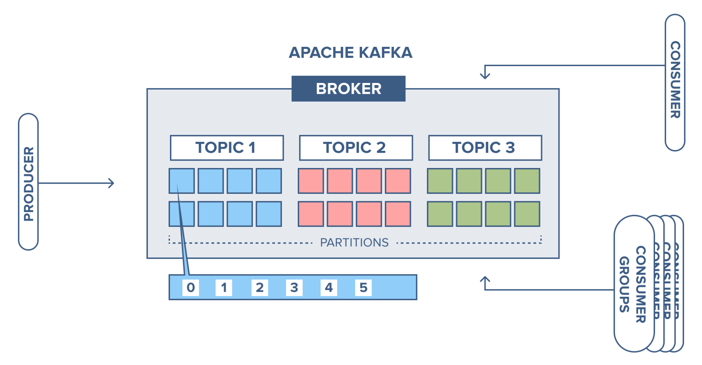
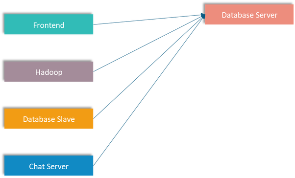
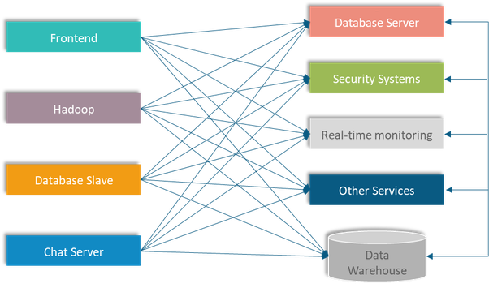
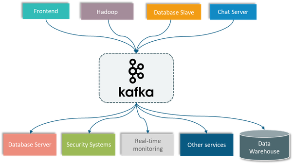

<h1 style="color:orange">Kafka</h1>
<h2 style="color:orange">1. Lịch sử hình thành và phát triển</h2>
Apache Kafka được viết bằng Scala và Java và là sự sáng tạo của các cựu kỹ sư dữ liệu LinkedIn. Ngay từ năm 2011, công nghệ này đã được chuyển giao cho cộng đồng nguồn mở như một hệ thống messaging có khả năng mở rộng cao. Ngày nay, Apache Kafka xử lý hàng nghìn tỷ event mỗi ngày. Apache Kafka đã khẳng định được vị thế của mình trên thị trường với nhiều công ty đáng tin cậy tin dùng.

Data và log liên quan đến các hệ thống phức tạp ngày nay phải được xử lý, reprocess, phân tích - thường theo thời gian thực. Và đó là lý do tại sao Apache Kafka đang đóng một vai trò quan trọng trong bối cảnh phát trực tuyến tin nhắn. Các nguyên tắc thiết kế chính của Kafka được hình thành dựa trên nhu cầu ngày càng tăng về các kiến ​​trúc thông lượng cao có thể dễ dàng mở rộng và cung cấp khả năng lưu trữ, xử lý và tái xử lý dữ liệu truyền trực tuyến.

 
<h2 style="color:orange">2. Kafka là gì</h2>
Apache Kafka hệ thống publish-subcribe. Một hệ thống nhắn tin giữa các processes, apps và server.

 
Message của kafka được lưu trên đĩa cứng trong một khoảng thời gian được định sẵn (có thể tùy chỉnh), đồng thời được replicate trong cluster giúp phòng tránh mất dữ liệu.

Kafka có thể hiểu là một hệ thống logging, nhằm lưu lại các trạng thái của hệ thống, nhằm phòng tránh mất thông tin.

Các khái niệm cơ bản :
- Kafka lưu, phân loại message theo topics.
- Kafka sử dụng producers để publish message vào các topics ở trên.
- Kafka sử dụng consumers để subscribe vào topics, sau đó xử lý các message lấy được theo một logic nào đó.
- Kafka thường được chạy dưới dạng cluster, khi đó mỗi server trong đó sẽ được gọi là broker.
- Record (messages) được lưu dưới dạng byte có thể lưu ở dạng bất kì. Một record có 4 thành phần: key và value là thành phần chính, mốc thời gian và header có thể có hoặc không. Value có thể là bất kì giá trị gì: JSON hoặc text. 
- Kafka lưu dữ liệu vào disk nên nó sẽ được lợi từ tốc độ đọc/ghi của disk.
<h2 style="color:orange">3. Các thành phần trong kafka</h2>

- `BROKER`: Xử lý mội request từ client (produce, consume và metadata) và giữ data replicate trong cluster. Thường khi dùng kafka, người ta dùng cluster.
- `ZOOKEEPER`: được dùng để quản lý và bố trí các broker, topic, user.
- `PRODUCER`: Gửi record đến Broker.
- `CONSUMER`: Lấy record đồng thời từ broker.
<h2 style="color:orange">3.1. Kafka broker</h2>
Kafka cluster bao gồm 1 hoặc nhiều server chạy Kafka. Producer đẩy record đến kafka topic chứa trên broker. Một consumer đọc record từ Kafka topic. Thường chạy cluster để có data replication. 

 
Zookeeper quản lý các broker. Có thể có nhiều zookeeper trong cluster, thường là 3-5 (số lẻ)
<h2 style="color:orange">3.2.  Kafka topic</h2>
Topic có thể hiểu là một ngôn ngữ chung giữa producer (người nói) và consumer (người nghe, sử dụng). Với mỗi topic, kafka sẽ duy trì thông qua partitioned log như dưới đây:

 

Mỗi partition là một chuỗi log, có thứ tự và không thể thay đổi (immutable).

Mỗi message trong partition sẽ có id tăng dần , gọi là offset.

Kafka cluster sẽ lưu lại mọi message đã được published, cho dù message đó đã được/chưa được sử dụng (consume). Thời gian lưu message có thể tuỳ chỉnh được thông qua log retention.

Consumer sẽ điều khiển những gì mình muốn đọc thông qua offset của message, hay thậm chí là thứ tự đọc. Consumer có thể reset lại vị trí của offset để re-process lại một vài message nào đó.

Consumer sẽ đọc message từ topic nó subcribe. Topic được xác định bằng unique name.
<h3 style="color:orange">3.2.1. Kafka topic partition</h3>
Kafka topic được chia thành các partition, là nơi lưu trữ các record theo 1 chuỗi không đổi. Mỗi record trong partition được đánh số và định dạng bởi 1 offset duy nhất. Một topic có thể có nhiều partition. Điều này cho phép nhiều consumer đọc từ topic cùng 1 lúc.

Partition cho phép topic đọc cùng lúc bằng cách chia dữ liệu vào topic cố định giữa các broker.

Trong kafka, replication diễn ra với partition. Mỗi partition thường có 1 hoặc nhiều bản replica; nghĩa là mỗi partition chứa record được replicate qua những broker trong cluster.

Mỗi partition (replica) có 1 server đại diện như 1 leader và các server còn lại là followers. Nếu leader fail, 1 trong các follower server trở thành leader. Nên cố gắng để có sự cân bằng số leader để mỗi broker là một leader của một partition (1 broker có thể là leader của nhiều partition).

Khi 1 producer đẩy 1 record vào topic, nó được đẩy vào leader. Leader đính record vào commit log và đồng thời đánh offset cho nó. Kafka chỉ cho consumer nhìn thấy record sau khi nó đã được commit vào partition.

Một producer phải biết partition nào để ghi vào, không phải dựa vào broker. Producer gắn 1 key vào record chỉ ra rằng record sẽ chạy vào partition nào. Tất cả record có cùng key sẽ đi vào cùng 1 partition. Trước khi producer gửi 1 record nào, nó phải request metadata của cluster từ broker. Metadata chứa thông tin broker nào chứa leader partition và producer luôn ghi vào leader partition. Producer dùng key để biết ghi vào partition nào, phương thức cơ bản nhất là dùng mã hash của key để tính partition, hoặc cũng có thể chỉ định ghi vào partition nào.

Lỗi thường gặp khi đẩy record là việc cấu hình cùng 1 key hoặc null key với mọi record, kết quả là một topic quá lớn.
<h2 style="color:orange">3.3.  Consumer và consumer group</h2>
Consumer có thể đọc message bắt đầu từ một offset cụ thể và được cho phép đọc từ bất cứ thời điểm offset nào.

Consumer group bao gồm 1 hoặc nhiều consumer. Consumer group được tạo bằng cách thêm `"group.id"` vào 1 consumer. Cùng `"group.id"` nghĩa là cùng group.

Broker sẽ phân phối dựa vào consumer nào nên đọc từ partition nào và nó cũng track xem group đang ở offset nào với mỗi partition. Nó track bằng cách xem xem tất cả consumer commit xem chúng đang ở offset nào.

Every time a consumer is added or removed from a group the consumption is rebalanced between the group. All consumers are stopped on every rebalance, so clients that time out or are restarted often will decrease the throughput. Make the consumers stateless since the consumer might get different partitions assigned on a rebalance.

Consumer kéo record từ topic partition. Consumer khác nhau chịu trách nhiệm với partition khác nhau. Kafka hỗ trợ số consumer lớn và giữ lại số lượng lớn data với overhead nhỏ. Bằng cách dùng consumer group, consumer có thể đọc song song từ nhiều partition trong 1 topic, cho phép throughput record lớn. Số lượng partition luôn lớn hơn số lượng consumer.

Record không phải được đẩy đến consumer, record sẽ được gửi đến consumer khi consumer hỏi và sẵn sàng xử lý. 
-----> Consumer sẽ không bao giờ bị quá tải hay mất dữ liệu vì record được xếp hàng (queue) trong kafka. Nếu consumer bị tụt hậu so với record thực tế. Nó được phép lựa chọn bắt kịp dữ liệu thời gian thực ngay lập tức.

`Lưu ý:` Khuyến nghị cấu hình 1 partition được đọc bởi 1 consumer trong 1 group 
 

Tuy vậy, 1 consumer trong 1 group có thể đọc nhiều partition 1 lúc 
 
1 partition có thể được đọc bởi các consumer trong các group khác nhau 
 
Đó là lý do người ta chia consumer group, nếu không, tất cả consumer phải đợi theo queue, consumer trước đọc xong, consumer sau mới được đọc.
<h2 style="color:orange">4. Zookeeper</h2>
Zookeeper đóng vai trò là nơi lưu trữ dữ liệu phân tán dạng key-value. Nó được tối ưu hóa cho tác vụ đọc nhanh nhưng ghi chậm. Kafka sử dụng Zookeeper để thực hiện việc bầu chọn leader của Kafka broker và topic partition. Zookeeper cũng được thiết kế cho khả năng chịu lỗi cao, do đó Kafka phụ thuộc khá nhiều vào Zookeeper.

Nó cũng được sử dụng để lưu trữ tất cả metadata như là:

Offset cho mỗi partition của consumer groupACL (Access control list) – được sử dụng cho việc giới hạn truy cập/ủy quyềnQuota của consumer/producer – số lượng message tối đa mỗi giây Partition Leader và trạng thái của chúng

Producer và consumer không tương tác trực tiếp với Zookeeper để biết leader của partition hay những metadata khác, thay vào đó chúng sẽ truy vấn metadata tới Kafka broker – sau đó Kafka tương tác với Zookeeper và gửi phản hồi metadata về lại cho chúng.
<h2 style="color:orange">5. Luồng dữ liệu kafka</h2>
Ví dụ có 1 broker với 3 topic, mỗi topic có 8 partition.

 
Producer gửi record tới partition 1 trong topic 1 và khi partition trống, record được đánh offset 0.

 
Record tiếp theo được thêm vào partition 1 được đánh số 1, record tiếp theo đánh số 2,...

 
Điều này được gọi là commit log, mỗi record được gắn với log và không cách nào có thể thay đổi record trong log. Đây cũng là off mà consumer dùng để quyết định đọc từ đâu.
<h2 style="color:orange">5. Mô hình hoạt động thường thấy của kafka</h2>
Một hệ thống thương mại điện tử có nhiều server thực hiện các tác vụ khác nhau. Tất cả các server này đều sẽ giao tiếp với database server để đọc ghi dữ liệu.

Vì vậy sẽ có rất nhiều data pipeline kết nối từ rất nhiều server khác đến database server này. Cơ cấu như sau:

 
Nhưng trong thực tế, hệ thống thương mại điện tử sẽ còn phải kết nối đến một vài server khác nữa như là

 
Lúc này data pipeline sẽ phức tạp khủng khiếp do gia tăng lượng hệ thống server. Lúc này nếu ta sử dụng Kafka tách rời các data pipeline giữa các hệ thống để làm cho việc giao tiếp giữa các hệ thống trở nên đơn giản hơn và dễ quản lý hơn.
 
<h2 style="color:orange">6. Use case kafka</h2>

- Sử dụng như một hệ thống message queue thay thế cho ActiveMQ hay RabbitMQ.
- Tracking hành động người dùng : các thông số như page view, search action của user sẽ được publish vào một topic và sẽ được xử lý sau.
- Log Aggregration: log sẽ được gửi từ nhiều server về một nơi thống nhất, sau đó có thể được làm sạch và xử lý theo một logic nào đó.
- Event-Sourcing: Lưu lại trạng thái của hệ thống để có thể tái hiện trong trường hợp system bị down.