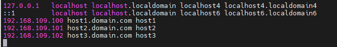
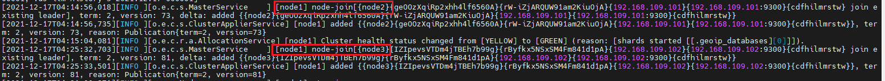
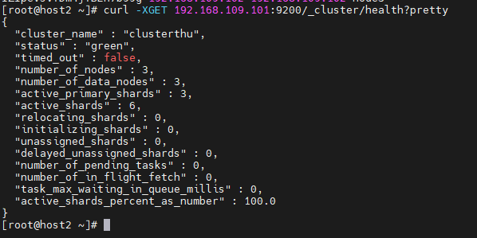
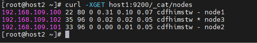
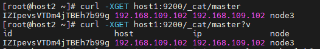
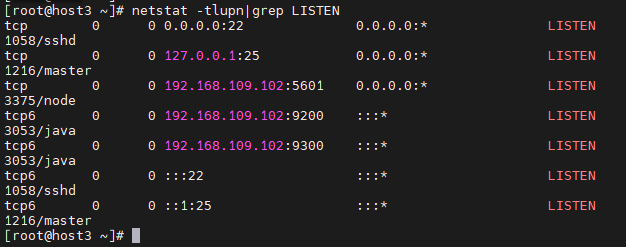
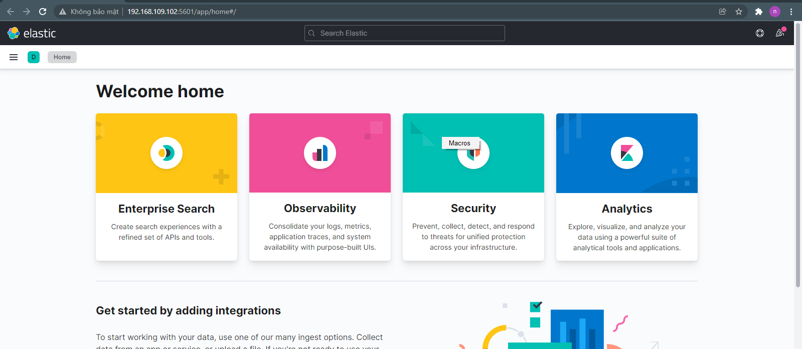

<h1 style="color:orange">Cài đặt elasticsearch cluster</h1>
Chuẩn bị:

- host1: 192.168.109.100/24 - cấu hình làm initial master
- host2: 192.168.109.101/24
- host3: 192.168.109.102/24

Cấu hình cả 3 máy đều cấu hhifnheligible master, data và ingest node.

Cả 3 máy đều phải khai hostname khác nhau trong file `/etc/hostname` và khai địa chỉ các máy trong file `/etc/hosts`
 
<h2 style="color:orange">1. Cài đặt elasticsearch trên 3 node</h2>
Cài java 1.8 (elasticsearch yêu cầu)

    # yum -y install java-openjdk-devel java-openjdk
Cài đặt và install public key

    # rpm --import https://artifacts.elastic.co/GPG-KEY-elasticsearch
Tạo repository của elasticsearch

    # vim /etc/yum.repos.d/elasticsearch.repo
paste vào

    [ELK-7.x]
    name=Elasticsearch repository for 7.x packages
    baseurl=https://artifacts.elastic.co/packages/7.x/yum
    gpgcheck=1
    gpgkey=https://artifacts.elastic.co/GPG-KEY-elasticsearch
    enabled=1
    autorefresh=1
    type=rpm-md
Cài elasticsearch

    # yum clean all && yum makecache && yum -y install elasticsearch
Thiết lập dung lượng RAM để chạy Elasticsearch

    # vim /etc/elasticsearch/jvm.options

    -Xms1G
    -Xmx1G
Vendor khuyến nghi 2 giá trị max, min này bằng nhau và không quá 32G.

Điều chỉnh bộ nhớ ảo
    
    # sudo vim /etc/sysctl.conf
    paste vào
    vm.max_map_count=262144
Tăng giới hạn mô tả file đang mở

    # sudo vim  /etc/security/limits.conf
    paste vào
    - nofile 65536
    elasticsearch soft memlock unlimited
    elasticsearch hard memlock unlimited
Cấu hình firewalld

    # firewall-cmd --permanent --add-port={9200,9300}/tcp
    # firewall-cmd --reload
<h3 style="color:orange">1.1. Chỉnh sửa cấu hình trên 3 node</h3>
Chỉnh sửa file cấu hình elasticsearch

    # vim /etc/elasticsearch/elasticsearch.yml
chỉnh sửa
<h3 style="color:orange">Trên node1</h3>
    
    cluster.name: clusterthu
    node.name: node1
    network.host: 192.168.109.100
    http.port: 9200
    discovery.seed_hosts: ["192.168.109.100", "192.168.109.101", "192.168.109.102"]
    cluster.initial_master_nodes: ["192.168.109.100"]  # cấu hình chỉ định initial master mà không cần bầu chọn
    discovery.zen.minimum_master_nodes: 2    # cần ít nhất 2 node để bình chọn
    node.master: true
    node.data: true
    node.voting_only: false
    node.ingest: true
    node.ml: false
    xpack.ml.enabled: true
    cluster.remote.connect: false
Khuyến nghị discovery.zen.minimum_master_nodes: =số node/2+1 để tránh tình trạng slpit brain.
<h3 style="color:orange">Trên node2</h3>
    
    cluster.name: clusterthu
    node.name: node1
    network.host: 192.168.109.101
    http.port: 9200
    discovery.seed_hosts: ["192.168.109.100", "192.168.109.101", "192.168.109.102"]
    cluster.initial_master_nodes: ["192.168.109.100"]  # cấu hình chỉ định initial master mà không cần bầu chọn
    discovery.zen.minimum_master_nodes: 2
    node.master: true
    node.data: true
    node.voting_only: false
    node.ingest: true
    node.ml: false
    xpack.ml.enabled: true
    cluster.remote.connect: false
<h3 style="color:orange">Trên node3</h3>

    cluster.name: clusterthu
    node.name: node1
    network.host: 192.168.109.101
    http.port: 9200
    discovery.seed_hosts: ["192.168.109.100", "192.168.109.101", "192.168.109.102"]
    cluster.initial_master_nodes: ["192.168.109.100"]  # cấu hình chỉ định initial master mà không cần bầu chọn
    discovery.zen.minimum_master_nodes: 2
    node.master: true
    node.data: true
    node.voting_only: false
    node.ingest: true
    node.ml: false
    xpack.ml.enabled: true
    cluster.remote.connect: false
Bật elasticsearch

    # systemctl start elasticsearch
    # systemctl enable elasticsearch
Sau khi start elasticsearch tren host1 thành công, lần luotj start trên host2 và 2, lúc này host1 đang làm node master (do cấu hình chỉ định). Ta có thể vào file:

    # tail -n 100 /var/log/elasticsearch/clusterthu.log
để check quá trình các node join vào cluster
 

Để kiểm tra sử dụng lệnh

    # curl -XGET 192.168.109.101:9200/_cluster/health?pretty
 
<h2 style="color:orange">2. Các cấu hình kiểm tra trên 3 node</h2>
<h3 style="color:orange">2.1. Kiểm tra cluster state</h3>
Cluster state lấy thông tin toàn diện về trạng thái elastic cluster

    # curl -XGET 192.168.109.100:9200/_cluster/state?pretty |less
đê thoát dùng "q"
<h3 style="color:orange">2.2. Kiểm tra cluster stat</h3>
Câu lệnh lấy metric cơ bản như dung lượng RAM sử dụng, số shard, và thông tin về node trên clusterr.

    # curl -XGET 192.168.109.100:9200/_cluster/stats?pretty
<h3 style="color:orange">2.3. Xem cluster node details</h3>

    # curl -XGET host1:9200/_cat/nodes
 
Ví dụ ở đây sẽ có 1 số trường:
- m là master-eligible node
- d là data node
- i là ingest node
Với *, node3 là master node trong cluster.
<h3 style="color:orange">2.4. Xem cluster master node</h3>

    # curl -XGET host1:9200/_cat/master
    # curl -XGET host1:9200/_cat/master?v
 
<h2 style="color:orange">3. Cấu hình RAM cho elasticsearch</h2>
Elasticsearch có càng nhiều RAM thì càng nhiều bộ nhớ cho caching, từ đó cải thiện hiệu năng tổng. Chính vì thế, swap rất có hại cho elasticsearch vì swap chậm. Chúng ta phải cấu hình để elasticsearch không bao giờ dùng đến swap

1. Cách 1: disable swap

       # swapoff -a
để disable swap sau khi reboot, thay đổi file /etc/fstab/ và comment/bỏ dòng file system có chữ "swap"

2. Chỉnh sửa file

       # vim /etc/elasticsearch/jvm.options
       -Xms1g
       -Xmx1g
để set cấu hình max/min cho elasticsearch. Vendor khuyến nghị 2 số max, min = nhau và bé hơn hoặc bằng 32G.
3. Bật bootstrap.memory_lock 
Cách này lock process chỉ chạy trên RAM: tạo 1 file

    # mkdir -p /etc/systemd/system/elasticsearch.service.d/
    # vim /etc/systemd/system/elasticsearch.service.d/override.conf
paste vào

    [Service]
    LimitMEMLOCK=infinity

    # systemctl daemon-reload
Sau đó thêm dòng sau:

    # vim /etc/elasticsearch/elasticsearch.yml
    bootstrap.memory_lock: true
<h2 style="color:orange">4. Cài đặt kibana</h2>
Nếu có nhiều node trong elasticsearch cluster, cách dễ nhất để cân bằng tải kibana request giữa các node là cấu hình kibana trên node coordinating (client) của elasticsearch. Vendor cũng khuyến nghị cài kibana tách khỏi node master và data. Tuy vậy, trong bài lab ta sẽ cấu hình kibana trên host3

Để monitor elastic cluster và điều hướng data thu được từ elastic node cấu hình các option sau trên tất cả node trong cluster:

    # vim /etc/elasticsearch/elasticsearch.yml

    # xpack.monitoring.collection.enabled: true
    # xpack.monitoring.elasticsearch.collection.enabled: false

    # systemctl restart elasticsearch
Lưu ý: restart elasticsearch theo thứ tự các node, không restart cùng lúc, tránh mất thời gian setup lại cluster.

Trên node host3: 192.168.109.102/24 cài đặt kibana

    # yum install -y kibana
Cấu hình kibana

    # vim /etc/kibana/kibana.yml
    server.port: 5601
    server.host: "192.168.109.102"
    server.name: "host3.domain.com"
    elasticsearch.hosts: ["http://192.168.109.100:9200", "http://192.168.109.101:9200", "https://192.168.109.102:9200"]
Kibana có thể cấu hình truy cập nhiều node trong 1 cluster. Trong trường hợp 1 node không có sẵn, kibana sẽ kết nối tới node có sẵn theo kiểu round-robin.

Cấu hình firewall

    # firewall-cmd --add-port=5601/tcp --permanent
    # firewall-cmd --reload
Khởi động kibana

    # systemctl enable kibana
    # systemctl start kibana
Kiểm tra

    # netstat -tlupn|grep LISTEN
 

Vào trình duyệt

    http://192.168.109.102:5601/
 