<h1 style="color:orange">Cài đặt cụm efk trên docker</h1>
Chuẩn bị: 

- máy docker cài efk stack: 192.168.109.100/tcp
- máy client để gửi log: 192.168.109.101/tcp
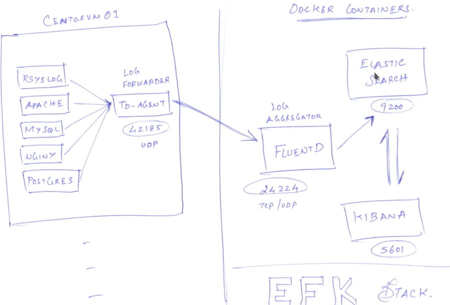 
<h2 style="color:orange">1. Trên efk host</h2>
Cài các package cần thiết

    # yum install -y git net-tools wget
    # yum install -y java-1.8.0-openjdk.x86_64
Cài docker

    # sudo yum install -y yum-utils device-mapper-persistent-data lvm2
Thêm Docker repo

    # sudo yum-config-manager --add-repo https://download.docker.com/linux/centos/docker-ce.repo
Cài đặt bản lastest của Docker CE

    # sudo yum install -y docker-ce docker-ce-cli containerd.io

    # sudo systemctl start docker
    # sudo systemctl enable docker
Cài docker-compose

    # sudo curl -L "https://github.com/docker/compose/releases/download/1.29.2/docker-compose-$(uname -s)-$(uname -m)" -o /usr/local/bin/docker-compose
    # sudo chmod +x /usr/local/bin/docker-compose
Điều chỉnh bộ nhớ ảo (cho elasticsearch)
    
    # sudo vim /etc/sysctl.conf
    paste vào
    vm.max_map_count=262144

    # sudo sysctl -w vm.max_map_count=262144
Tăng giới hạn mô tả file đang mở

    # sudo vim  /etc/security/limits.conf
    paste vào
    - nofile 65536
Disable SElinux
Cấu hình mở port firewalld

    # firewall-cmd --add-port={9200,9300,24224,5601}/tcp --permanent
    # firewall-cmd --add-port=24224/udp --permanent
    # firewall-cmd --reload
elasticsearch dùng port = 9200,9300 
kibana = 5601 
fluentd = 24224 /tcp,udp
<h3 style="color:orange">1.1. Clone git repo đã cấu hình cụm efk trên docker</h3>

    # cd /tmp/
    # git clone https://github.com/justmeandopensource/elk
    # cd /tmp/elk/docker-efk/
chỉnh sửa file docker-compose.yml

    # vim docker-compose.yml
xóa hết file và paste vào

    version: '2.2'

    services:

      fluentd:
        build: ./fluentd
        container_name: fluentd
        volumes:
          - ./fluentd/conf:/fluentd/etc
        ports:
          - "24224:24224"
          - "24224:24224/udp"

      # Elasticsearch requires your vm.max_map_count set to 262144
      # Default will be 65530
      # sysctl -w vm.max_map_count=262144
      # Add this to /etc/sysctl.conf for making it permanent
      elasticsearch:
        image: docker.elastic.co/elasticsearch/elasticsearch:7.16.1
        container_name: elasticsearch
        environment:
          - bootstrap.memory_lock=true
          - node.name=elasticsearch
          - discovery.seed_hosts=elasticsearch
          - cluster.initial_master_nodes=elasticsearch
          - cluster.name=docker-cluster
          - "ES_JAVA_OPTS=-Xms512m -Xmx512m"
        ulimits:
          memlock:
            soft: -1
            hard: -1
        volumes:
          - esdata1:/usr/share/elasticsearch/data
        ports:
          - 9200:9200

      kibana:
        image: docker.elastic.co/kibana/kibana:7.16.1
        container_name: kibana
        environment:
          ELASTICSEARCH_URL: "http://elasticsearch:9200"
        ports:
          - 5601:5601
         depends_on:
      - elasticsearch

    volumes:
      esdata1:
        driver: local
Chạy file docker-compose

    # docker-compose up -d
option -d là detached, chạy daemon
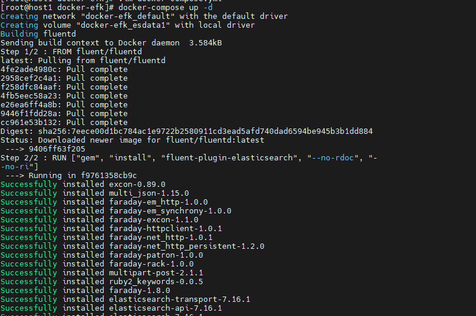 
<h3 style="color:orange">1.2. Kiểm tra</h3>

    # docker-compose ps
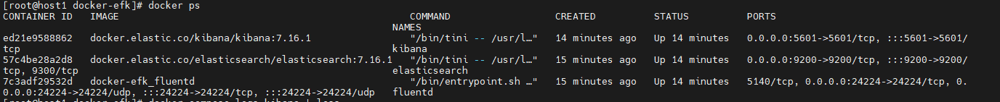 
Kiểm tra log của kibana, elasticsearch và fluentd

    # docker-compose logs kibana | less
    # docker-compose logs elasticsearch | less
    # docker-compose logs fluentd | less    #using config file that we specify in yaml
Kiểm tra dịch vụ trên port

    # sudo netstat -nltp | grep docker
 
<h2 style="color:orange">2. Trên client</h2>
Cài td-agent trên client để đẩy log về efk host

    # curl -L https://toolbelt.treasuredata.com/sh/install-redhat-td-agent4.sh | sh
Cấu hình file td-agent

    # vim /etc/td-agent/td-agent.conf
xóa hết nội dung và paste vào cấu hình 

    <source>
      @type syslog
      @id input_syslog
      port 42185
      tag host2.system
    </source>

    <match *.**>
      @type forward
      @id forward_syslog
      <server>
        host 192.168.1.100     #fluentd running on my host machine
      </server>
    </match>
Cấu hình rsyslog gửi log đến td-agent

    # vim /etc/rsyslog.conf

    *.* @127.0.0.1:42185         #@- udp, @@ - tcp
    
    # systemcrl restart rsyslog
Khởi động td-agent

    # systemctl enable td-agent
    # systemctl start td-agent
Kiểm tra 

    # netstat -nltup  
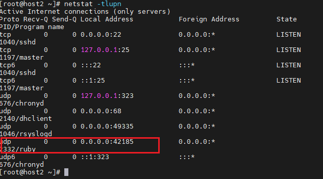 
<h2 style="color:orange">3. Add log trên kibana</h2>
Truy cập vào browser: http://192.168.109.100:5601/

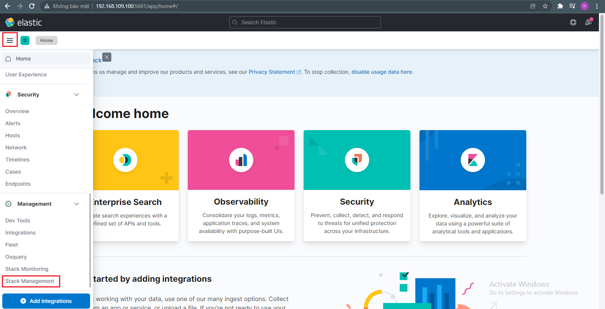 
vào thanh trượt menu --> stack management

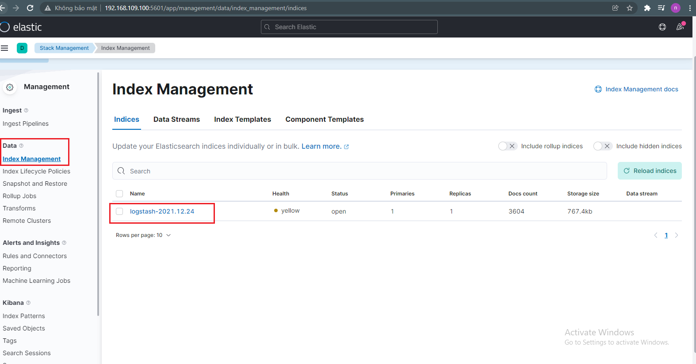 
data -> index management: index là logstash bởi trong file `/elk/docker-efk/fluentd/conf/fluent.conf` ta sử dụng logstash format

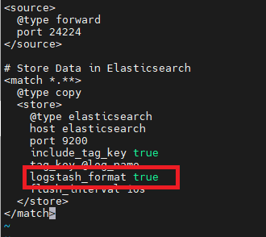 
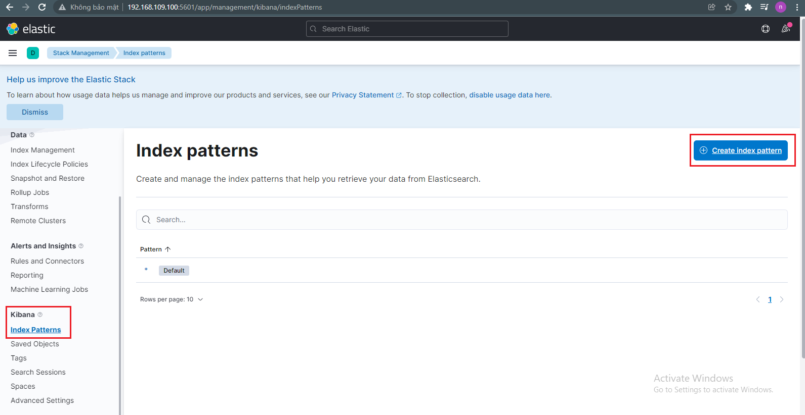 
Vào kibana --> index patterns ---> create index pattern

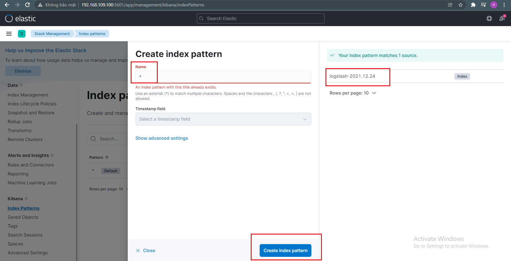 
Nhập * vào name sẽ thấy index ta vừa tạo ----> create index pattern

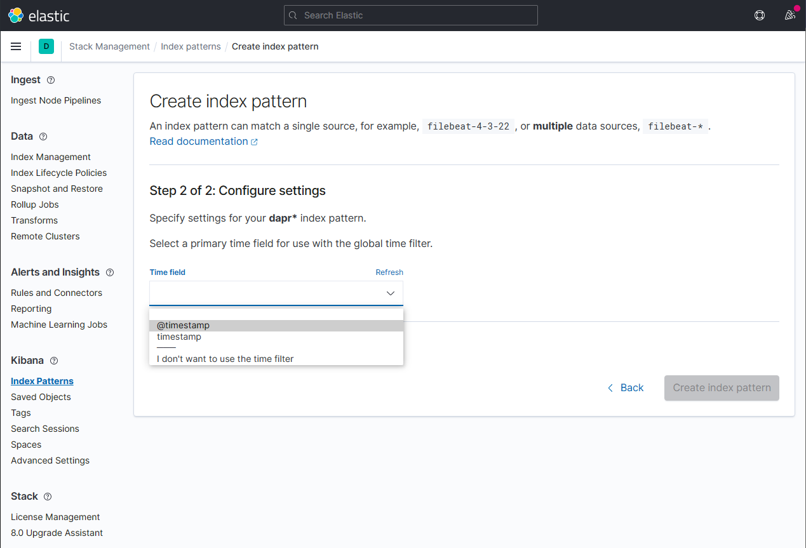 
Chon @time stamp --> create

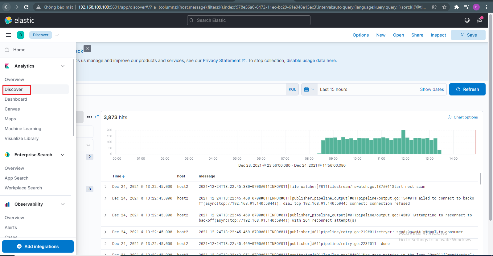 
Vào thanh menu analytic ---> Discover đã thấy log được gửi đến elasticsearch
<h2 style="color:orange">4. Kiểm tra</h2>
Trên client tạo 1 log đẩy vào `/var/log/message` để xem efk host có nhận được không

    # logger day la log testing td-agent
    # vim /var/log/message
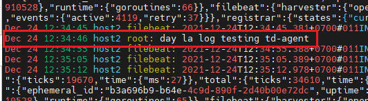 
Kiểm tra trên kibana 
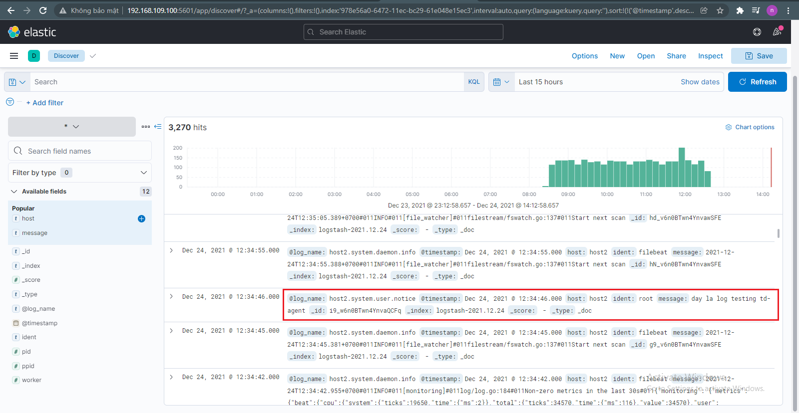 
-----> Thành công