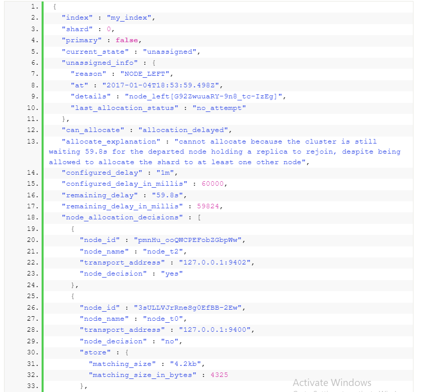

<h1 style="color:orange">Fix lỗi index health yellow</h1>

Link tham khảo: https://opster.com/guides/elasticsearch/operations/elasticsearch-yellow-status/
Trạng thái vàng của 1 index health thể hiện rằng 1 hoặc nhiều replica shard của 1 cluster chưa được assign vào node. Lý do:

1. Cluster chỉ có 1 node
2. Bạn vừa restart 1 node
3. Node down
4. Vấn đề về mạng

Nếu các node không thể kết nối với nhau ổn định, thì shard sẽ không sync được -> node health yellow hoặc red. Có thể check lỗi này bằng cách check log, join và unjoin cluster liên tục

5. Giới hạn dung lượng lưu trữ

Xóa bớt indices cũ hoặc mở rộng cluster

6. Shard vượt quá số lần retry

Nếu error báo: `“shard has exceeded the maximum number of retries [5] on failed allocation attempts – manually call [/_cluster/reroute?retry_failed=true] to retry”` phải chạy allocation retry dùng lệnh: 

    curl -XPOST localhost:9200/_cluster/reroute?retry_failed

7. Node allocation awareness 
Đôi khi do allocation rules được tạo trên cluster ngăn không cho cluster allocate shard

Xử lý lỗi bằng cách: vào Dev Tools trên kibana

    GET /_cluster/health
    check dòng
    "unasssigned_shards": 76,
Chi tiết hơn

    GET /_cluster/allocation/explain
ra kết quả lỗi: (mục 6)
https://opster.com/guides/elasticsearch/operations/elasticsearch-yellow-status/ 

 
Chú thích: 
- "unassigned_info": Lý do shard bị unassigned
- "node_allocation_decision" => 1 List lý do tại sao không nhận/ nhận shard.
- "deciders": Quyết định nhận shard hay ko

<h1 style="color:orange">Lỗi gặp phải</h1>

https://discuss.elastic.co/t/shards-not-being-allocated-according-to-box-type-setting-in-designated-nodes-of-same-type/197723

Cách sửa: 

    PUT /index_name/_settings
    {
        "settings": {
            "index.routing.allocation.require._name": null
        }
    }