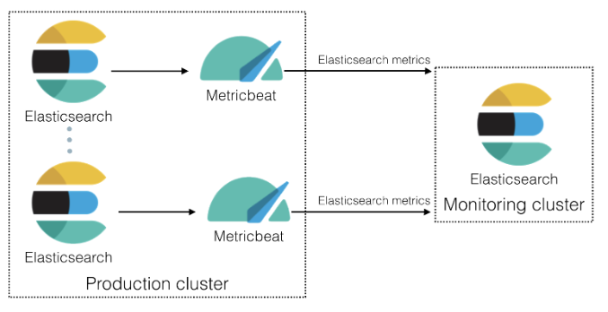
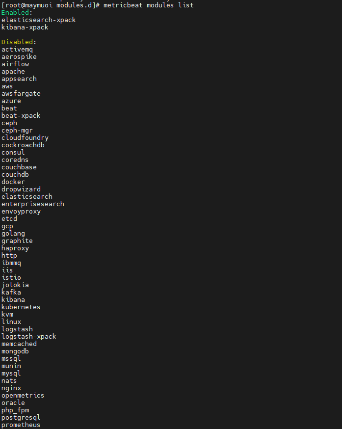
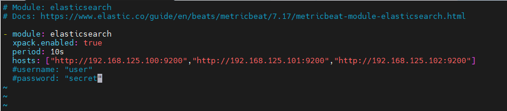
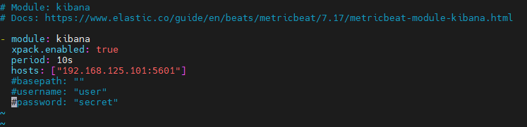
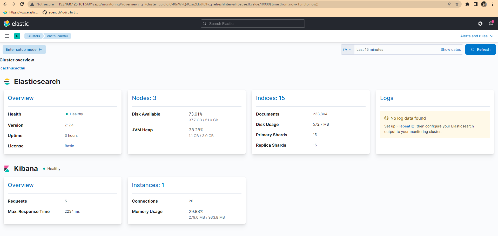

<h1 style="color:orange">Metricbeat</h1>
Metric là agent được cài đặt để theo dõi tài nguyên cluster elasticsearch.

 
<h2 style="color:orange">1. Trên server cài metricbeat</h2>
<h3 style="color:orange">1.1. Cài metricbeat</h3>
Cài java 1.8 (elasticsearch và logstash yêu cầu)

    # yum -y install java-openjdk-devel java-openjdk
Cài đặt và install public key

    # rpm --import https://artifacts.elastic.co/GPG-KEY-elasticsearch
Tạo repository của elasticsearch

    # vim /etc/yum.repos.d/elasticsearch.repo
paste vào

    [ELK-7.x]
    name=Elasticsearch    repository for 7.x packages
    baseurl=https://artifacts.elastic.co/packages/7.x/yum
    gpgcheck=1
    gpgkey=https://artifacts.elastic.co/GPG-KEY-elasticsearch
    enabled=1
    autorefresh=1
    type=rpm-md
Cài metricbeat

    # yum clean all && yum makecache && yum -y install metricbeat
<h3 style="color:orange">1.2. Config metricbeat</h3>

    # vim /etc/metricbeat/metricbeat.yml
    Cấu hình
    setup.kibana:
    host: "http://192.168.125.101:5601"
    output.elasticsearch:
    hosts: ["http://192.168.125.100:9200","http://192.168.125.101:9200","192.168.125.102"]
http://192.168.125.101:5601 là địa chỉ kibana, metricbeat sẽ hiển thị dữ liệu trên địa chỉ này
http://192.168.125.100:9200, http://192.168.125.101:9200, http://192.168.125.102:9200 là địa chỉ node elasticsearch metricbeat đẩy dữ liệu đến (có thể là địa chỉ 1 node hoặc nhiều node trong cluster, tránh node master-eligible, thường là coordinating node, node nào cài kibana thì cài luôn metricbeat)

    # metricbeat modules enable elasticseach-xpack
    # metricbeat modules enable kibana-xpack
để enable module lấy dữ liệu storage của metricbeat
    
    # metricbeat modules disable system
disable module system mặc định của metricbeat. Ngoài ra metricbeat còn hộ trợ lấy dữ liệu của nhiều module khác:

    # metricbeat modules list
 
<h3 style="color:orange">1.3. Config metricbeat modules</h3>
    
    # vim /etc/metricbeat/modules.d/elasticsearch-xpack.yml
 

    # vim /etc/metricbeat/modules.d/kibana-xpack.yml
 
period: 10s; cứ 10s 1 lần metricbeat sẽ lấy metric từ elasticsearch = lệnh curl và gửi cho output.elasticsearch ở trên
<h2 style="color:orange">2. Trên giao diện web kibana</h2>

 
Dữ liệu đã được đẩy đến elasticsearch

Bắt đầu từ phiên bản 8.0.0, xpack.monitoring sẽ được thay thế hoàn toàn bằng metricbeat để quản lý tài nguyên cluster.