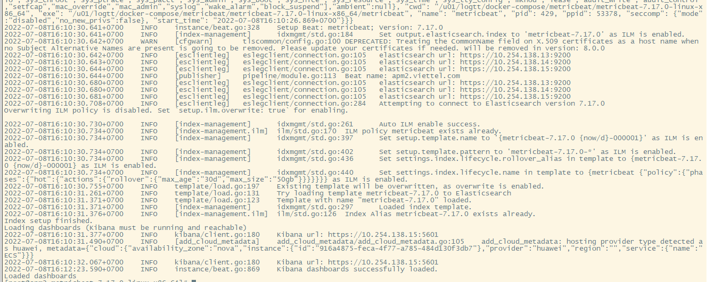
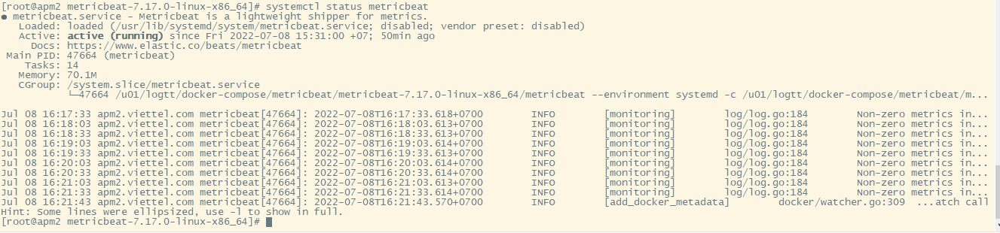
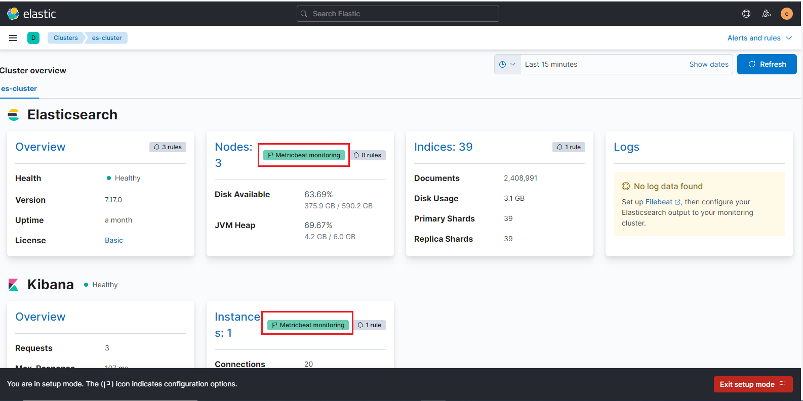

<h1 style="color:orange">Metricbeat</h1>
Metric là agent được cài đặt để theo dõi tài nguyên cluster elasticsearch.

 
<h2 style="color:orange">1. Trên server cài metricbeat</h2>
<h3 style="color:orange">1.1. Cài metricbeat</h3>
Cài java 1.8 (elasticsearch và logstash yêu cầu)

    # yum -y install java-openjdk-devel java-openjdk
Cài đặt và install public key

    # rpm --import https://artifacts.elastic.co/GPG-KEY-elasticsearch
Tạo repository của elasticsearch

    # vim /etc/yum.repos.d/elasticsearch.repo
paste vào

    [ELK-7.x]
    name=Elasticsearch    repository for 7.x packages
    baseurl=https://artifacts.elastic.co/packages/7.x/yum
    gpgcheck=1
    gpgkey=https://artifacts.elastic.co/GPG-KEY-elasticsearch
    enabled=1
    autorefresh=1
    type=rpm-md
Cài metricbeat

    # yum clean all && yum makecache && yum -y install metricbeat
<h3 style="color:orange">1.2. Config metricbeat</h3>

    # vim /etc/metricbeat/metricbeat.yml
    Cấu hình
    setup.kibana:
    host: "http://192.168.125.101:5601"
    output.elasticsearch:
    hosts: ["http://192.168.125.100:9200","http://192.168.125.101:9200","192.168.125.102"]
http://192.168.125.101:5601 là địa chỉ kibana, metricbeat sẽ hiển thị dữ liệu trên địa chỉ này
http://192.168.125.100:9200, http://192.168.125.101:9200, http://192.168.125.102:9200 là địa chỉ node elasticsearch metricbeat đẩy dữ liệu đến (có thể là địa chỉ 1 node hoặc nhiều node trong cluster, tránh node master-eligible, thường là coordinating node, node nào cài kibana thì cài luôn metricbeat)

    # metricbeat modules enable elasticseach-xpack
    # metricbeat modules enable kibana-xpack
để enable module lấy dữ liệu storage của metricbeat
    
    # metricbeat modules disable system
disable module system mặc định của metricbeat. Ngoài ra metricbeat còn hộ trợ lấy dữ liệu của nhiều module khác:

    # metricbeat modules list
 
<h3 style="color:orange">1.3. Config metricbeat modules</h3>
    
    # vim /etc/metricbeat/modules.d/elasticsearch-xpack.yml
 

    # vim /etc/metricbeat/modules.d/kibana-xpack.yml
 
period: 10s; cứ 10s 1 lần metricbeat sẽ lấy metric từ elasticsearch = lệnh curl và gửi cho output.elasticsearch ở trên
<h2 style="color:orange">2. Trên giao diện web kibana</h2>

 
Dữ liệu đã được đẩy đến elasticsearch

Bắt đầu từ phiên bản 8.0.0, xpack.monitoring sẽ được thay thế hoàn toàn bằng metricbeat để quản lý tài nguyên cluster.

<h2 style="color:orange">3. Cài bằng cách tải package từ elastic với truyền TLS/SSL</h2>
Kéo package về từ trang chủ của elastic:

    curl -L -O https://artifacts.elastic.co/downloads/beats/metricbeat/metricbeat-7.17.0-linux-x86_64.tar.gz
    tar xzvf metricbeat-7.17.0-linux-x86_64.tar.gz
Đổi tên file vừa giải nén cho nó gọn

    mv metricbeat-8.3.2-linux-x86_64 metricbeat
    cd metrcibeat
Sửa lại config file metricbeat.yml

    vim metricbeat.yml
paste vào các dòng

    setup.kibana:
      host: "https://192.168.125.101:5601"
      username: "elastic"
      password: "********"
      ssl:
        enabled: true
        certificate_authorities: ["/etc/client/ca.pem"]
        certificate: "/etc/client/cert.pem"
        key: "/etc/client/cert.key"

    output.elasticsearch:
      hosts: ["http://192.168.125.100:9200","http://192.168.125.101:9200","192.168.125.102"]
      username: "elastic"
      password: "********"
      ssl:
        certificate_authorities: ["/etc/client/ca.pem"]
        certificate: "/etc/client/cert.pem"
        key: "/etc/client/cert.key"
Lưu ý: username, password ở đây là của user elasticsearch có quyền `monitor` cluster và quyền `create_doc` ở đây dùng elastic là built-in superuser.
- Đây là cấu hình khi cluster elasticsearch truyền TLS/SSL

<h2 style="color:orange">3.1. Cấu hình để metricbeat lấy dữ liệu từ elasticsearch và kibana</h2>

    cd metricbeat
    ./metricbeat module disable system
    ./metricbeat module enable elasticsearch-xpack
    ./metricbeat module disable kibana-xpack
Sửa file module

    vim modules.d/elasticsearch-xpack.yml
paste vào

    - module: elasticsearch
      xpack.enabled: true
      period: 10s
      hosts: ["http://192.168.125.100:9200","http://192.168.125.101:9200","192.168.125.102"] 
      scope: node 
      username: "elastic"
      password: "********"
      ssl.enabled: true
      ssl.certificate_authorities: ["/etc/pki/root/ca.pem"]
      ssl.certificate: "/etc/pki/client/cert.pem"
      ssl.key: "/etc/pki/client/cert.key"
      ssl.verification_mode: "full"
Tương tự file kibana-xpack.yml

    vim modules.d/kibana-xpack.yml
paste vào

    - module: kibana
      xpack.enabled: true
      period: 10s
      hosts: ["http://192.168.125.100:5601","http://192.168.125.101:5601"] 
      scope: node 
      username: "elastic"
      password: "********"
      ssl.enabled: true
      ssl.certificate_authorities: ["/etc/pki/root/ca.pem"]
      ssl.certificate: "/etc/pki/client/cert.pem"
      ssl.key: "/etc/pki/client/cert.key"
      ssl.verification_mode: "full"
Trong trường hợp có nhiều kibana thì để đường dẫn nhiều kibana

Để load cấu hình metricbeat:

    cd metricbeat
    ./metricbeat setup -e
Kết quả trả về không báo error 
 

Để chạy metricbeat

    ./metricbeat -e
<h2 style="color:orange">3.2. Cấu hình để metricbeat chạy daemon</h2>

    vim /usr/lib/systemd/system/metricbeat.service
paste vào

    [Unit]
    Description=Metricbeat is a lightweight shipper for metrics.
    Documentation=https://www.elastic.co/beats/metricbeat
    Wants=network-online.target
    After=network-online.target

    [Service]
    Environment="GODEBUG='madvdontneed=1'"
    Environment="BEAT_LOG_OPTS="
    Environment="BEAT_CONFIG_OPTS=-c {extract.path}/metricbeat.yml"
    Environment="BEAT_PATH_OPTS=--path.home {extract.path}/metricbeat --path.config {extract.path} --path.data {extract.path}/data --path.logs {extract.path}/logs"
    ExecStart={extract.path}/metricbeat --environment systemd $BEAT_LOG_OPTS $BEAT_CONFIG_OPTS $BEAT_PATH_OPTS
    Restart=always

    [Install]
    WantedBy=multi-user.target
Ở đây {extract.path} là nơi giải nén file, cụ thể là /tmp/metricbeat

    chmod 644 /usr/lib/systemd/system/metricbeat.service
    systemctl start metricbeat
    systemctl enable metricbeat
 

Kiểm tra trên giao diện kibana
 
Các node elasticsearch và kibana đã được metricbeat quản lý.