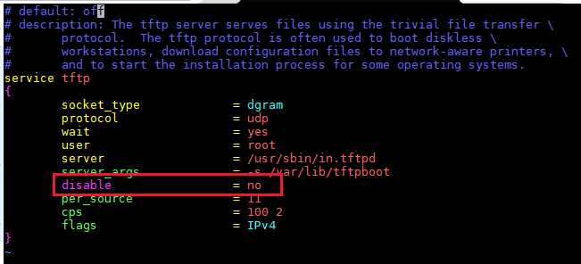
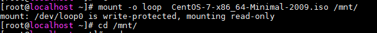
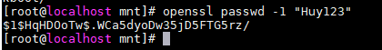
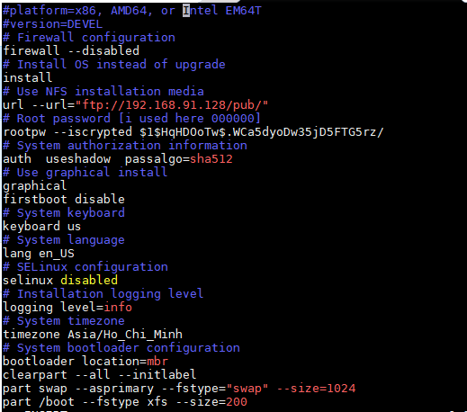
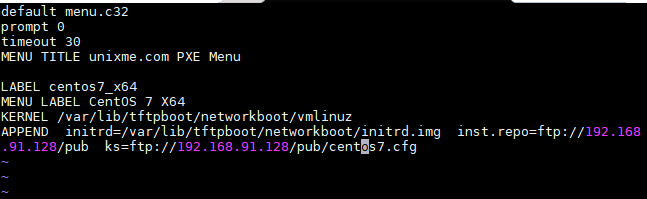
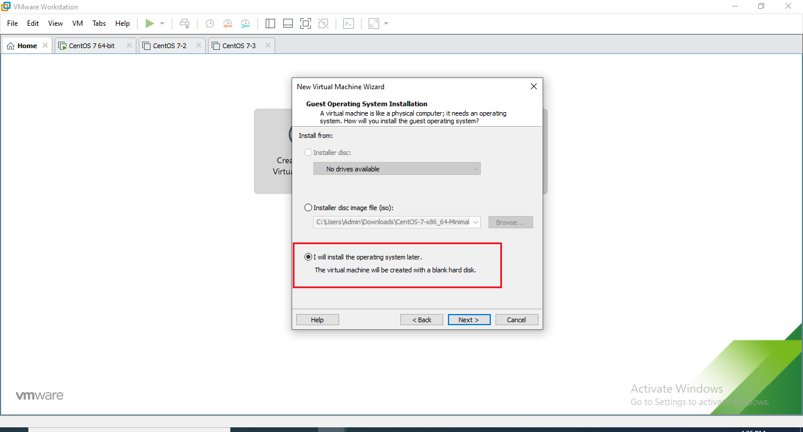
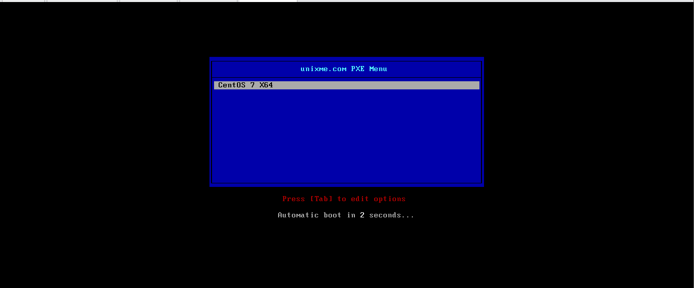

<h1 style="color:orange">Cài đặt cấu hình PXE cho máy Centos7</h1>
Chuẩn bị: máy Centos7: 2 card mạng

- 192.168.91.128 (địa chỉ host-only)
- 192.168.1.70 (bridge-địa chỉ thông ra internet)
Ở đây thì nghiệm PXE-server sử dụng centos7 có 2 card mạng, 1 card thông ra internet để tải các package PXE cần thiết, 1 card để cấp DHCP cho client

Lưu ý, máy hoàn toàn có thể dùng 1 card mạng bridge vừa cấp dhcp vừa thông ra internet; máy client sẽ xin dhcp tạm thời từ card mạng này. Tuy vậy, trong bài lab sẽ chia 2 card mạng cho dễ hình dung
<h1 style="color:orange">1. Tải các packages cần thiết</h1>

    # yum install dhcp tftp tftp-server syslinux wget vsftpd xinetd -y
Cấu hình file /etc/dhcp/dhcp.conf

    # vim /etc/dhcp/dhcpd.conf
paste vào 

    #
    # DHCP Server Configuration file.
    #   see /usr/share/doc/dhcp*/dhcpd.conf.example
    #   see dhcpd.conf(5) man page
    #
    ddns-update-style interim;
    ignore client-updates;
    authoritative;
    allow booting;
    allow bootp;
    allow unknown-clients;
    # internal subnet for my DHCP Server
    subnet 192.168.91.0 netmask 255.255.255.0 {
    range 192.168.91.130 192.168.91.150;
    option domain-name-servers 192.168.91.128;
    option domain-name "centos7.domain.com";
    option routers 192.168.91.128;
    option broadcast-address 192.168.91.255;
    default-lease-time 600;
    max-lease-time 7200;
    # # IP of PXE Server
    next-server 192.168.91.128;
    filename "pxelinux.0";
    }
Cấu hình file /etc/xinetd.d/tftp

    # vim /etc/xinetd.d/tftp
    sửa disable = yes thành disable = no
 

Setup TFTP server network boot files:

    # cp -v /usr/share/syslinux/pxelinux.0 /var/lib/tftpboot
    # cp -v /usr/share/syslinux/menu.c32 /var/lib/tftpboot
    # cp -v /usr/share/syslinux/memdisk /var/lib/tftpboot
    # cp -v /usr/share/syslinux/mboot.c32 /var/lib/tftpboot
    # cp -v /usr/share/syslinux/chain.c32 /var/lib/tftpboot
Tạo 2 file:

    # mkdir /var/lib/tftpboot/pxelinux.cfg
    # mkdir /var/lib/tftpboot/networkboot
Tải ISO Centos7:

    # wget http://mirror.bizflycloud.vn/centos/7.9.2009/isos/x86_64/CentOS-7-x86_64-Minimal-2009.iso
Mount ISO centos7 vào file /mnt

    # mount -o loop  CentOS-7-x86_64-Minimal-2009.iso /mnt/
 

    # cd /mnt/
    # cp -av * /var/ftp/pub/
Copy 2 file initrd.img và vmlinuz từ FTP folder vào /tftpboot/networkboot/

    # cp /mnt/images/pxeboot/vmlinuz /var/lib/tftpboot/networkboot/
    # cp /mnt/images/pxeboot/initrd.img /var/lib/tftpboot/networkboot/
Gen password root dùng cho máy client

    # openssl passwd -1 "Huy123"
 

Cấu hình file kickstart

    # vim /var/ftp/pub/centos7.cfg
paste vào, lưu ý đây chỉ là file kickstart mẫu, ngoài ra còn rất nhiều kiểu file kickstart khác, (ví dụ như file anaconda-ks.cfg)

    #platform=x86, AMD64, or Intel EM64T
    #version=DEVEL
    # Firewall configuration
    firewall --disabled
    # Install OS instead of upgrade
    install
    # Use NFS installation media
    url --url="ftp://192.168.1.70/pub/"
    # Root password [i used here 000000]
    rootpw --iscrypted $1$HqHDOoTw$.WCa5dyoDw35jD5FTG5rz/
    # System authorization information
    auth  useshadow  passalgo=sha512
    # Use graphical install
    graphical
    firstboot disable
    # System keyboard
    keyboard us
    # System language
    lang en_US
    # SELinux configuration
    selinux enabled
    # Installation logging level
    logging level=info
    # System timezone
    timezone Asia/Ho_Chi_Minh
    # System bootloader configuration
    bootloader location=mbr
    clearpart --all --initlabel
    part swap --asprimary --fstype="swap" --size=1024
    part /boot --fstype xfs --size=200
    part pv.01 --size=1 --grow
    volgroup rootvg01 pv.01
    logvol / --fstype xfs --name=lv01 --vgname=rootvg01 --size=1 --grow
    %packages
    @^minimal
    @core
    %end
    %addon com_redhat_kdump --disable --reserve-mb='auto'
    %end

 
Tạo file menu cho PXE

    # vim /var/lib/tftpboot/pxelinux.cfg.default
paste vào 

    default menu.c32
    prompt 0
    timeout 30
    MENU TITLE unixme.com PXE Menu

    LABEL centos7_x64
    MENU LABEL CentOS 7_X64
    KERNEL /networkboot/vmlinuz
    APPEND  initrd=/networkboot/initrd.img  inst.repo=ftp://192.168.91.128/pub  ks=ftp://192.168.91.128/pub/centos7.cfg
Lưu ý tên đường dẫn file: /pub/centos7.cfg giống file cấu hình kickstart trên.
 
<h2 style="color:orange">1.1. Cấu hình SELinux và firewalld</h2>

    # setsebool -P allow_ftpd_full_access 1
    # firewall-cmd --permanent --add-port={69,4011}/udp
    # firewall-cmd --permanent --add-port=69/tcp
    # firewall-cmd --permanent --add-service=ftp
    # firewall-cmd --permanent --add-service=dhcp
    # firewall-cmd --reload
Khởi động lại các daemon

    # systemctl restart hdcpd
    # systemctl restart xinetd
    # systemctl restart vsftpd
    # systemctl enable hdcpd
    # systemctl enable xinetd
    # systemctl enable vsftpd
<h2 style="color:orange">2. Cấu hình máy client</h2>
Vì đây là môi trường lab nên khi tạo máy ảo trên wmware, ta cài sẽ cấu hình ISO như sau

 
Bật máy lên: 

 
Đầu tiên máy sẽ xin DHCP ----> sau đó có thể boot được