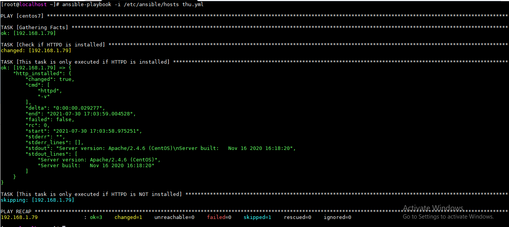
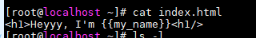
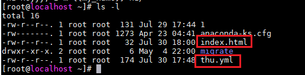
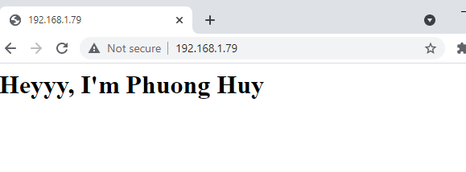

<h1 style="color:orange">Viết playbook</h1>
<h2 style="color:orange">1. Thuật ngữ</h2>
Dưới đây là danh sách một số thuật ngữ được Ansible sử dụng:

- `Control Node/Management Control` : server cài đặt Ansible, chịu trách nhiệm cho việc “đưa các công việc bạn cung cấp đến các server từ xa mà bạn quản lý và chạy chúng”.
- `Inventory:` Một file INI chứa các thông tin về các server từ xa mà bạn quản lý.
- `Playbook:` Một file YAML chứa một tập các công việc cần tự động hóa.
- `Task:` một task sẽ xác định một công việc đơn lẻ sẽ được thực hiện.
- `Module:` Một Module sẽ trừu tượng hóa một tác vụ hệ thống. Ansible cũng cấp rất nhiều Module tích hợp để ta sử dụng nhưng nếu muốn bạn cũng có thể tự tạo Module. Nói cách khác, ta giao tiếp với Ansible thông qua các Module.
- `Role:` Một tập hợp các Playbook, các template và các file khác, được tổ chức theo cách được xác định trước để tạo điều kiện tái sử dụng và chia sẻ.
- `Play:` Một lần thực thi suôn sẻ từ đầu tới cuối được gọi là một play.
- `Facts:` Các biến toàn cục chứa các thông tin về hệ thống, như các network interface hay operating system.
- `Handlers:` Sử dụng để kích hoạt thay đổi trạng thái các service, như việc ta restart hay reload một service

 

Bạn đứng trên một Node Control và ra lệnh cho các server mà bạn quản lý.

Tuy nhiên vấn đề đặt ra là số lượng thao tác cần thực hiện trên các server kìa thì nhiều, nhiều server có tác dụng, nhiệm vụ giống nhau nên cần thực hiện các tháo tác giống nhau.

Vậy không lẽ bạn định gõ tay hàng trăm thậm chí hàng ngàn lệnh. Để rồi khi có một server mới, bạn lại gõ tay lại, chưa kể việc sai sót khi thao tác.

Lúc này bạn sẽ cần viết một Playbook - nơi sẽ chứa chi tiết tất cả những gì bạn muốn làm với các server từ xa kia và cách thức thực hiện chúng

Mỗi một thao tác trong Playbook gọi là một Task (Cài đặt, khởi động, dừng,....)

Ta sử dụng Module để tạo thành Task (Ví dụ: muốn cài đặt một gói trên CentOs7 ta sử dụng Module yum của Ansible).

Có việc cần làm rồi, giờ ta cần truyền thông tin chi tiết hơn về server cho Playbook chứ không thì làm sao nó biết sẽ làm việc với ai. Lúc này ta cần đến Inventory.
<h2 style="color:orange">2. Định dạng của task</h2>
Ví dụ 1 task:

    - name: Install http package
      yum:
        name: httpd
        state: latest
`name` là một tùy chọn nhưng bạn nên sử dụng nó để đặt tên cho Task. Nó sẽ hiển thị khi Task được thực thi, giúp bạn dễ quan sát, theo dõi. Với những người sử dụng lại Playbook của bạn, họ sẽ dễ dàng đọc, hiểu Playbook hơn.

`yum` là Module tích hợp sẵn của Ansible giúp Ansible hiểu được bạn muốn quản lý các package trên CentOs

Task này thể hiện rằng bạn muốn cập nhật http package lên bản mới nhất. Nếu chưa có, nó sẽ được cài đặt.
<h3 style="color:orange">2.1. Module yum</h3>
Nói sơ qua về module yum. State nằm trong các parameters(tham số). Có các state:  

`installed, present`: để tải package 
`absent, removed`: để uninstall application 
`latest`: dùng để update application lên bản mới nhất, nếu máy chưa cài app thì nó sẽ có tác dụng tương tự installed, present với packages mới nhất.

Tìm hiểu thêm về module yum: https://docs.ansible.com/ansible/latest/collections/ansible/builtin/yum_module.html
<h2 style="color:orange">3. Định dạng của playbook</h2>
Các Playbook là các file định dạng YAML chứa một loạt các mô tả chỉ thị nhằm mục đích tự động hóa chúng trên server từ xa.

    - hosts: centos7
      become: True
      tasks:
      - name: Install httpd
        yum:
          name: httpd
          state: latest
      - name: Start httpd
        service:
          name: httpd
          state: started
          enabled: Yes
YAML dựa vào việc thụt đầu dòng để sắp xếp cấu trúc dữ liệu. Bạn cần cẩn thận điều này khi viết Playbook và đặc biệt là khi sao chép nội dung của chúng. Trong đó: 
Sử dụng module service
- become: ssh sử dụng quyền sudo
- state started: start httpd
- enabled: Khởi động httpd on boot 

Tham khảo module service tại đây: https://docs.ansible.com/ansible/latest/collections/ansible/builtin/service_module.html
<h2 style="color:orange">4. Viết file playbook</h2>
<h2 style="color:orange">4.1. Vars</h2>
Các đơn giản nhất để xác định các biến là sử dụng section có tên là vars của Playbook.

Ví dụ dưới đây, ta định nghĩa biến package – biến mà sau này được sử dụng bên trong các Task

    - hosts: centos7
      become: True
      vars:
        package: httpd
      tasks:
    - name: Install httpd
      yum:
        name: "{{package}}"
        state: latest
Biến package có phạm vi sử dụng trên toàn Playbook
<h2 style="color:orange">4.2. Vòng lặp</h2>
Ta sử dụng vòng lặp khi phải lặp lại cùng một task nhiều lần, chỉ khác giá trị input.

Để tạo một vòng lặp bên trong một task, ta sử dụng with_items kèm theo bên dưới là 1 mảng các giá trị. Ta truy xuất đến các giá trị này thông qua biến vòng lặp item

    - hosts: centos7
      become: True
      tasks:
      - name: Install packages
        yum:
          name: "{{item}}"
          state: latest
        with_items:
        - httpd
        - mariadb-server
        - mariadb
        - php
        - php-mysql
        - php-fpm
Ta cũng có thể sử dụng kết hợp một biến mảng

    - hosts: centos7
      become: True
    tasks:
    - name: Install packages
      yum:
        name: ['httpd','mariadb-server','mariadb','php','php-mysql','php-fpm']
        state: latest
<h2 style="color:orange">4.3. Conditions(điều kiện)</h2>
Các điều kiện được sử dụng để tự động quyết định xem liệu một task có được thực thi hay không dựa trên một biến hay một output từ một nguồn, ví dụ : output của một command.

     - name: Shutdown CentOS Based Systems
       command: /sbin/shutdown -t now
       when: ansible_facts['distribution'] == "CentOS"
Ví dụ trên sử dụng một trong các biến ansible_facts (các biến đặc biệt của Ansible) là ansible_facts[‘distribution’] nhằm kiểm tra OS hiện tại của node client. Nếu node này cài CentOS thì sẽ thực hiện lệnh shutdown để tắt nó.

1 ví dụ khác
 
    - hosts: centos7
      become: True
      tasks:
      - name: Check if HTTPD is installed
        register: http_installed
        command: httpd -v
        ignore_errors: true

      - name: This task is only executed if HTTPD is installed
        debug: var=http_installed
        when: http_installed is success

      - name: This task is only executed if HTTPD is NOT installed
        debug: msg='HTTPD is NOT installed'
        when: http_installed is failed
Ở ví dụ này ta viết 3 task

- task 1 : Chạy lệnh kiểm tra version của apache trên CentOS. Nếu đã cài apache thì lệnh sẽ chạy bình thường ; output và các giá trị trả về sẽ lưu vào biến http_installed
- task 2 : Kiểm tra xem lệnh ở task 1 có được thực thi thành công không thông qua việc kiểm tra biến http_installed. Nếu thành công thì hiển thị nội dung của biến http_installed.
 

- task 3 : Kiểm tra xem lệnh ở task 1 có được thực thi thành công không thông qua việc kiểm tra biến http_installed. Nếu không thành công thì hiển thị nội dung HTTPD is NOT installed.

Ở đây tạo file "/root/thu.yml" với mẫu playbook trên. Chạy câu lệnh playbook

    # ansible-playbook -i /etc/ansible/hosts thu.yml
Trong đó: 

    # ansible-playbook -i path_to_inventory_file path_to_playbook
-i: Chỉ định đường dẫn inventory file 
<h2 style="color:orange">4.4. Làm việc với các template</h2>
Các template thường được sử dụng để thiết lập các tệp cấu hình, cho phép sử dụng các biến và các tính năng khác nhằm làm cho các tệp trở nên linh hoạt hơn và thuận tiện cho việc sử dụng lại chúng.

Ansible sử dụng template engine có tên `Jinja2`

Ví dụ: Tôi có 1 file tên là index.html có nội dung như sau 
 

Để ý biến my_name nhé.

Cùng với đó tôi có một playbook ở cùng folder chứa file index.html kia.

    - hosts: centos7
      become: True
      vars:
        my_name: 'Phuong Huy'

      tasks:
      - name: Test template
        template:
          src: index.html
          dest: /var/www/html/index.html
Lưu ý: cả 2 file index.html và file playbook đều cùng ở trong 1 thư mục và đều cùng ở trên ansible server; nếu khác thư mục thì phải sửa phần src. Ansible sẽ gửi file index.html vào /var/www/html/index.html của máy client (dest-destination)

 

    # ansible-playbook -i /etc/ansible/hosts thu.yml
vào giao diện web ta có kết quả
 
Ta hoàn toàn có thể sử dụng lại file index này với một cái tên khác, chỉ cần thay đổi giá trị biến my_name
<h2 style="color:orange">4.5. Khai báo và kích hoạt các handler</h2>
Các handler được sử dụng để kích hoạt một trạng thái nào đó của service như restart hay stop

Các handler trông khá giống các task nhưng chúng chỉ được thực thi khi được kích hoạt bởi một chỉ thị notify bên trong một task

Chúng thường được khai báo như một mảng trong phần handlers của playbook nhưng cũng hoàn toàn có thể đặt trong các tệp riêng biệt

    - hosts: centos7
      become: True
      vars:
        my_name: 'PhamKhanh123'
      tasks:
      - name: template configuration file
        template:
          src: index.html
          dest: /var/www/html/index.html
        notify:
          - restart httpd
      handlers:
          - name: restart httpd
            service:
              name: httpd
              state: restarted
Chú thích: restart httpd để httpd nhận file index.html mà ansible server vừa chuyển sang client.
<h2 style="color:orange">5. Playbook mẫu</h2>

    ---
    - hosts: centos7
      become: True
      vars:
        my_name: 'Phuong Huy'
        package: httpd
      tasks:
      - name: Install httpd
        yum:
          name: "{{package}}"
          state: latest

      - name: Check if HTTPD is installed
        register: http_installed
        command: httpd -v
        ignore_errors: true

      - name: This task is only executed if HTTPD is installed
        debug: var=http_installed
        when: http_installed is success

      - name: This task is only executed if HTTPD is NOT installed
        debug: msg='HTTPD is NOT installed'
        when: http_installed is failed

      - name: template configuration file
        template:
          src: index.html
          dest: /var/www/html/index.html
        notify:
          - restart httpd
      handlers:
          - name: restart httpd
           service:
             name: httpd
             state: restarted
Một số điểm ta cần chú ý là:

- `host:` centos7 : playbook bắt đầu bằng cách nói rằng nó sẽ được áp dụng cho một máy chủ được đặt tên là centos7 hoặc tất cả các máy chủ nằm trong nhóm centos7 bên trong inventory của bạn.
- `become:` True : nói với Ansible rằng nó sẽ sử dụng leo thang đặc quyền (sudo) để chạy tất cả các task trong playbook.
- `vars:` Khai báo các biến.
- `tasks:` Nơi các task được khai báo.
- `handlers:` Nơi các service cùng trạng thái của nó được khai báo.
<h2 style="color:orange">6. Chạy 1 playbook</h2>

    # ansible-playbook -i path_to_inventory_file path_to_playbook
-i : Chỉ định đường dẫn inventory file

Ngoài ra có thể cho chạy playbook giả lập để check đầu ra của playbook xem có lỗi gì không nhưng sẽ không thực hiện hành động nào cả bằng cách thêm option --check. Ví dụ:

    # ansible-playbook -i path_to_inventory_file path_to_playbook --check    