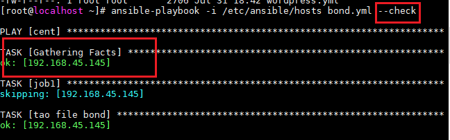
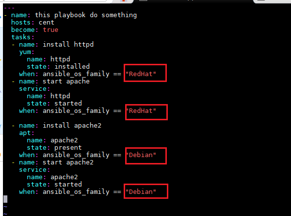

<h1 style="color:orange">Bổ sung kiến thức ansible</h1>
<h2 style="color:orange">1. Mẫu playbook</h2>
Playbook luôn được bắt đầu bằng "---". Ví dụ:

    ---
    - name: this playbook do something
      hosts: all
      become: true
      tasks:
      - name: something good
        ...
<h2 style="color:orange">2. check đầu ra file playbook</h2>
Mỗi khi muốn chạy thử file playbook ta dùng thêm option --check. Ansible sẽ giả định đầu ra của file playbook nhưng không thay đổi bất cứ gì trên client.

    ansible-playbook -i /etc/ansible/hosts /root/file.yaml --check
 
<h2 style="color:orange">3. Gather fact</h2>
Mỗi khi chạy file playbook, ansible server sẽ có động tác thu thập dữ liệu từ các client; gọi là task gather fact: 

 
Bản chất chính là ansible sẽ chạy lệnh:

    # ansible -m setup
để lấy toàn bộ thông tin của các client có trong file playbook. 

Tuy vậy, trong trường hợp chạy ansible hàng trăm máy cùng lúc, gather fact này có thể gây ra mất thời gian, để vô hiệu hóa hành dộng này, trong file play book thêm dòng: gather_facts: no

    ---
    - name: this playbook do something
      hosts: cent
      become: true
      gather_facts: no
      tasks:
      - name: install httpd
<h2 style="color:orange">4. when condition</h2>
Gỉả sử trong trường hợp muốn cài apache cho 2 máy centos và ubuntu, 2 OS này dùng 2 module khác nhau là yum và apt để cài package. Ta muốn chỉ viết 1 file playbook mà có thể cài package apache cho cả 2 máy này trong 1 lần chạy playbook. Viết file playbook như sau:

    ---
    - name: this playbook do something
      hosts: all
      become: true
      tasks:
      - name: install httpd
        yum:
          name: httpd
          state: installed
        when: ansible_os_family == "RedHat"
      - name: start apache
        service:
          name: httpd
          state: started
        when: ansible_os_family == "RedHat"

      - name: install apache2
        apt:
          name: apache2
          state: present
        when: ansible_os_family == "Debian"
      - name: start apache2
        service:
             name: apache2
             state: started
        when: ansible_os_family == "Debian"
 
Ở đây ta cài package apache cho máy centos và ubuntu. Chúng ta sử dụng when condition để hệ điều hành nào thì task đó mới chạy.

Lưu ý: nếu vô hiệu hóa gather_facts thì không thực hiện được hành động này.
<h2 style="color:orange">5. copy module</h2>
Ansible có thể copy 1 file từ ansible server sang managed node bằng module copy
<h2 style="color:orange">6. ignore errors</h2>
File playbook chạy các task từ trên xuồng dưới. Nếu có task nào bị lỗi trên 1 client thì các task sau sẽ không chạy nữa. Để khắc phục điều này, trong file playbook thêm vào trường: ignore_errors: yes

    - name: start apache
      service:
        name: httpd
        state: started
      when: ansible_os_family == "RedHat"
      ignore_errors: yes
Nếu task bị lỗi, ansible vẫn sẽ chạy những task dưới trên client.