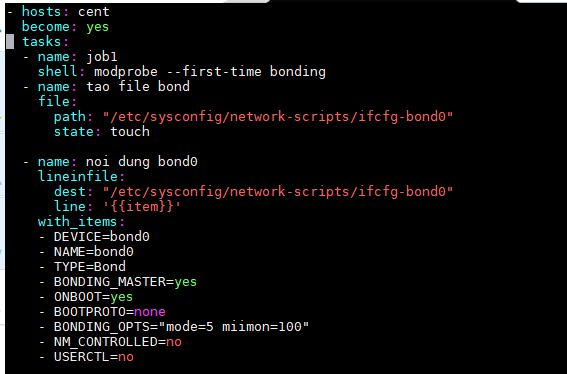
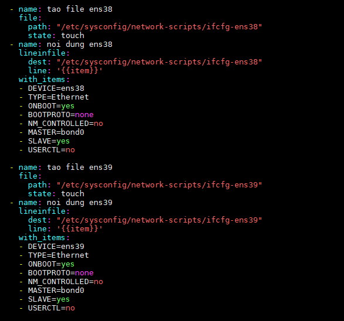
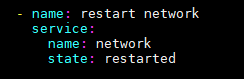
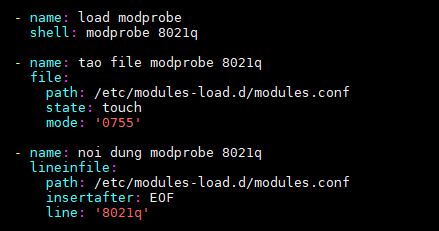
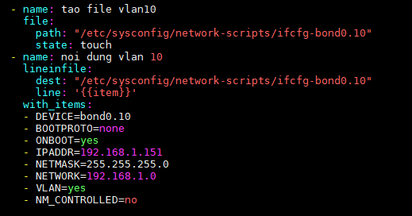
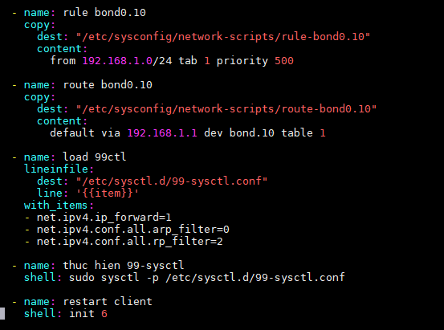

<h1 style="color:orange">Hướng dẫn gán vlan vào bonding bằng ansible</h1>
<h2 style="color:orange">1.    Bonding 2 card máy client</h2>

1. Load module bond nếu việc đây là bond lần đâu 
2. tạo file bond0 
3. gán nội dung vào file bond0 

 

4. Tạo file 2 card mạng cần bond và nội dung file config 2 card mạng (ở đây là ens38 và ens39) 

 
5. restart network

 
<h2 style="color:orange">2.    Gán vlan vào bond</h2>

1. load modprobe(cho vlan); Tạo file modprobe để client có thể load vlan khi reboot

 
2. Tạo file bond0 vlan 10 
 
3. Tạo rule và định tuyến cho vlan10 
 
4. reboot client
<h3 style="color:orange">3. Nội dung file playbook</h3>

    - hosts: cent
      become: yes
      tasks:
      - name: job1
        shell: modprobe --first-time bonding
      - name: tao file bond
        file:
          path: "/etc/sysconfig/network-scripts/ifcfg-bond0"
          state: touch

      - name: noi dung bond0
        lineinfile:
          dest: "/etc/sysconfig/network-scripts/ifcfg-bond0"
          line: '{{item}}'
        with_items:
        - DEVICE=bond0
        - NAME=bond0
        - TYPE=Bond
        - BONDING_MASTER=yes
        - ONBOOT=yes
        - BOOTPROTO=none
        - BONDING_OPTS="mode=5 miimon=100"
        - NM_CONTROLLED=no
        - USERCTL=no

      - name: tao file ens38
        file:
          path: "/etc/sysconfig/network-scripts/ifcfg-ens38"
          state: touch
      - name: noi dung ens38
        lineinfile:
          dest: "/etc/sysconfig/network-scripts/ifcfg-ens38"
          line: '{{item}}'
        with_items:
        - DEVICE=ens38
        - TYPE=Ethernet
        - ONBOOT=yes
        - BOOTPROTO=none
        - NM_CONTROLLED=no
        - MASTER=bond0
        - SLAVE=yes
        - USERCTL=no

      - name: tao file ens39
        file:
          path: "/etc/sysconfig/network-scripts/ifcfg-ens39"
          state: touch
      - name: noi dung ens39
        lineinfile:
          dest: "/etc/sysconfig/network-scripts/ifcfg-ens39"
          line: '{{item}}'
        with_items:
        - DEVICE=ens39
        - TYPE=Ethernet
        - ONBOOT=yes
        - BOOTPROTO=none
        - NM_CONTROLLED=no
        - MASTER=bond0
        - SLAVE=yes
        - USERCTL=no

      - name: restart network
        service:
          name: network
          state: restarted

      - name: load modprobe
        shell: modprobe 8021q

      - name: tao file modprobe 8021q
        file:
          path: /etc/modules-load.d/modules.conf
          state: touch
          mode: '0755'

      - name: noi dung modprobe 8021q
        lineinfile:
          path: /etc/modules-load.d/modules.conf
          insertafter: EOF
          line: '8021q'

      - name: tao file vlan10
        file:
          path: "/etc/sysconfig/network-scripts/ifcfg-bond0.10"
          state: touch
      - name: noi dung vlan 10
        lineinfile:
          dest: "/etc/sysconfig/network-scripts/ifcfg-bond0.10"
          line: '{{item}}'
        with_items:
        - DEVICE=bond0.10
        - BOOTPROTO=none
        - ONBOOT=yes
        - IPADDR=192.168.1.151
        - NETMASK=255.255.255.0
        - NETWORK=192.168.1.0
        - VLAN=yes
        - NM_CONTROLLED=no

      - name: rule bond0.10
        copy:
          dest: "/etc/sysconfig/network-scripts/rule-bond0.10"
          content:
            from 192.168.1.0/24 tab 1 priority 500

      - name: route bond0.10
        copy:
          dest: "/etc/sysconfig/network-scripts/route-bond0.10"
          content:
            default via 192.168.1.1 dev bond.10 table 1

      - name: load 99ctl
        lineinfile:
          dest: "/etc/sysctl.d/99-sysctl.conf"
          line: '{{item}}'
        with_items:
        - net.ipv4.ip_forward=1
        - net.ipv4.conf.all.arp_filter=0
        - net.ipv4.conf.all.rp_filter=2

      - name: thuc hien 99-sysctl
        shell: sudo sysctl -p /etc/sysctl.d/99-sysctl.conf

      - name: restart client
        shell: init 6