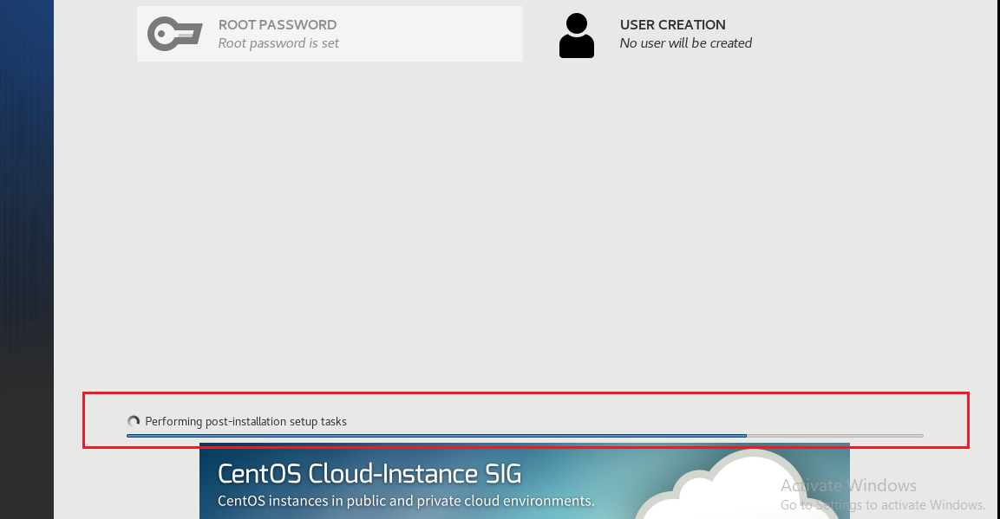
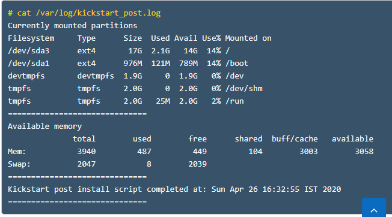
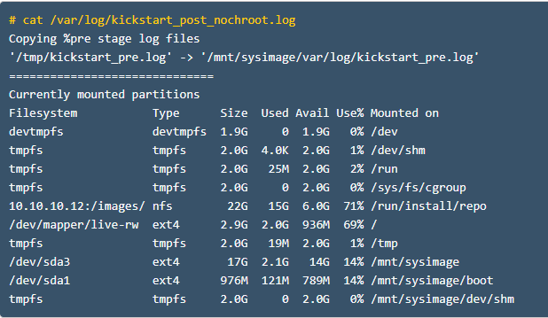
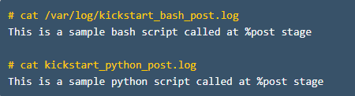

<h1 style="color:orange">Post-install</h1>
<h2 style="color:orange">1. Post-install là gì?</h2>

- post-install script là script trong file kickstart được chạy sau khi việc install OS xong (tuy vậy vẫn trong quá trình cài đặt OS) và trước khi client được reboot lần đầu sau cài OS.
- Có thể nhiều dòng script post-install trong 1 file kickstart.
- Tất cả script post-install phải bắt đầu với "%post" và kết thúc với "%end".
- Tất cả script post-install mặc định chạy trong môi trường chroot.
 
<h2 style="color:orange">2. Có thể chạy lệnh systemctl trong phần %post trong file kickstart</h2>

- Vì chạy trong môi trường chroot, lệnh "systemctl" sẽ không chạy được.
- Chỉ trừ 2 lệnh "systemctl enable" và "systemctl disable"
- Tuy vậy có thể dùng lệnh "systemctl" nếu thêm option --nochroot
<h2 style="color:orange">3. 1 số ví dụ post install</h2>
%post trong file kickstart 

    %post --log=/var/log/kickstart_post.log

    echo "Currently mounted partitions"
    df -Th

    echo "=============================="
    echo "Available memory"
    free -m
    echo "=============================="
    echo "Kickstart post install script completed at: `date`"
    echo "=============================="

    %end
Xem file /var/log/kickstart_post_nochroot.log sau khi cài xong OS

 
<h3 style="color:orange">3.2. chạy với --nochroot</h3>

    %post --nochroot --log=/mnt/sysimage/var/log/kickstart_post_nochroot.log

    echo "Copying %pre stage log files"
    /usr/bin/cp -rv /tmp/kickstart_pre.log /mnt/sysimage/var/log/

    echo "=============================="

    echo "Currently mounted partitions"
    df -Th
  
    %end
Xem file /var/log/kickstart_post_nochroot.log sau khi cài xong

 
<h3 style="color:orange">3.3. Sử dụng --interpreter với %post script </h3>

Chúng ta có thể chạy script riêng trong %post section. Tất cả script có sẵn trong linux có thể sử dụng, như là: `/usr/bin/sh`, `/usr/bin/bash`, và `/usr/libexec/platform-python`. Ngoài ra cũng có thể dùng `/usr/bin/python` để chạy python script trong %post.

Ví dụ:

    %post --interpreter=/usr/libexec/platform-python --log=/var/log/kickstart_python_post.log
    print("This is a sample python script called at %post stage")
    %end

    %post --interpreter=/usr/bin/bash --log=/var/log/kickstart_bash_post.log
    echo "This is a sample bash script called at %post stage"
    %end
Kiểm tra file `/var/log/kickstart_bash_post.log` và `/var/log/kickstart_python_post.log` sau khi cài xong.
 