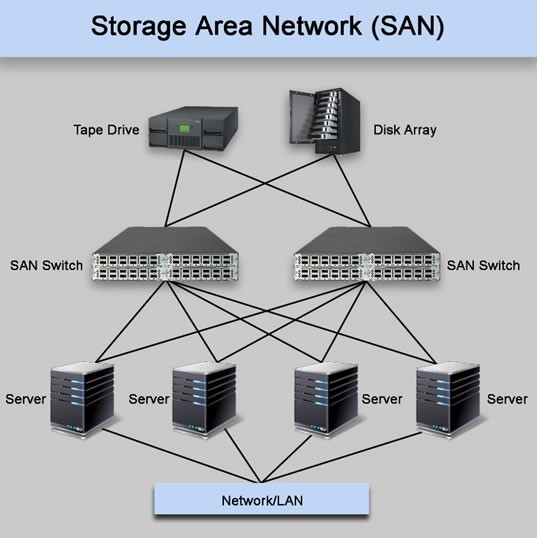
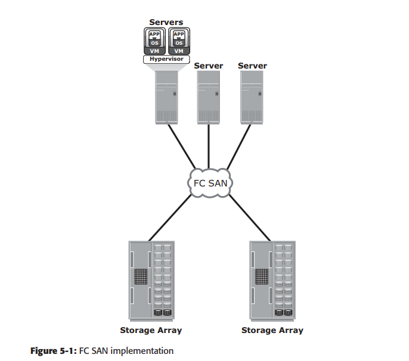
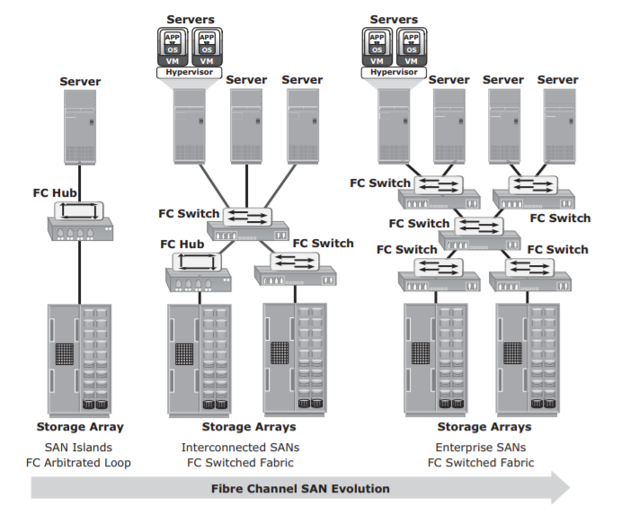
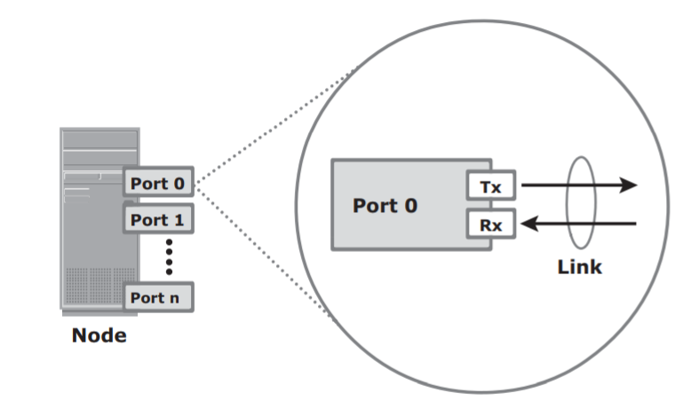
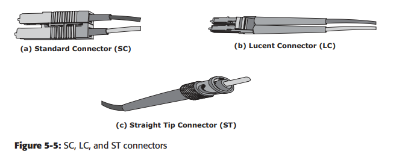
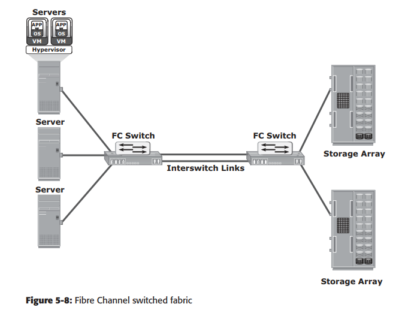
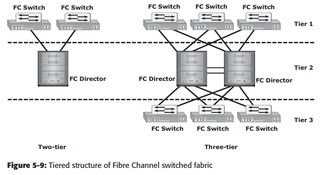
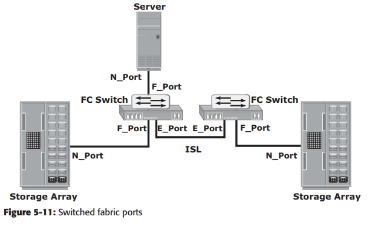

<h1 style="color:orange">Giới thiệu về SAN</h1>
Direct-attached storage (DAS) thường được nhắc tới là môi trường lưu trữ hình ống. Host "sở hữu" storage và khá khó để scale lớn ra và cũng khó để chia sẻ tài nguyễn giữa những thiết bị lưu trữ độc lập. Nỗ lực để tổ chức những dữ liệu rời rạc này dẫn tới storage area network (SAN).

SAN là một mạng máy chủ chuyên dụng được thiết kế để kết nối các máy chủ tới hệ thống lưu trữ dữ liệu. Trong đó, các máy chủ truy cập đến hệ thống lưu trữ ở mức block. Trung tâm của SAN là một thiết bị chuyển mạch (xét về hình thức, cấu trúc mạng SAN tương đồng với mạng LAN). Thiết bị chuyển mạch sẽ được nối tới các máy chủ và các thiết bị lưu trữ như băng từ, ổ đĩa…
Các triển khai SAN phổ biến là Fibre Channel (FC) SAN và IP SAN. Fibre Channel SAN sử dụng giao thức Fibre Channel để vận chuyển dữ liệu, lệnh và thông tin trạng thái giữa các máy chủ hoặc giữa các máy chủ và thiết bị lưu trữ. IP SAN sử dụng các giao thức dựa trên IP để liên lạc như: iSCSI, FCIP, FCoE.
 
<h2 style="color:orange">1. Tổng quan fibre channel</h2>
Kiến trúc Fibre channel (FC) là một kiến trúc cơ bản trong hạ tầng SAN. FC là một công nghệ mạng tốc độ cao được chạy trong môi trường kênh dẫn sợi quang và cáp đồng nối tiếp. Công nghệ này đáp ứng nhu cầu về tăng tốc độ truyền dữ liệu giữa server và khối lưu trữ. Truyền dữ liệu tốc độ cao là một trong những thuộc tính quan trong nhất của công nghệ FC. Phiên bản triển khai đầu tiên, công nghệ này đã cho thông lượng lên đến 200MB/s, cao hơn nhiều so với thông lượng của Ultra SCSI (20 MB/s), giao thức thường được sử dụng trong các hệ thống DAS. So với Ultra SCSI, FC là một bước tiến lớn. Hiện nay, thông lượng của FC đã đạt đến 3200MB/s, trong khi đó Ultra 640 SCSI cũng chỉ cho phép truyền với thông lượng là 640 MB/s. Kiến trúc FC cho khả năng mở rộng cao và theo lý thuyết một mạng FC có thể chứa khoảng 15 triệu thiết bị.
<h2 style="color:orange">2. SAN lịch sử hình thành và phát triển</h2>
Mạng SAN mang dữ liệu từ servers (hoặc hosts) và thiết bị lưu trữ qua Fibre channel. SAN cho phép chia sẻ dữ liệu giữa nhiều server, nó cũng cho phép mô hình mạng trở nên tập trung và ít phức tạp hơn ----> giảm chi phí.

Mô hình SAN tổng quát
 

Trong những ngày đầu của SAN, Fibre channel SAN (FC SAN) đơn giản là tập hợp giữa các host và storage sử dụng hub làm thiết bị kết nối (hub đơn giản hơn switch và chỉ hỗ trợ half duplex). Mô hình này được gọi là FC Arbitrated loop (FC-AL).

Việc sử dụng switch đã cải thiện đáng kế hiệu năng của SAN và giúp cho dễ dàng mở rộng hơn.
 
<h2 style="color:orange">3. Thành phần của FC SAN</h2>
FC SAN là mạng bao gồm servers và các storage. Servers và các storage là các điểm cuối trong SAN (gọi là các nodes). Cấu trúc SAN bao gồm node ports, cáp, connector (các module quang), và thiết bị nối (hub và switch), cùng với phần mềm quản lý SAN.

1. Node ports 
Trong FC SAN, mỗi node đều cần ít nhất 1 port vật lý để giao tiếp trong mạng. Những port này là port của card mạng HBA. Cácc port đều chạy full-duplex với link chuyền (Tx) và link nhận (Rx). 
* Lưu ý: card mạng HBA khác card mạng NIC. NIC dùng IP, SCSI, ... HBA dùng Word wide name để định danh. Cả 2 thiết bị đều có thể sử dụng dây quang và dây đồng.
 

2. Cáp và connector 
SAN sử dụng cả dây quang (multi và single mode) lẫn dây đồng. Đi kèm là các connector (module quang- hình dưới).
 

3. Thiết bị kết nối 
SAN sử dụng hub, switch và director. Director cũng là switch nhưng xịn hơn với nhiều port hơn và chịu lỗi tốt hơn. Switch lúc nào cũng có số port cố định trong thiết kế; trong khi director có dạng module và số port tăng lên khi thêm các blade vào các khe director.

4. Phần mềm quản lý SAN 
phần mềm quản lý các interface giữa host, switch và storage array (thường gọi là các ổ đĩa). Phần mềm cho phép quản trị các tài nguyên từ một trung tâm duy nhất. Nó cung cấp chức năng mapping, monitering, alert và zoning (giống vlan).
<h2 style="color:orange">4. Cấu trúc kết nối FC</h2>
Cấu trúc FC hỗ trợ 3 kiểu kểt nối: point-to-point, arbitrated loop, và fibre channel switched fabric. Trong đó hiện tại chỉ còn cấu trúc FC switched fabric là được sử dụng nhờ tính ưu việt so với 2 kiểu còn lại.
<h3 style="color:orange">4.1. Cấu trúc kết nối FC</h3>
Mạng Fibre channel switched fabric (FC-SW) cung cấp định tuyến và khả năng mở rộng. Việc thêm hoặc bớt 1 switch trong mạng sẽ giảm tối đa thiệt hại, không ảnh hưởng tới traffic giữa những thiết bị khác.

FC -SW cũng được gọi là `kết nối fabric`. Một fabric là một vùng logic mà trong đó tất cả các node giao tiếp với nhau trong 1 mạng (có thể hình dung ra LAN, nhưng không phải LAN). Fabric có thể tạo ra với 1 switch hoặc nhiều switch kết nối với nhau. Mỗi switch bao gồm 1 domain riêng biệt, là 1 phần trong sơ đồ địa chỉ của fabric.

Trong FC-SW, các node không bị loop; dữ liệu được truyền qua một đường chỉ định giữa các node. Mỗi port trong fabric chứa 24-bit địa chỉ FC. Trong fabric, đường nối giữa mỗi 2 switch được gọi là `interswitch link 
(ISL)`. ISL cho phép các switch kết nối với nhau để tạo thành một fabric. ISL được dùng để truyền dữ liệu host-to-storage. Dùng ISL cho phép mở rộng nhiều node. 
 

Một fabric có thể được mô tả theo kiến trúc xếp tầng. Số tầng của fabric được xác định dựa trên số lượng switch trên đường đi giữa 2 node xa nhau nhất. Số lượng này dựa trên cấu trúc hạ tầng thay vì cách mà các server và các thiết bị lưu trữ kết nối thông qua switch.
FC-SW sử dụng các switch để chuyển lưu lượng dữ liệu trực tiếp giữa các node thông qua switch port. Các khung dữ liệu được định tuyến giữa nguồn và đích bởi facbric.
 
<h2 style="color:orange">5. Switch fabric ports</h2>

- `N_port:` Node port, nó là host port (HBA) hay port cuar ổ đĩa.
- `E_port:` Port tạo kết nối giữa 2 FC switch. Port này cũng được gọi là port mở rộng. E_port của FC switch này kết nối với E_port của switch khác qua ISL trong fabric.
- `F_port:` Port trên FC switch kết nối với N_port (Fabỉc port).
- `G_port:` 1 port chung trên switch có thể biến thành E_port hay F_port.

 