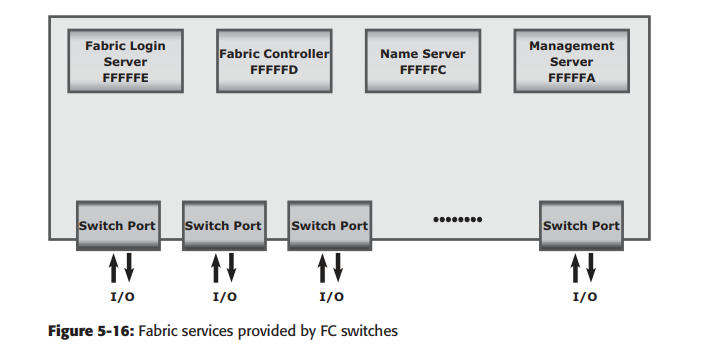
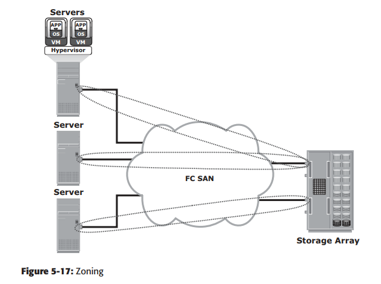
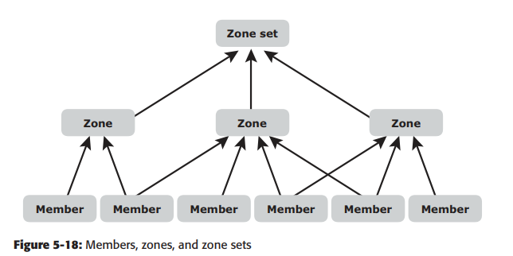
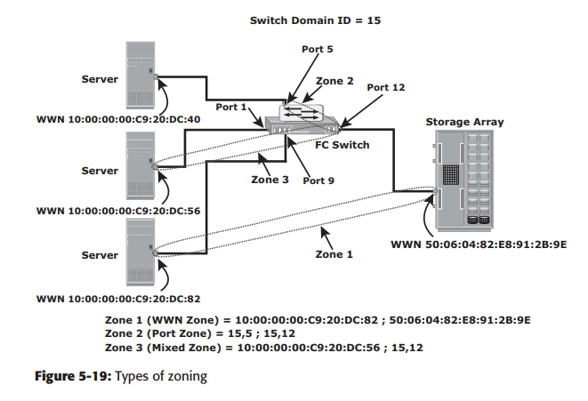

<h1 style="color:orange">Fabric service</h1>
Tất cả FC switch, bất kể nhà sản xuất, cung cấp một set service được định nghĩa trong chuẩn FC. Trong đó, có Fabric login server, Fabric controller, Name server và management server. 

- `Fabric login server` được đặt tại địa chỉ cố định FFFFFE và được dùng trong phần khởi động node login vào fabric. 
- `Name server` địa chỉ FFFFFC và chịu trách nhiệm cho đăng ký tên và quản lý node port. Mỗi switch trao đổi Name server với các switch khác trong fabric để đảm bảo tính đồng nhất.
- `Fabric controller` địa chỉ FFFFFD. Fabric controllẻ cung cấp service cho các node port và các switch khác. Fabric controller chịu trách nhiệm quản lý và phân phối Registered State Change Notificatión (RSCNs) với node port đăng kí với Fabric Controller. Nếu có thay dổi trong fabric, RSCNs sẽ được gửi đến tất cả node port gắn liền với switch. RSCNs này giữ name servẻ được cập nhật liên tục với tất cả switch trong fabric.

 
FFFFFA là địa chỉ Fibre channel cho Management Server được phân phối cho mỗi switch trong fabric. Management server cho phép phần mềm FC SAN management lấy dữ liệu và quản trị fabric.
<h2 style="color:orange">1. Các kiểu switched fabric login</h2>

- `Fabric login (FLOGI)`: giữa N_port và F_port. Để login vào fabric, 1 node gửi FLOGI frame với WWNN và WWNP tới login service với địa chỉ FFFFFE (Fabric login server). Switch nhận được tin và gửi bản tin ACCEPT (ACC) với địa chỉ FC cấp cho node (tương tự xin DHCP). Ngay lập tức sau FLOGI, N_port nhận local Name server trên switch, ấn định WWNN, WWNP, port type, class of service, địa chỉ FC.
- `Port login (PLOGI)`: Giữa 2 N_port để triển khai phiên. N_port truyền gửi bản tin PLOGI request đến N_port nhận. Sau đó N_port nhận accept bằng cách gửi bản tin ACC. Sau đó, 2 N_port có thể trao đổi với nhau.
- `Process login (PRLI)`: cũng giữa 2 N_port. Login này liên quan tới tầng FC-4 và ULP, như SCSI. Nếu ULP là SCSI, N_port trao đổi service SCSI.

<h1 style="color:orange">Zoning</h1>
Zoning là một chế độ hoạt động trong FC switch cho phép gộp các port trong 1 fabric thành các nhóm và để giao tiếp các port với nhau trong cùng 1 nhóm (tương tự VLAN).

 
Mỗi khi có name server thay đổi, fabric controller gửi bản tin Registered State Change Notification (RSCN) tới tất cả các node. Nếu không có zoning, fabric controller sẽ gửi cả RSCNs cho cả các node không ảnh hưởng bởi thay đổi ------> ảnh hưởng traffic đối với những hệ thống lớn.

Zone members, zone và zone sets từ thấp lên cao tạo thành zoning process. Một zone set là tập hợp các nhóm zone, các nhóm zone có thể được activated hoặc deactivated như một khối trong fabric. Nhiều nhóm zone có thể có trong fabric nhưng chỉ duy nhất một zone set active. Zone members là các node port (switch port, HBA, Cổng ổ đĩa). Một port có thể là thành viên của nhiều zone. Các port không cùng switch trong 1 fabric có thể cùng 1 zone (giống VLAN).

 

Zoning cho phép điều khiển bằng cách chỉ cho những membẻ cùng 1 zone thấy nhau.
<h2 style="color:orange">1. Các kiểu zoning</h2>
Zoning có thể chia làm 3 kiểu:

- `Port zoning:` Dùng địa chỉ FC để định danh node port nối với switch port (bằng switch domain ID và port number). Nếu node port thay đổi switch port trong fabric thì zoning phải cấu hình lại. Hoặc, HBA bị hỏng, phải thay thiết bị hỏng đấy mà không cần đổi cấu hình zoning.
- `WWN zoning:` Dùng world wide name để định nghĩa zone. Lợi thế lớn của WWN zoning là cho phép node port chuyển sang switch port khác mà không phải cấu hình lại zone. Bởi WWN là duy nhất như MAC.
- `Mixed zoning:` Kết hợp WWN zoning và port zoning. Dùng mixed zoning cho phép một node port gắn liền với WWN của 1 node. 
 

Zoning thường dùng với LUN masking để điều khiển server access tới storage. Tuy vậy, zoning ở fabric level còn LUN lại thực hiện ở ổ đĩa.