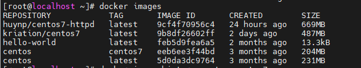
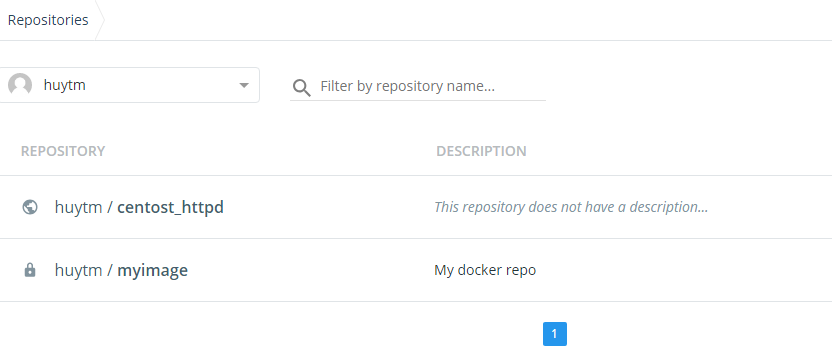

<h1 style="color:orange">Các câu lệnh với Image docker</h1>
<h2 style="color:orange">1. Hiển thị list images đang có</h2>

    # docker images
 
- REPOSITORY: là kho chứa của một Image. Image này có thể có nhiều TAG
- TAG: TAG có thể hiểu là version của Image cũng được
- IMAGE ID: ID của Image
- CREATED: Thời gian tạo Image
- SIZE: Dung lượng của Image
<h2 style="color:orange">2. Tải 1 image về từ Registry</h2>
Mặc định image registry là DockerHub

    # docker image pull [OPTIONS] NAME[:TAG|@DIGEST]
    # docker image pull centos:centos7
<h2 style="color:orange">3. Đẩy 1 image lên registry</h2>

    # docker image push [OPTIONS] NAME[:TAG]
Trước hết phải tạo một tài khoản của DockerHub. Tiếp theo là tên Image phải bắt đầu bởi tên tài khoản DockerHub của bạn (Chẳng hạn huytm/centost_httpd)

    # docker image push huytm/centost_httpd:1.0
Nhập username / password của DockerHub và đợi một chút để image được đẩy lên.
 
<h2 style="color:orange">4. Hiển thị chi tiết image</h2>

    # docker inspect [OPTIONS] IMAGE
    # docker inspect my_image
<h2 style="color:orange">5. Hiển thị lịch sử image</h2>

    # docker image history [OPTIONS] IMAGE
    # docker image history my_image
    # docker image history my_image:<TAG>
<h2 style="color:orange">6. Tạo 1 image TAG mới</h2>
Tạo 1 image có TAG mới từ 1 image đang có

    # docker image tag my-image:TAG1 my-image:TAG2
<h2 style="color:orange">7. Save 1 image thành 1 file tar</h2>
Save một image thành một file .tar. File này sẽ bao gồm các Layer sử dụng để tạo image đó, các file data dạng .json

    # docker image save [OPTIONS] IMAGE [IMAGE...]
    # docker image save -o /opt/my_image_file.tar my_image
<h2 style="color:orange">8. Tạo lại image bằng việc load lại file tar</h2>
Sử dụng file tar vừa save được ở câu lệnh docker save để tạo lại một image

    # docker image load [OPTIONS]
    # docker image load -i my_image_file.tar
<h2 style="color:orange">9. Xóa image</h2>

    # docker rmi my_image