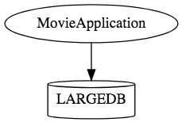
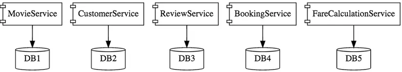
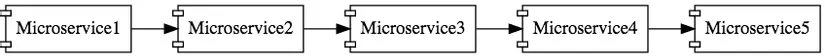

<h1 style="color:orange">Microservice</h1>
Microservice là một kiếu kiến trúc phần mềm. Các module trong phần mềm này được chia thành các service rất nhỏ (microservice). Mỗi service sẽ được đặt trên một server riêng -> dễ dàng để nâng cấp và scale ứng dụng.
<h2 style="color:orange">1. Monolithic</h2>
Khi xây dựng phần mềm theo kiến trúc monolith (một khối). Toàn bộ các module (view, business, database, report) đều được gom chung vào một project lớn. Khi deploy, chúng ta sẽ quăng khối code này lên server và config để nó chạy.

Kiến trúc này hoạt động khá ngon vì nó đơn giản, dễ code. Tuy nhiên, khi phần mềm trở nên lớn và phức tạp thì nó lại dần bộc lộ nhược điểm. Do các module đóng với nhau thành một bánh, khi muốn nâng cấp một module, ta phải deploy lại toàn bộ code, vì có thể code 1 module mới sẽ không tương thích với code của các module khác (người dùng cuối sẽ không sử dụng được toàn bộ các chức năng của hệ thống khi deploy); khi muốn phục vụ nhiều người dùng, ta phải nâng cấp server...

Nhược điểm mô hình monolithic:
- Khó scale
- Khó áp dụng công nghệ mới
- Cực kì phức tạp khi hệ thống scale lên lớn.
<h2 style="color:orange">2. Kiến trúc Microservice</h2>
Khác biệt với kiến trúc Monolith, thay vì gom tất cả module thành một khối (monolith), ta tách các module thành những service siêu nhỏ. Mỗi service sẽ được đặt trên một server riêng (Có thể dùng server cloud như AWS hoặc Azure), giao tiếp với nhau thông qua mạng (Gửi nhận message qua giao thức HTTP hoặc sử dụng MessageQueue)...

Mô hình cấu trúc microservice
 

So sánh mô hình monolithic và microservice: 
 
Kiến trúc Monolith, một ứng dụng sẽ chứa tất cả các thành phần 

 
Mỗi service được triển khai riêng 

 
Kiến trúc Microservice bao gồm một số thành phần nhỏ, được thiết kế tốt và tương tác qua các message. Các service sẽ gọi nhau. Tuy nhiên microservice thường được triển khai thêm với API gateway để gọi dịch vụ tập trung thay vì để các module gọi nhau lẫn lộn.

<h2 style="color:orange">3. Ưu nhược điểm microservice</h2>

1. Ưu điểm:
- Mã nguồn tinh gọn: Bởi vì hệ thống được cấu hình từ các dự án nhỏ và mỗi dự án đều rất đơn giản cũng như tập trung vào một hoặc một số nghiệp vụ chính. Vì vậy, code base và độ phức tạp của chúng đều không cao. Nhờ vậy, nó sẽ giúp các tính năng vận hành mượt mà, dễ dàng hơn trong bảo trì hay mở rộng phát triển.
- Tối ưu hóa bảo mật cho mã nguồn: Việc nhân viên ở dự án nào chỉ được truy cập vào một mã nguồn của dự án đó sẽ đảm bảo khả năng kiểm soát dữ liệu tốt hơn.
- Được tồn tại độc lập: Khi có 4 dự án khác nhau và được triển khai riêng biệt nhưng một dịch vụ nào đó chết thì các dịch vụ khác vẫn sẽ hoạt động bình thường.
- Scale hoàn toàn độc lập: Tùy vào nhu cầu sử dụng của hệ thống mà bạn có thể mở rộng quy mô riêng cho dịch vụ đó. Ví dụ như đơn hàng dịch vụ mà sử dụng thường xuyên nên chạy từ máy chủ 2 đến 3 để gia tăng hiệu suất.
2. Nhược điểm:
- Nhà phát triển thường xuyên phải đối phó với sự phức tạp khi tạo ra một hệ thống phân tán. 
- Cần phải implement việc communication giữa các inter-services
- Handle partial failure rất phức tạp bởi vì luồng xử lý cần phải đi qua nhiều service khác nhau. 
Khi thực hiện các requests trải rộng trên nhiều service cần đòi hỏi sự phối hợp giữa các team. 
- Khó khăn trong việc đảm bảo toàn vẹn cho cơ sở dữ liệu nếu như triển khai theo các cấu trúc dạng phân vùng. 
- Việc triển khai và quản lý microservices nếu như làm thủ công theo cách làm với ứng dụng thì sẽ rất phức tạp.
- Lập trình viên cần phải xử lý các sự cố kết nối chậm, lỗi nếu như thông điệp không được gửi hoặc nếu như thông điệp được gửi đến nhiều đích đến vào các thời điểm khác nhau. 
- Triển khai phức tạp nhưng scale lại dễ