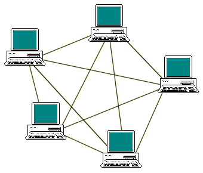
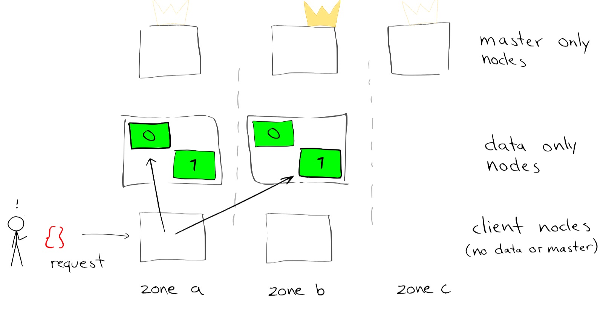
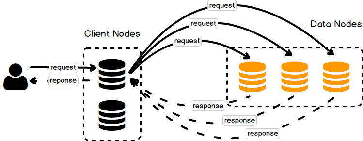
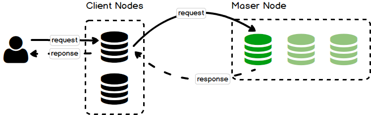

<h1 style="color:orange">Elasticsearch cluster</h1>

Khi khởi chạy một máy chủ Elasticsearch, thì bạn đã khởi động một ES Node và chúng ta mặc định đã có một Cluster với duy nhất một Node đơn lẻ đang hoạt động. Khi mà bạn khởi động thêm một máy chủ Elasticsearch khác có cùng cấu hình `'cluster.name'` với Node ES ta đã khởi động ban đầu thì bạn bắt đầu có một cluster ES với 2 Node. Vậy nếu khởi động nhiều máy chủ ES nữa cùng gia nhập Cluster ES thì hoàn toàn là chuyện đơn giản.

Mỗi Node trong cụm cluster có thể giao tiếp với các Node khác qua phương thức kĩ thuật riêng của Elasticsearch chạy giao thức TCP. Mô hình mà Cluster ES chạy là `mesh topology`, toàn bộ các Node đều giao tiếp với nhau.

 
<h2 style="color:orange">1. Vai trò các node trong Elasticsearch cluster</h2>
Mỗi Node ES trong một Cluster đều có thể đảm nhận các vai trò chức năng khác nhau đảm bảo mô hình hoạt động an toàn, chịu lỗi và tính sẵn sàng cao cho nhu cầu search/lưu trữ log.

 
File cấu hình vai trò ES Node nằm ở: `/etc/elasticsearch/elasticsearch.yml`

Nội dung cấu hình Role ES Node

    node.master: true/false 
    node.data: true/false
    node.ingest: true/false
    search.remote.connect: true/false
Chú thích: 
- `node.master:` kích hoạt (true) vai trò Master ES Node.
- `node.data:` kích hoạt (true) vai trò Data ES Node.
- `node.ingest:` kích hoạt (true) vai trò Ingest ES Node.
- `search.remote.connect:` kích hoạt (true) khả năng search giữa các cụm cluster.
<h3 style="color:orange">1.1. Master node</h3>
Master Node chịu trách nhiệm cho các hoạt động quản lý tạo, xoá Index, tái sắp xếp shard, thêm hoặc xoá một Node Elasticsearch khỏi Cluster. Bên cạnh đó, nếu trạng thái cluster của ES có sự thay đổi thì Master Node sẽ broadcast các sự thay đổi đến toàn bộ các node hiện hành trong hệ thống cluster.

lưu ý là chỉ có một Master Node hoạt động trong một thời điểm của hệ thống Cluster, bạn hoàn toàn có thể cấu hình backup Master Node với một node dự trù riêng (Master-eligible Node- các server sẵn sàng trở thành Master Node)

Trong một hệ thống ES Cluster chạy production, thường chúng ta sẽ dựng 1 con server chỉ để chạy Master Node , không xử lý các truy vấn từ client.

Mặc định khi cài đặt Elasticsearch mới toanh thì, một Node sẽ vừa là Master Node vừa là Data Node.

Cấu hình Data Node ES:

    node.master: true 
    node.data: true
    node.ingest: false 
    search.remote.connect: false
Để cấu hình máy chủ chỉ chạy chức năng Master Node ES:

    node.master: true 
    node.data: false 
    node.ingest: false 
    search.remote.connect: false
<h3 style="color:orange">1.2. Data node</h3>
Data Node chịu trách nhiệm cho việc lưu trữ dữ liệu ở các shard và thực hiện các hoạt động liên quan đến dữ liệu như CRUD : tạo, đọc, cập nhật, xoá, tìm kiếm,… Bạn hoàn toàn có thể có nhiều Data Node trong một cụm ES Cluster. Nếu mà một Data Node chết hoặc dùng hoạt động thì cụm cluster vẫn tiếp tục vận hành và tiến hành tổ chức lại các shard Index trên các node khác.

Để cấu hình Data Node ES:

    node.master: false 
    node.data: true 
    node.ingest: false 
    search.remote.connect: false
<h3 style="color:orange">1.3. Client node/ Coordinating node</h3>
Client Node chịu trách nhiệm cho việc điều hướng các truy vấn hoặc cân bằng tải các truy vấn tuỳ theo chức năng đến các Master Node hoặc Data Node. Có thể mường tượng Client Node có công năng như 1 con ‘router’ vậy.

Một Client Node sẽ không lưu trữ bất kì dữ liệu nào và nó cũng không thể trở thành Master Node. Cấu hình client khuyến nghị cho cluster lớn (10 con trở lên). Nếu tồn tại client node trong cluster thì search request sẽ được cân bằng tải giữa các node client thay vì đẩy đến data node. `(Tất cả node trong cluster đều nối với nhau nên request sẽ luôn được forward tới node cần thiết).`

 
Hình minh hoạ Node Client 1: client node điều hướng các truy vấn liên quan đến dữ liệu (CRUD) đến các Data Node trong cụm cluster. 
 
Hình minh hoạ Node Client 2: client node điều hướng các truy vấn liên quan đến cluster về các Master Node.

Để cấu hình Client Node ES:

    node.master: false 
    node.data: false
    node.ingest: false 
    search.remote.connect: false
<h3 style="color:orange">1.4. Ingest node</h3>
Ingest Node sẽ hỗ trợ bạn thực hiện hoạt động xử lý các documents trước khi quá trình index bắt đầu. Ingest Node được sử dụng khi ta cần pre-process các document trước khi chúng được index. Ingest node sẽ can thiệp vào giữa quá trình bulk và index, thực hiện các phép biến đổi, sau đó truyền kết quả trở lại index/bulk api.

Mặc định, các node đều enable ingest, vậy nên các node đêu có thể thực hiện được ingest. Nếu muốn disable ingest, đơn giản chỉ cần thêm config vào file elasticsearch.yml:

    node.ingest: false

Để thực hiện pre-process, đầu tiên ta cần định nghĩa 1 pipeline chỉ định 1 chuỗi các processor. Mỗi processor sẽ biển đổi các document theo 1 cách nào đó. Cluster state sẽ thực hiện lưu trữ các configured pipeline.

Để sử dụng pipeline, những gì bạn cần làm là truyền thêm tham số pipeline vào request index/bulk:

    PUT my-index/_doc/my-id?pipeline=my_pipeline_id
    {
      "foo": "bar"
    }
<h2 style="color:orange">2. Qúa trình thêm/bớt node trong Elasticsearch cluster</h2>
<h3 style="color:orange">2.1. Thêm 1 node</h3>
Khi thêm một ES Node vào cụm phân tán (cluster) ES thì Node mới thêm đó sẽ tiến hành ping toàn bộ các node đang chạy trong cluster để tìm ra Master Node. Một khi Master Node đã được tìm thấy, ES Node mới sẽ hỏi Master xin phép được nhập vào cụm ES Cluster đang chạy bằng request xin phép. Khi mà Master Node đồng ý cho phép ES Node mới tham gia vào cluster thì Master Node sẽ thông báo với toàn bộ các Node khác trong cụm cluster về sự hiện diện của Node mới. Cuối cùng ES Node mới có thể kết nối giao tiếp với toàn bộ các ES Node khác.

Khi mà ES Node mới được gia nhập cluster thành công, thì Master Node sẽ tiến hành tái sắp xếp dữ liệu giữa các Node. Việc tái sắp xếp này thường diễn ra khi bạn tạo các Index mới hoặc chủ động tái sắp xếp (reallocate) dữ liệu cho một Index (re-index).
<h3 style="color:orange">2.2. Bớt 1 node</h3>
Nếu chúng ta dừng một ES node hoặc một Node trong cụm ES Cluster dừng hoạt động ở một thời điểm thì Master Node sẽ loại bỏ Node đó khỏi Cluster. Master Node sẽ tiến hành hoạt động tái sắp xếp dữ liệu trên các Node khác nếu Node bị loại bỏ là một Data Node.

Mà làm thế nào mà Master Node biết được Node nào trong cụm cluster còn hoạt động ?! Đơn giản là Master Node sử dụng cơ chế kĩ thuật nhận biết lỗi riêng như bắn tín hiệu đến toàn bộ các node trong cụm và kiểm tra xem các Node còn sống không.

Vậy trong trường hợp Master Node chết thì sao ? Hiển nhiên chúng ta thường sẽ có 1 Master Node và thường có 2 Backup Master Node. Các Node trong cùng cụm phân tán sẽ sử dụng cơ chế kĩ thuật nhận diện lỗi hệ thống ở các Node trong cùng ES Cluster, ví dụ chúng ping Master Node để kiểm tra khả năng sống còn. Nếu Master Node chết, thì Master Node backup khác sẽ được lựa chọn trở thành Master Node mới trong vòng vài giây.