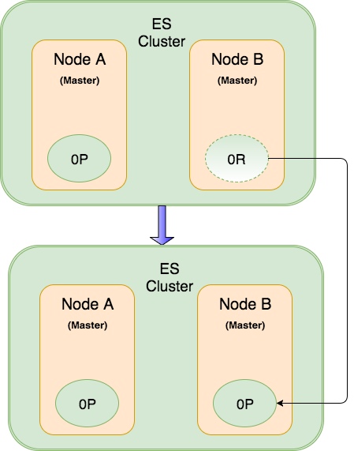

<h1 style="color:orange">Elasticsearch master node</h1>
Master Node chịu trách nhiệm cho các hoạt động quản lý tạo/xoá Index, tái sắp xếp shard, thêm hoặc xoá một Node Elasticsearch khỏi Cluster,… Bên cạnh đó, nếu trạng thái cluster của ES có sự thay đổi thì Master Node sẽ broadcast các sự thay đổi đến toàn bộ các node hiện hành trong hệ thống cluster. Nên đây là một trong những Node quan trọng nhất của một ES Cluster cần phải có.

Chỉ có một máy chủ Master Node hiện hành chạy trong hệ thống ES Cluster. Không thể có nhiều hơn 1 máy chủ Master Node cùng chạy trong Elasticsearch Cluster.

- `Master Node:` là máy chủ Elasticsearch Node đang chạy với vai trò Master Node. Được bầu chọn từ danh sách các máy chủ Master-eligible Node .
- `Master-eligible Node:` là các máy chủ Elasticsearch Node được cấu hình sẵn sàng tham gia quá trình bầu chọn trở thành Master Node, nếu Master Node hiện hành bị sự cố.

Mặc định khi cài đặt Elasticsearch mới toanh thì, một Node ES sẽ vừa là Master Node vừa là Data Node.
    
    node.master: true 
    node.data: true
    node.ingest: false 
    search.remote.connect: false
Để cấu hình máy chủ chỉ chạy chức năng Master Node ES:

    node.master: true 
    node.data: false 
    node.ingest: false 
    search.remote.connect: false
<h2 style="color:orange">1. Zen discovery</h2>
Zen Discovery là một module cung cấp thuật toán kĩ thuật giúp Elasticsearch khám phá/kiểm tra ra các Node trong cụm phân tán ES Cluster khi mà trạng thái của chúng có sự thay đổi. Zen Discovery còn góp mặt trong các hoạt động như : bầu chọn Master Node, kiểm tra sự cố lỗi ở các Node, cập nhật trạng thái cluster,… Đây là kĩ thuật mặc định mà Elasticsearch sử dụng để khám phá/kiểm tra và giao tiếp giữa các Node trong cluster.

Data Node và Master Node phát hiện ra nhau bằng 2 cách

- Ping: đây là một tiến trình mà một Node sẽ sử dụng kĩ thuật zen discovery để tìm kiếm và kiểm tra các Node khác. Master Node sẽ ping toàn bộ các Node trong cluster để đảm bảo tất cả các Node khác đều đang vận hành chạy. Ở phần còn lại, thì tất cả các Node còn lại như Client Node, Data Nodes,.. sẽ tiến hành ping Master Node để xác định xem Master Node còn sống hay không ? Nếu chết thì sẽ tiến hành bầu chọn lại Master Node.
- Unicast: unicast discovery yêu cầu một danh sách các host được cấu hình sẵn sàng làm Master Node. Bạn sẽ phải định nghĩa một danh sách thông tin Master-eligible Node (các host sẵn sàng tham gia bầu chọn Master Node). Điều này giúp một Node mới muốn gia nhập ES cluster thì chỉ cần kết nối giao tiếp đến các Master-eligible Node, nằm trong phần cấu hình unicast discovery, xem ai đang là Master Node để xin gia nhập cluster.
<h2 style="color:orange">2. Cơ chế phát hiện lỗi ở các Node trong ES Cluster</h2>
Có hai quá trình phát hiện lỗi được chạy cùng lúc :

- Đầu tiên là ở Master Node, node này sẽ ping tất cả các Node khác trong cụm phân tán và xác minh rằng chúng còn sống.

 
- Còn lại là ở các Node khác ngoại trừ Master Node, mỗi Node tiến hành ping Master Node để xác minh xem Master Node vẫn còn sống không? Nếu Master Node chết thì quá trình bầu cử Master Node mới sẽ được bắt đầu.

 
<h2 style="color:orange">3. Qúa trình cập nhật trạng thái ES cluster</h2>
Master Node là node duy nhất trong cụm phân tán ES Cluster được phép thay đổi trạng thái của cluster. Master Node xử lý một cập nhật trạng thái cluter theo hàng đợi (nếu có nhiều thay đổi), cập nhật sự thay đổi và thông báo sự thay đổi trạng thái của cluster đến toàn bộ các node trong cụm phân tán.

Mỗi node sẽ nhận được một thông điệp thông báo và buộc phải phản hồi xác nhận đã nhận được thông điệp đó (ack), nhưng các node sẽ không cập nhật trạng thái mới liền. Vì trong thời gian đó, Master Node sẽ phải đợi nhận được thông điệp xác nhận (ack) từ tối thiểu các máy chủ ES Master-eligible Node đang ở chế độ sẵn sàng ‘discovery.zen.minimum_master_nodes‘ và ‘node.master=true‘ trong một khoảng thời gian (mặc định 30 giây) trước khi quyết định là thông điệp thay đổi trạng thái cluster đó có bị huỷ bỏ hay không.
 
Một khi Master Node nhận được đầy đủ phản hồi xác nhận từ các Node về thông điệp trước đó, thì Master Node sẽ chính thức áp dụng sự thay đổi về trạng thái cluster và một thông điệp lần nữa được gửi đến các Node để báo các Node hãy lập tức thay đổi thông tin về trạng thái cluster ES mà các Node đang giữ. Master Node sẽ đợi phản hồi xác nhận đã cập nhật trạng thái cluster ES từ các Node, nếu timeout sẽ gửi lại.
<h2 style="color:orange">3. Qúa trình bầu chọn Master Node</h2>
Quá trình thực hiện bầu chọn Master Node thường được tự động xử lý bầu chọn Master Node mới. Bạn không thể chỉ định cụ thể Node nào sẽ là Node Master theo mong muốn, quá trình này là ngẫu nhiên và tự Elasticsearch vận hành khi gặp đủ điều kiện bầu chọn Master Node mới:

- Điều kiện 1: là có ít nhất một Master-eligible Node được cấu hình ‘node.master: true‘, nếu chỉ có 1 Node thì tự thân nó sẽ bầu chọn là Master Node. Nếu có nhiều Master-eligible Node thì chúng sẽ tự liên lạc với nhau qua kĩ thuật Zen Discovery để tự bầu Master Node mới.
- Điều kiện 2: thông số ‘discovery.zen.minimum_master_nodes‘ quy định số lượng tối thiểu các Master-eligible Node cần có trong mạng để tham gia tiến trình bầu chọn Master Node mới. Đây cũng là con số tối thiểu mà một Node cần phải thấy (giao tiếp được) để có thể bắt đầu quá trình hoạt động trong ES Cluster. Nếu hệ thống Cluster không đáp ứng được thông số tối thiểu Master-eligible Node cần có này, thì Master Node hiện hành sẽ dừng hoạt động và quá trình bầu chọn mới cũng sẽ được bắt đầu.

Khi mà Master Node dừng hoạt động hoặc gặp bất kì sự cố gián đoạn về hạ tầng hay mạng, toàn bộ các Node còn lại trong cụm cluster lúc đó sẽ thực hiện quá trình ping Master Node kiểm tra định kì. Tại sao phải toàn bộ các Node còn lại ping đến Master Node ? Vì lỡ 1 Node có vấn đề về mạng với Master Node gây ra cảnh báo giả, thì lúc này Node đó cần phải kiểm tra thông tin các Node khác xem có phải là cả đám node đều không thể ping được con Node Master hiện hành hay không ? Từ đó mới xác định là Master Node đã chết và bắt đầu quá trình bầu chọn Master Node mới.

Các Node có thể đứng ngoài quá trình bầu chọn Master Node nếu cấu hình ‘node.master’ là ‘false’. Điều đó có nghĩa Node đó không ở chế độ sẵn sàng cho việc bầu chọn trở thành Master Node trong Cluster ES Node.

Lưu ý:
- Thông số `“discovery.zen.ping_timeout“`, thông số này quy định thời gian ping timeout mà một Node sẽ đợi trước khi quyết định bắt đầu một cuộc bầu chọn Master Node mới.
- Thông số `“discovery.zen.join_timeout“`, thông số này quy định thời gian Node mới gửi request tham gia cluster cần đợi trước khi quyết định bắt đầu gửi lại request xin tham gia vào ES Cluster mới.
<h2 style="color:orange">4. Mô hình Master Node thường gặp</h2>
<h3 style="color:orange">4.1. Mô hình 1</h3>
Đầu tiên là mô hình tiết kiệm, nhiều người không muốn tách chức năng Master Node ra làm 1 Node riêng mà sẽ gộp chung Master Node với Data Node/Client Node. Vì tiết kiệm nên cũng không có nhu cầu giải pháp HA cho Master Node nên chỉ có 1 Master-eligible Node.
<h3 style="color:orange">4.2. Mô hình 2</h3>
Vẫn tiết kiệm, nhưng muốn đảm bảo tính sẵn sàng hơn cho Master Node (node quan trọng mà) nên cấu hình đủ số lượng Master-eligible Node sẵn sàng tham gia quá trình bầu chọn Master Node mới theo công thức quorum. Con số tối ưu hợp lý thường là 3 Master-eligible Node.

 
<h3 style="color:orange">4.3. Mô hình 3</h3>
Bạn có điều kiện về phần cứng cũng như resource để có thể đảm bảo hệ thống Elasticsearch Cluster vận hành ngon lành. Thế là bạn sẽ tách Data/Client Node một lớp. Còn Master Node ra làm một lớp riêng và chạy đủ số lượng Master-eligible Node đảm bảo tính HA.

 
<h2 style="color:orange">5. Vấn đề ‘Split-brain’ trong Elasticsearch Cluster</h2>
Bình thường nếu chỉ có 1 con Master Node thì sẽ rất nguy hiểm, nên thường nhiều người mới sẽ cấu hình thêm 1 Master-eligible Node sẵn sàng. Như vậy chỉ có 2 Master-eligible Node với cấu hình mặc định ban đầu của Elasticsearch sẽ phát sinh một vấn đề rất nghiêm trọng mang tên ‘Split-Brain‘ trong một ES Cluster.

Giả định kịch bản: Ta có một cụm ES Cluster với 2 máy chủ ES Node. Cả 2 vừa là Master-Eligible Node và Data Node. 
 
ES Cluster này đang lưu 1 Index với 1 Primary Shard và 1 Replica. Node A được bầu chọn là Master Node trong cụm này và giữ Primary Shard (kí hiệu là 0P), còn Node B giữ Replica Shard (kí hiệu là 0R).

 
Chẳng may một hôm nọ, sự cố phát sinh về đường mạng (không tính vấn đề một hệ thống sự cố downtime) giữa 2 Node A và B. Cả 2 Node thật chất đều vẫn còn đang chạy, nhưng cả hai không thể giao tiếp kiểm tra lẫn nhau qua hình thức ping (zen discovery).
 
Cả Node A và Node B đều tin rằng Node kìa đang có vấn đề như đang downtime chẳng hạn. Node A sẽ chẳng hành động gì mới, vì bản thân nó đã là Master Node hiện hành. Nhưng Node B thì lập tức tự động bầu chọn chính nó làm Master Node mới vì nó tin rằng phần còn lại trong Cluster  hiện không còn ai làm Master. 
 
Và như bạn đã biết thì nhiệm vụ của một Master Node trong ES Cluster, đó là quản lý các shard của Index giữa các Node. Lúc này Node B đang giữ một Replica Shard của Index và tin rằng không còn Primary Shard nào tồn tại nữa, vì vậy mà Node B Master Node tự chuyển Replica Shard thành Primary Shard. 
 
Lúc này Node A và Node B trở thành 2 Master Node độc lập, như ta biết 1 ES Cluster chỉ có 1 Master Node duy nhất chạy 1 thời điểm. Nên 2 Master Node độc lập cùng chạy sẽ trở thành 2 ES Cluster độc lập , quá trình này được gọi là ‘Split-Brain‘. Lúc này dẫu đường truyền mạng có khôi phục lại thì cũng không khôi phục được trạng thái Master Node ban đầu, trừ khi cả 2 node cùng khởi động lại dịch vụ Elasticsearch để bầu chọn lại Master Node. 
 
Lúc này hệ thống ES Cluster của chúng ta bắt đầu phát sinh sự cố về trạng thái của các Node không còn chính xác. Tình huống vấn đề sẽ phát sinh khi mà các Index request nếu xuống Node A thì Node A tự ghi vào primary shard của nó, nếu Index request xuống Node B thì Node B tự xử lý với primary shard của nó và hoàn toàn không có cơ chế dự phòng replica shard nữa.

Tình huống này rất khó phát hiện, chỉ đến khi bạn query Index và thấy thiếu kết quả trả về so với mong đợi.
<h3 style="color:orange">5.1.  Xử lý ‘Split-brain’</h3>

Để xử lý Split-Brain chúng ta cần quan tâm thông số `'discovery.zen.minimum_master_nodes'`: 
Với giá trị ‘minimum_master_nodes‘ là 1 : các Master-eligible Node có thể tự bầu chọn chính nó làm Master Node trong trường hợp sự cố mạng có vấn đề. Do nó được quy định chỉ cần số lượng thấp nhất 1 Master-eligible Node là đã có thể bắt đầu quá trình bầu chọn Master Node mới nếu Master Node có sự cố. Do nó đã là 1 Master-eligible rồi, nên nó cứ tự xử và sự cố ‘Split-brain‘ phát sinh từ đây. Cả 2 Node này sẽ không bao giờ quay lại cụm cluster đầu tiên nếu không có sự khởi động lại một trong hai Node để bắt đầu mới quá trình bầu chọn hay tham gia cụm Cluster. 
 
Với giá trị ‘minimum_master_nodes‘ là 2 : các Master-eligible Node cần nhìn thấy tối thiểu 2 Master-eligible trong mạng (bao gồm cả nó) để có thể bắt đầu quá trình bầu chọn Master Node mới. Theo hình, 1 bên trái sẽ không thể thấy đủ 2 Master-eligible Node cần thiết, nên từ cơ chế Master Node sẽ chuyển sang cơ chế Non-Master Node. Còn bên phải cả 2 Master-eligible Node đều thấy nhau nên thoả mãn điều kiện để bầu chọn Master Node mới. 
 
<h3 style="color:orange">5.2. Cấu hình số lượng Master-eligible Node tối thiểu</h3>
Giá trị ‘minimum_master_nodes‘ cực kì quan trọng cho tính sẵn sàng của hệ thống Elasticsearch Cluster khi đảm bảo Master Node luôn chạy. Con số tối ưu Minimum Master-eligible Node là 3. Vì nếu cấu hình nhiều Master-eligible Node sẵn sàng, sẽ làm tăng số lượng Node cần phải kiểm tra trạng thái là không cần thiết.

Giá trị ‘minimum_master_nodes‘ sẽ nói với Elasticsearch không được thực hiện quá trình bầu chọn Master Node nếu không có đủ số lượng Master-eligible Node được nhìn thấy nhau bởi các Master-eligible Node (các server sẵn sàng trở thành Master Node).

Hãy luôn sử dụng công thức ‘quorum‘ mà Elasticsearch khuyến cáo để tính toán thông số cấu hình ‘minimum_master_nodes‘ :

    (number of master-eligible nodes / 2) + 1
Cấu hình này có thể cấu hình trong file ‘elasticsearch.yml‘ :

    discovery.zen.minimum_master_nodes: 2
Cấu hình này có thể linh động cập nhật qua API Elasticsearch nhưng nó không mang tính vĩnh viễn như khi cấu hình trong file.

Cấu hình chuẩn Master Node
Đây là cấu hình chuẩn thường được ứng dụng để đảm bảo số lượng Master-eligible Node và quá trình bầu chọn Master Node an toàn tránh sự cố ‘Split-brain‘ phát sinh.

    discovery.zen.fd.ping_timeout: 10s
    discovery.zen.minimum_master_nodes: 2
    discovery.zen.ping.unicast.hosts: ["master_node_01″,"master_node_02″,"master_node_03″]
Lưu ý: trường discovery.zen đã bị remove từ elas 7.x