<h1 style="color:orange">Producer và Consumer trong Kafka</h1>
<h2 style="color:orange">1. Producer</h2>
Producer ghi data vào cluster bằng 2 thành phần:

- Message keys
- Acknowledgment
<h2 style="color:orange">1.1. Message keys</h2>
Kafka sử dụng key để gửi message theo thứ tự. Key cho phép producer có thể hoặc gửi data đến các partition (tự động) hoặc gửi data đến 1 partition chỉ định. Nếu producer gửi key đi cùng data thì data đó sẽ luôn được gửi đến cùng partition. Nhưng nếu không gửi key đi cùng, data sẽ được gửi kiểu `round-robin`. Tiến trình này được gọi là load-balancing. 

Message key có thể là string, số hoặc bất kì kí tự gì. Có 2 các để xem data được gửi với key hay không:
1. Nếu key=NULL, dữ liệu được gửi theo kiểu round-robin vào các partition
2. Nếu key!=NULL, data luôn được gửi vào 1 partition.

Ví dụ 1 producer ghi data vào Kafka cluster, data được gửi không kèm key nên được phân phối giữa các partition của Topic X mỗi broker. 
 
Lưu ý, như hình trên, key và offset không liên quan gì đến nhau. Với partition nào thì với mỗi data đi vào sẽ được đánh offset tăng dần.

Với ví dụ khác khi 1 producer gửi kèm key là Pro_id. Dữ liệu đi cùng key Pro_id1 sẽ được gửi vào partition 0 dưới broker 1 và data với key Pro_id2 được gửi vào partition 1 dưới broker 2. 
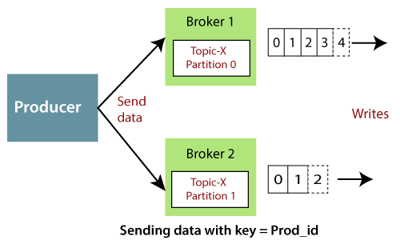 
<h2 style="color:orange">1.2. Sticky partitioner</h2>
Log khi được gửi đến kafka đều được đóng gói thành lô (batch) trước khi gửi đi.  
Bình thường khi Producer không đính kèm key khi gửi log đến Kafka, Kafka sẽ phân message lần lượt vào các partition theo kiểu round-robin. Producer sẽ đẩy log đầu vào batch đẩy vào partition 0, log 2 vào batch đẩy vào partition 1, và tiếp tục, cho đến hết số lượng partition trong topic thì sẽ bắt đầu lại từ batch đẩy vào partition số 0. Như hình vẽ: 

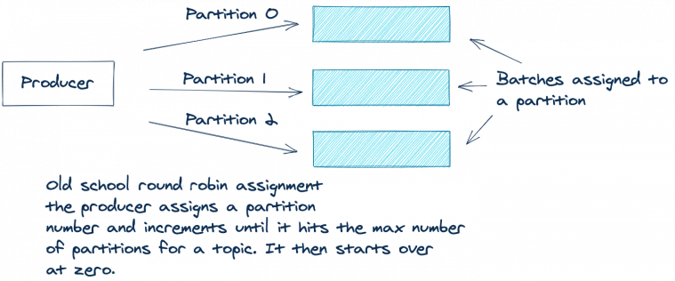 
Kiểu round-robin này làm tốt nhiệm vụ khi phân phối đều log giữa các partition. Tuy vậy, kiểu này có 1 nhược điểm: producer có thể gửi những batch có log thưa thớt, chưa đầy dung lượng batch. Sẽ tối ưu hơn khi gửi ít batch hơn nhưng nhiều log hơn trong 1 batch. Lấy ví dụ: 

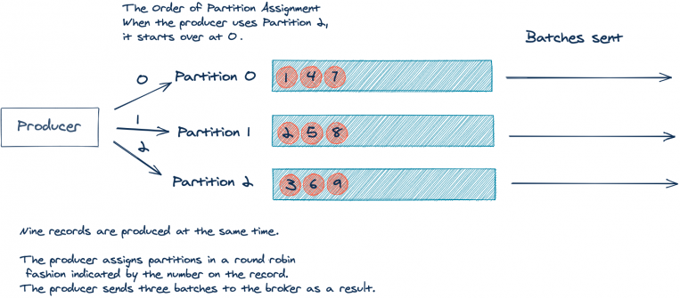 
Trong ví dụ trên, 9 record sẽ được gửi đi trong 3 batch. Nhưng sẽ tối ưu hơn khi gửi 1 batch chứa 9 record. Bởi ít batch hơn sẽ ít tải hơn cho broker.

Apache Kafka 2.4.0 đưa vào sticky partioner, biến điều này thành hiện thực. Thay vì sử dụng round-robin với mỗi record, sticky partitioner đẩy record vào cùng 1 batch cho đến khi đầy. Rồi, sau khi gửi batch, sticky partitioner đẩy record vào batch tiếp theo. Ví dụ minh họa:  

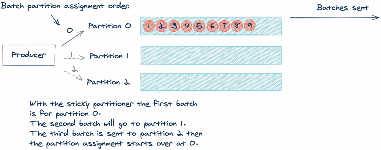 
Khi đẩy record vào 1 batch của 1 partition cho đến khi đầy, ta sẽ đẩy ít batch hơn -> giảm tải cho broker. Việc phân phối đều trước đây thay vì "per-record" sẽ đổi thành "per-batch", và là 1 cách tiếp cận hoàn thiện hơn.

Tham khảo: https://www.confluent.io/blog/5-things-every-kafka-developer-should-know/
<h3 style="color:orange">1.2.1. Nếu như producer đẩy messages theo nhiều batch cùng lúc?</h3>
Nếu producer đẩy message theo nhiều batch cùng lúc vào 1 topic trong Kafka mà không có key thì ntn?
Nếu message đẩy vào topic kafka mà không có key thì sẽ lưu theo kiểu round-robin. Điều tương tự cũng xảy ra khi đẩy theo batch. Nếu có nhiều batch cùng lúc gửi đến 1 topic kafka thì cũng sẽ được phân phối theo round-robin. VD: Có 10 batch được gửi cùng lúc thì batch 1 vào partition 1, batch 2 vào partition 2,... Nếu số batch gửi tới ít hơn số partition thì Kafka vẫn sẽ phân phối theo round-robin từ 0 -> 20 rồi quay ngược lại 0.
<h2 style="color:orange">1.3. Acknowledgement</h2>
Đê ghi dữ liệu vào Kafka cluster, producer sử dụng bản tin ack xác nhận.

- `acks=0:` Có nghĩa producer gửi data đến broker nhưng không đợi ack xác nhận. Điều này dẫn tới mất mát data vì không có xác nhận, có thể nếu broker down, producer sẽ không biết mà gửi lại.
- `acks=1:` Producer sẽ đợi ack của partition leader. Leader partition hỏi broker đã lưu thành công data chưa, rồi sẽ gửi lại ack cho producer. Mất dữ liệu được hạn chế.
- `acks=all:` Ở đây, bản tin ack sẽ được gửi bởi cả leader partition lẫn các replica partition. Cấu hình này không mất dữ liệu.

Ví dụ 1: producer gửi data đến 1 broker, nhưng không nhận bản tin ack. Mát dữ liệu nhiều khả năng xảy ra và không thể gửi tới consumer. 
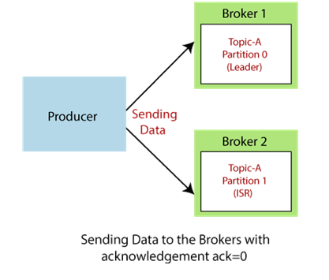 
Ví dụ 2: Producer gửi data đến broker. Broker 1 giữ leader partition. Do đó, leader hỏi broker 1 đã ghi được data vào chưa. Sau khi broker confirm, leader gửi ack=1 
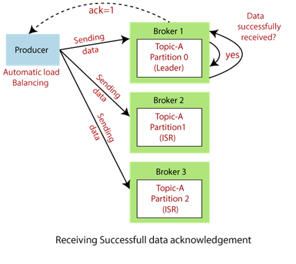 
Ví dụ 3: producer gửi data đến leader, leader gửi data đến replica, leader sẽ gửi lại bản tin ack khi cả broker của leader lẫn broker của replica partition xác nhận đã lưu dữ liệu. ==> không mất data.
<h2 style="color:orange">1.4. Làm sao producer biết đẩy về partition nào khi con kafka chứa partition nó đang liên lạc bị chết?</h2>

Nhìn chung, producer sẽ gửi (read/write) request đến boostrap server, được liệt kê trong phần config của producer. Request này trả lại thông tin chi tiết con broker nào chứa partition leader. Mỗi broker trong cluster sẽ chứa thông tin meta của cả cluster, có nghĩa là sẽ biết được partition leader nằm đâu.

Khi 1 con broker chết, leader partition được chuyển và producer sẽ biết thông tin này theo cách trên.
https://stackoverflow.com/questions/43146546/when-does-kafka-leader-election-happen
https://stackoverflow.com/questions/64832386/how-client-will-automatically-detect-a-new-leader-when-the-primary-one-goes-down
<h2 style="color:orange">2. Consumer</h2>

- Consumer đọc message từ topic, xác định bằng topic name.
- Đồng thời, consumer biết nên đọc message từ broker nào. Trong trường hợp chưa read xong mà broker gặp sự cố, consumer cũng có cơ chế tự phục hồi.
- Việc đọc message trong một partition diễn ra tuần tự để đảm bảo message ordering. Có nghĩa là consumer không thể đọc message offset=3 khi chưa đọc message offset=2.
- Một consumer cũng có thể đọc message từ một hoặc nhiều hoặc tất cả partition trong một topic.

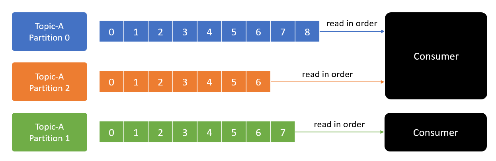 

- Message ordering chỉ đảm bảo trong một partition. Việc đọc ghi message giữa nhiều partition không đảm bảo thứ tự.
- Message offset=5 ở partition 0 có thể được đọc trước message offset=2 ở partition 1.
<h3 style="color:orange">2.2 Consumer group</h3>
Mỗi consumer thuộc consumer group sẽ đọc toàn bộ data của một hoặc nhiều partition để đảm bảo message ordering. Không tồn tại nhiều consumer cùng đọc message từ một partition.

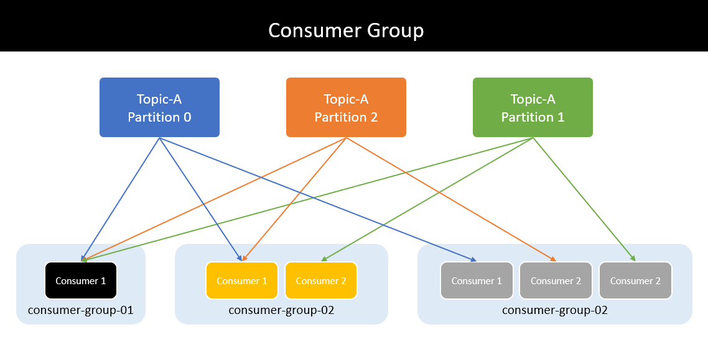 
Một consumer có thể nhận message từ nhiều partition. Nhưng một partition không thể gửi message cho nhiều consumer trong cùng consumer group.

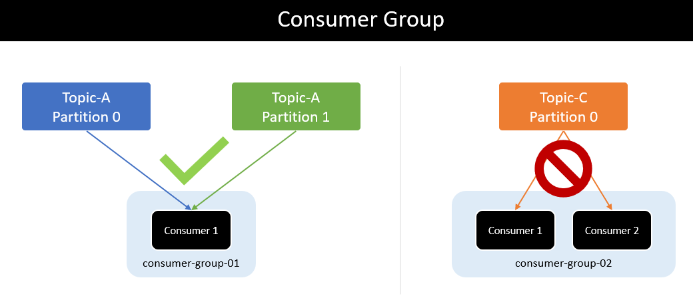 
Nếu số lượng consumer trong consumer group lớn hơn số lượng partition thì những consumer dư thừa có trạng thái inactive - không nhận bất kì message nào từ topic.

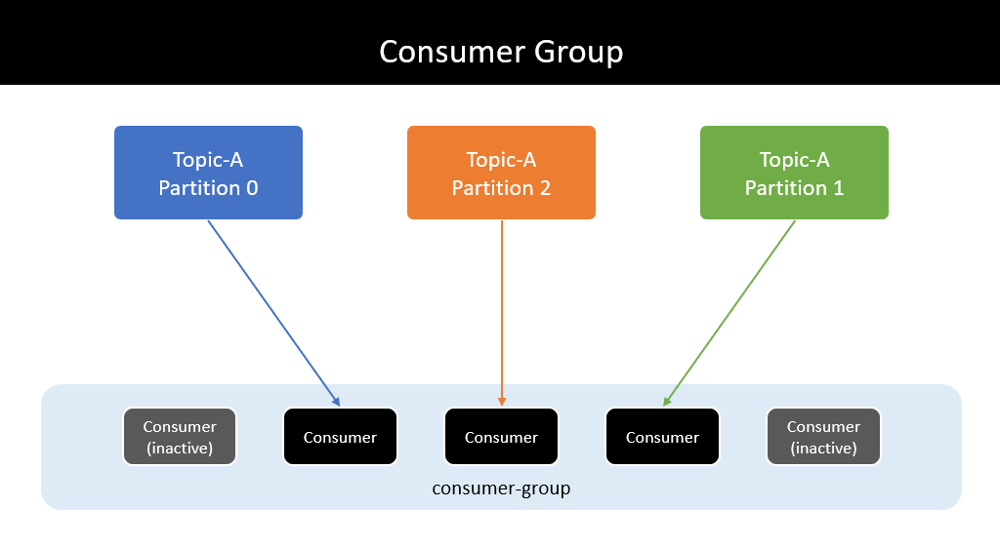 
<h3 style="color:orange">2.3. Rebalance consumer group</h3>
Các consumer trong một consumer group chia sẽ quyền sở hữu các partition trong một topic mà chúng subcribe tới. Khi chúng ta thêm một consumer mới tới group, nó bắt đầu tiêu thụ các message từ các partitions trước đó mà đã được tiêu thụ bởi consumer khác. Điều tương tự cũng xảy ra khi một consumer bị shutdown hay crash. Nó rời khỏi group, và các partitions nó đã sử dụng sẽ được tiêu tiêu thụ bởi một trong những consumer còn lại trong consumer group. Quá trình sắp xếp lại các partition (Reasssignment) tới các consumers cũng xảy ra khi các topics mà consumer group đang tiêu thụ được chỉnh sửa (nếu người quản trị thêm các partition mới vào topic).

Quá trình di chuyển các partitions được liên kết tới từ consumer này tới consumer khác được gọi là quá trình rebalance. `Rebalance` rất quan trọng vì chúng cung cấp cho consumer group khả năng sẵn sàng và tính mở rộng cao (cho phép chúng ta thêm và xóa consumer dễ dàng và an toàn), nhưng trong quá trình sử dụng bình thường, quá trình này không nên xảy ra. Trong quá trình rebalance, consumer không thể tiêu thụ các message được, do đó, việc rebalance về cơ bản sẽ làm cho toàn bộ consumer trong consumer group không thể tiêu thụ message được. Ngoài ra, khi các partitions được di chuyển từ consumer này tới consumer khác, consumer sẽ mất đi trạng thái hiện tại của nó. Nếu như nó đã cache dữ liệu sẵn rồi, nó sẽ cần phải làm mới lại cache – dẫn đến làm chậm ứng dụng cho đến khi consumer thiết lập lại trạng thái của nó.

- Sau phiên bản kafka 2.3, kafka đã được nâng cấp, trong quá trình rebalance, thay vì toàn bộ consumer sẽ bỏ toàn bộ quyền owner partition của mình và rebalance lại; chỉ những partition của consumer đã off mới phải đổi chủ ----> không có downtime cho những partition của consumer đang up. Luồng: kafka coordinator ko nhận đc heartbeat từ consumer off ----> báo cho consumer leader, consumer leader assign consumer nào đọc thêm partition nào ----> báo cho coordinator ----> coordinator báo lại cho consumer nào phải đọc them partition nào.
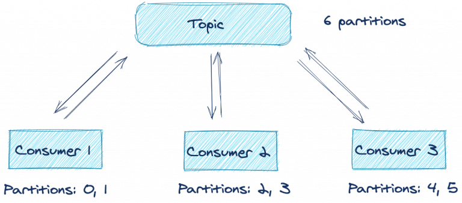 

Cách mà consumer duy trì tư cách thành viên trong một consumer group và sở hữu các partitions được gán tới chúng được thực hiện bằng cách gửi `heartsbeats` tới Kafka Broker – được chỉ định làm Kafka Coordinator hay điều phối viên (broker này có thể khác consumer groups khác). Miễn là consumer gửi heartbeats đều đặn, nó sẽ được coi là alive (đang còn khỏe) và đang xử lý các message từ các partitions của nó. Heartbeats được gửi khi một consumer polls (nhận các record về) diễn ra và khi nó commit records mà nó đã tiêu thụ.

Nếu như consumer ngừng gửi heartbeats trong một khoảng thời gian được quy định, khi đó phiên làm việc của nó sẽ hết hạn và group coordinator sẽ coi như nó đã chết và kích hoạt quá trình rebalance. Nếu một consumer gặp sự cố và ngừng xử lý các message, sẽ mất vài giây để group coordinator quyết định rằng nó đã chết hay chưa và kích hoạt quá trình rebalance. Trong những giây này, không có message nào được xử lý từ các partitions thuộc sở hữu bởi consumer đã chết. Khi đóng một consumer, consumer sẽ thông báo cho group coodinator rằng nó sẽ đang đi, và group coordinator sẽ kích hoạt quá trình rebalance ngay lập tức, giảm thiểu khoảng cách trong xử lý.

<h3 style="color:orange">2.4. Làm sao consumer nào biết mình phải đọc partition nào?</h3>

- `Consumer leader`: Khi một consumer muốn tham gia vào 1 consumer group, nó sẽ gửi một yêu cầu JoinGroup đến `group coordinator. Consumer đầu tiên tham gia nhóm sẽ trở thành consumer leader. Consumer leader nhận được danh sách tất cả consumer trong group từ group coordinator (bao gồm tất cả consumer đã gửi heartbeat đây và do đó được coi là alive) và consumer leader này có trách nhiệm chỉ định một tập hợp các partition cho từng consumer. Nó sử dụng việc triển khai giao diện PartitionAssignor để quyết định partition nào sẽ được xử lý bởi consumer nào.

Sau khi quyết định partition, consumer leader gửi danh sách phân công cho group coordiantor và group coordiantor gửi thông tin này đến tất cả consumer. Mỗi consumer chỉ thấy partition của riêng mình - consumer leader là consumer duy nhất có danh sách đầy đủ consumer trong group và nhiệm vụ của họ. Quá trình này lặp lại mỗi khi xảy ra rebalance.