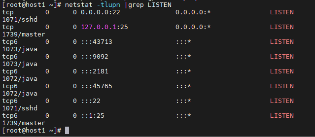
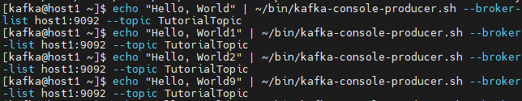
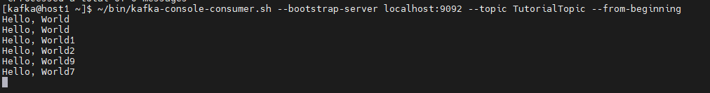

<h1 style="color:orange">Cài đặt kafka</h1>
<h2 style="color:orange">1. Cài đặt java</h2>

    # yum install -y java-1.8.0-openjdk.x86_64
Thêm môi trường "JAVA_HOME" và "JRE_HOME" vào cuối file "/etc/bashrc"

    # vim /etc/bashrc
paste vào

    export JRE_HOME=/usr/lib/jvm/jre
    export JAVA_HOME=/usr/lib/jvm/jre-1.8.0-openjdk
    PATH=$PATH:$JRE_HOME:$JAVA_HOME
Mở file ~/.bashrc và đảm bảo những dòng sau có:

    if [ -f /etc/bashrc ] ; then
      . /etc/bashrc
    fi
Chạy lệnh sau để kích hoạt path ngay lập tức:

    # source /etc/bashrc
<h2 style="color:orange">2. Cài đặt kafka</h2>
Tạo 1 user mới cho kafka dùng lệnh sau:

    # useradd kafka -m
Set password cho user mới

    # passwd kafka
Gán user kafka vào group wheel

    # usermod -aG wheel kafka
Login vào user kafka

    # su kafka
Tải kafka về

    # cd ~
    # wget http://apache.osuosl.org/kafka/2.8.1/kafka_2.13-2.8.1.tgz
    # tar -xvzf kafka_2.13-2.8.1.tgz
    # mv kafka_2.13-2.8.1/* .
    # rm -rf /home/kafka/kafka_2.13-2.8.1
Apache kafka dùng zookeeper để lưu cluster metadata, nên cần install zookeeper. Zookeeper file đi cùng Kafka, chạy trên port 2181.

Tạo file systemd để chạy zookeeper như là service:

    # sudo vim /etc/systemd/system/zookeeper.service
paste vào

    [Unit]
    Requires=network.target remote-fs.target
    After=network.target remote-fs.target

    [Service]
    Type=forking
    User=kafka
    ExecStart=/bin/sh -c '/home/kafka/bin/zookeeper-server-start.sh -daemon /home/kafka/config/zookeeper.properties'
    ExecStop=/home/kafka/bin/zookeeper-server-stop.sh
    Restart=on-abnormal

    [Install]
    WantedBy=multi-user.target
Tạo file systemd cho kafka

    # sudo vim /etc/systemd/system/kafka.service
paste vào

    [Unit]
    Requires=network.target remote-fs.target zookeeper.service
    After=network.target remote-fs.target zookeeper.service

    [Service]
    Type=forking
    User=kafka
    ExecStart=/bin/sh -c '/home/kafka/bin/kafka-server-start.sh -daemon /home/kafka/config/server.properties'
    ExecStop=/home/kafka/bin/kafka-server-stop.sh
    Restart=on-abnormal

    [Install]
    WantedBy=multi-user.target
Edit file `server.properties`:

    # sudo vim /home/kafka/config/server.properties
Thêm vào cuối file
    
    delete.topic.enable = true
    listeners=PLAINTEXT://192.168.45.130:9092
    log.dirs=/home/kafka/kafka-logs
Trường `delete.topic.enable = true` cho phép xóa topic. Mặc định kafka không cho phép.

Sau khi edit file xong 

    # sudo systemctl daemon-reload
Tạo 1 directory 'kafka-logs' trong `/home/kafka`:

    # sudo mkdir -p /home/kafka/kafka-logs
    # sudo chown kafka:kafka -R /home/kafka/kafka-logs
Mở firewall

    # sudo firewall-cmd --add-port={9092,2181}/tcp --permanent
    # sudo firewall-cmd --reload
Start và enable service

    # sudo systemctl start zookeeper
    # sudo systemctl start kafka
    # sudo systemctl enable zookeeper
    # sudo systemctl enable kafka
Kiểm tra port 9092 của kafka và 2181 của zoo keeper
 
<h2 style="color:orange">3. Kiểm tra</h2>
Publish rồi consume 1 "Hello World" message.
Publish 1 message trong kafka cần: 1 publisher và 1 consumer.

Tạo 1 topic tên `TutoriorTopic`:

    # ~/bin/kafka-topics.sh --create --zookeeper localhost:2181 --replication-factor 1 --partitions 1 --topic TutorialTopic
    hoặc
    # ~/bin/kafka-topics.sh --create --bootstrap-server localhost:9092 --replication-factor 1 --partitions 1 --topic TutorialTopic
Output

    Created topic "TutorialTopic".
Tạo 1 producer từ command line sử dụng `kafka-console-producer.sh`. Bash script yêu cầu server hostname, port và topic name.

    # echo "Hello, World" | ~/bin/kafka-console-producer.sh --broker-list localhost:9092 --topic TutorialTopic > /dev/null
Sau đó tạo 1 kafka consumer sử dụng `kafka-consolo-consumer.sh`. Nó sử dụng zookeeper server hostname và port, cùng với topic name.

    # ~/bin/kafka-console-consumer.sh --bootstrap-server localhost:9092 --topic TutorialTopic --from-beginning
Output:

    Hello, World
Script sẽ tiếp tục chạy, chờ thêm message publish đến topic. Mở 1 terminal mới và tiếp tục dùng producer publish message đến topic TutorialTopic trong kafka.
 
 