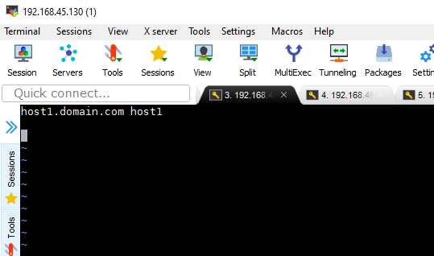
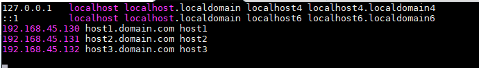
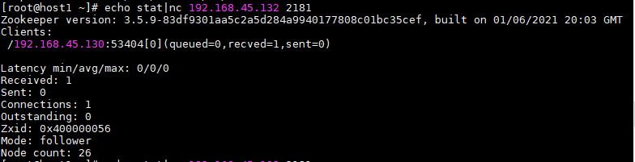
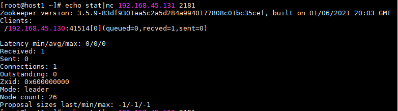
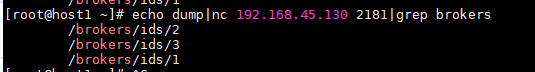
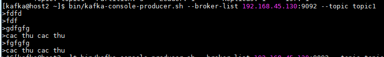

<h1 style="color:orange">Cài đặt kafka cluster</h1>
<h2 style="color:orange">1. Chuẩn bị</h2>
3 node kafka:

- 192.168.45.130/24 kafka 1
- 192.168.45.131/24 kafka 2
- 192.168.45.132/24 kafka 3

Định nghĩa hostname trên cả 3 node

    # vim /etc/hostname
 

    # vim /etc/hosts
 
Vô hiệu hóa SELinux trên cả 3 node

Cấu hình firewall trên 3 node

    # firewall-cmd --permanent --add-port={9092,2181,2888,3888}/tcp
    # firewall-cmd --reload
<h3 style="color:orange">1.1 Cài đặt java</h3>

    # yum install -y java-1.8.0-openjdk.x86_64
Thêm môi trường "JAVA_HOME" và "JRE_HOME" vào cuối file "/etc/bashrc"

    # vim /etc/bashrc
paste vào

    export JRE_HOME=/usr/lib/jvm/jre
    export JAVA_HOME=/usr/lib/jvm/jre-1.8.0-openjdk
    PATH=$PATH:$JRE_HOME:$JAVA_HOME
Mở file ~/.bashrc và đảm bảo những dòng sau có:

    if [ -f /etc/bashrc ] ; then
      . /etc/bashrc
    fi
Chạy lệnh sau để kích hoạt path ngay lập tức:

    # source /etc/bashrc
<h2 style="color:orange">2. Tải kafka và zookeeper</h2>
Tạo 1 user mới cho kafka dùng lệnh sau:

    # useradd kafka -m
Set password cho user mới

    # passwd kafka
Gán user kafka vào group wheel

    # usermod -aG wheel kafka
Login vào user kafka

    # su kafka
Từ bước này ta sẽ đứng trên user kafka để thao tác

Tải kafka về

    # cd ~
    # wget http://apache.osuosl.org/kafka/2.8.1/kafka_2.13-2.8.1.tgz
    # tar -xvzf kafka_2.13-2.8.1.tgz
    # mv kafka_2.13-2.8.1/* .
    # rm -rf /home/kafka/kafka_2.13-2.8.1
Apache kafka dùng zookeeper để lưu cluster metadata, nên cần install zookeeper. Zookeeper file đi cùng Kafka, chạy trên port 2181.

Tạo file systemd để chạy zookeeper như là service:

    # sudo vim /etc/systemd/system/zookeeper.service
paste vào

    [Unit]
    Requires=network.target remote-fs.target
    After=network.target remote-fs.target

    [Service]
    Type=forking
    User=kafka
    ExecStart=/bin/sh -c '/home/kafka/bin/zookeeper-server-start.sh -daemon /home/kafka/config/zookeeper.properties'
    ExecStop=/home/kafka/bin/zookeeper-server-stop.sh
    Restart=on-abnormal

    [Install]
    WantedBy=multi-user.target
Tạo file systemd cho kafka

    # sudo vim /etc/systemd/system/kafka.service
paste vào

    [Unit]
    Requires=network.target remote-fs.target zookeeper.service
    After=network.target remote-fs.target zookeeper.service

    [Service]
    Type=simple
    User=kafka
    ExecStart=/bin/sh -c '/home/kafka/bin/kafka-server-start.sh -daemon /home/kafka/config/server.properties'
    ExecStop=/home/kafka/bin/kafka-server-stop.sh
    Restart=on-abnormal

    [Install]
    WantedBy=multi-user.target

    # sudo systemctl daemonp-reload
<h2 style="color:orange">3. Cài đặt kafka và zookeeper</h2>
Chúng ta phải tạo data và log directory cho zookeeper và kafka. Để đơn giản bước này, chúng ta có thể thêm directory vào thẳng /home/kafka. Trong môi trường production, chúng ta sẽ dùng chỗ khác; ví dụ mount point hoặc đĩa vật lý cho thư mục data và log.

    # sudo mkdir -p /home/kafka/zookeeper/data
    # sudo mkdir -p /home/kafka/kafka/kafka-logs
<h3 style="color:orange">3.1. Cấu hình zookeeper</h3>
Cấu hình zookeeper trên 3 node

    # vim config/zookeeper.properties
thay đổi các dòng sau

    dataDir=/home/kafka/zookeeper/data
    tickTime=2000
    initLimit=10
    syncLimit=5
    4lw.commands.whitelist=*
    maxClientCnxns=60
    server.1=192.168.45.130:2888:3888
    server.2=192.168.45.131:2888:3888
    server.3=192.168.45.132:2888:3888
Mỗi node trong cluster cần 1 unique id. Zookeeper tìm thông tin này trong file sau /home/kafka/zookeeper/data/myid

    # echo "1" > /home/kafka/zookeeper/data/myid
Broker nào dùng ID đó
<h3 style="color:orange">3.2. Cấu hình kafka</h3>

    # vim config/server.properties
thay đổi các dòng sau

    broker.id=1
    log.dirs=/home/kafka/kafka/kafka-logs
    listeners=PLAINTEXT://192.168.45.130:9092
    advertised.listeners=PLAINTEXT://192.168.45.130:9092
    zookeeper.connect=192.168.45.130:2181,192.168.45.131:2181,192.168.45.132:2181
    delete.topic.enable=true
Broker nào dùng ip broker đó

    # sudo systemctl enable zookeeper
    # sudo systemctl enable kafka
    # sudo systemctl start zookeeper
    # sudo systemctl start kafka
<h2 style="color:orange">4. Sửa lỗi</h2>

Lỗi `java.net.BindException: Address already in use` 
Lý do, 1 tiến trình zookeeper đã chạy trước đó 

    # yum install -y lsof
chạy lệnh để xem có tiến trình nào đã tồn tại

    # lsof -i:8080
Port 8080 là port mà Java chạy.

kill tiến trình đó

    # kill -9 <PID>
<h2 style="color:orange">5. Kiểm tra</h2>
Dùng lệnh để kiểm tra zookeeper
  
    # yum install -y netcat
    # echo stat|nc 192.168.45.131 2181
 
 

Dùng lệnh để kiểm tra kafka

    # echo dump|nc 192.168.45.130 2181|grep brokers
 

Tạo 1 topic

    #  bin/kafka-topics.sh --create --zookeeper 192.168.45.130:2181,192.168.45.131:2181,192.168.45.132:2181 --replication-factor 1 --partitions 6 --topic topic1 --config cleanup.policy=delete --config delete.retention.ms=60000
Lệnh tạo 1 topic tên là topic1 với 6 partition. Môi cluster sẽ có 2 partitions. Replication-factor set là 1, nghĩa là data không được replicate và data của 1 partition sẽ chỉ được chứa trên 1 server.

List những topic đang có trong cluster

    # bin/kafka-topics.sh --list --zookeeper 192.168.45.130:2181
Detailed description của topic

    # bin/kafka-topics.sh --describe --zookeeper 192.168.45.130:2181 --topic topic1
 
<h2 style="color:orange">6. Test cluster</h2>
Chạy kafka producer

    # bin/kafka-console-producer.sh --broker-list 192.168.45.130:9092 --topic topic1
 

Chạy kafka consumer

    # bin/kafka-console-consumer.sh --bootstrap-server 192.168.45.132:9092 --topic topic1
 
<h2 style="color:orange">7. Giới hạn kafka user</h2>
Sau khi tất cả công đoạn cài đặt đã xong, có thể bỏ quyền user kafka. Trở lại user root hoặc sudo user. Bỏ quyền user kafka

    # sudo gpasswd -d kafka wheel
Có thể lock user account lại. Điều này làm cho ko ai có thể đăng nhập vào kafka:

    # sudo passwd kafka -l
Chỉ user root mới có thể chuyển sang user kafka. Mở lại user kafka bằng cách:

    # sudo passwd kafka -u