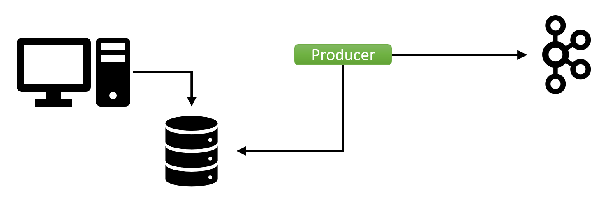
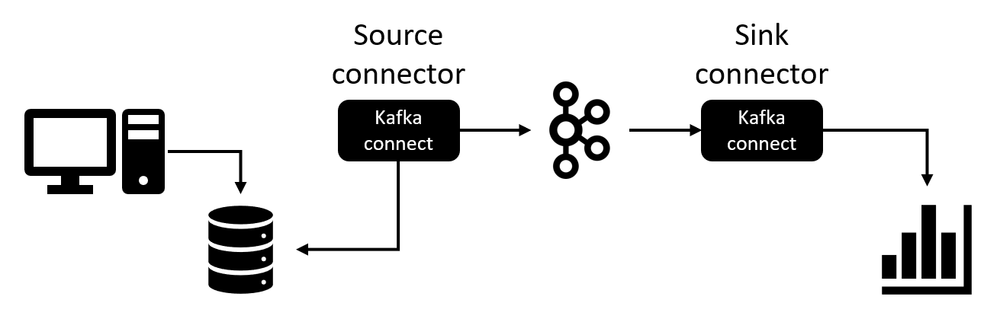
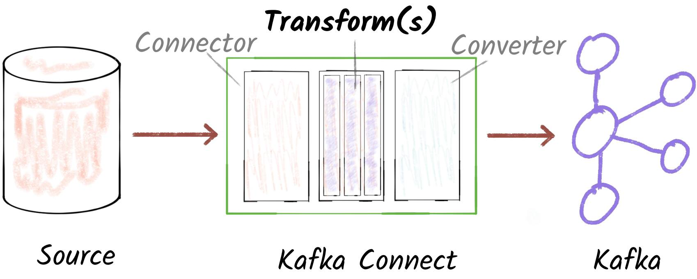
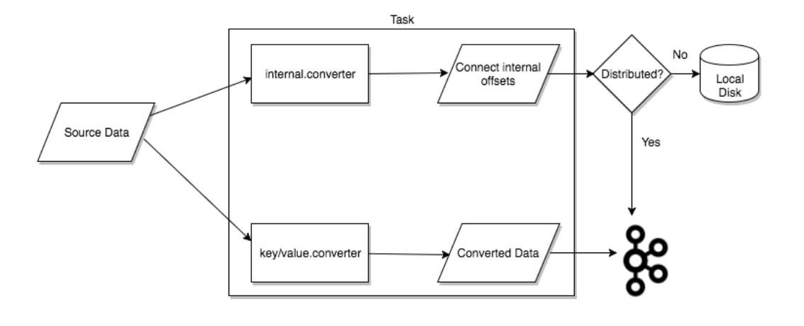
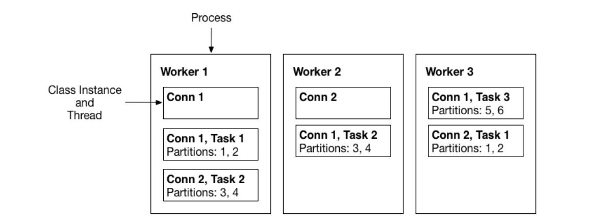
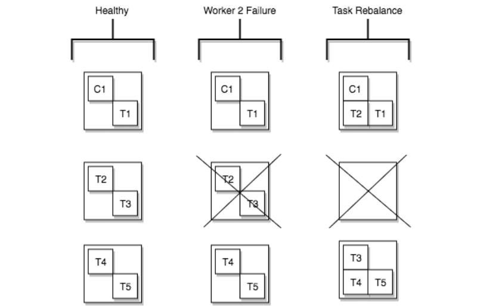
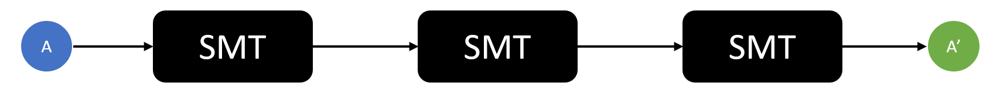

<h1 style="color:orange">Kafka connect</h1>
Như các bạn đã biết, theo cách truyền thống Kafka client API được nhúng vào ứng dụng của bạn với vai trò là producer hoặc consumer để giúp ứng dụng của bạn ghi hoặc đọc dữ liệu từ Kafka. Bạn có thể sửa code ứng dụng để đẩy hoặc kéo dữ liệu từ Kafka theo ý muốn của bạn.

Với Kafka Connect API thì không giống như vậy, Bạn chỉ cần cấu hình các connector để lấy dữ liệu từ một hệ thống bên ngoài đưa vào Kafka hoặc lấy dữ liệu từ Kafka đẩy ra hệ thống khác.
 
 

có 2 loại connect là `Source connector` và `Sink connector`: 
 
- Bên trái được gọi là Source connector: pull data từ source system và gửi đến Kafka cluster (tương tự producer).
- Bên phải là Sink connector: consume data từ topic và sink đến hệ thống đích (tương tự consumer).
- Kafka connect là một component của Kafka với nhiệm vụ connect và transfer data giữa Kafka và các external system như: 
Source: Twitter, Viblo, Reddit, MySQL, PostgreSQL.. 
Sink: Cloud storage, Elasticsearch, MongoDB, Cassandra... 
<h2 style="color:orange">1. Kafka connect hoạt động thế nào?</h2>
Read và write cho mỗi hệ thống là hoàn toàn khác nhau từ cơ chế cho đến cách implement.

Bản chất Kafka connect giống như một interface, abstract level, tạo các API để 3rd party có thể implement dựa trên từng cách thức hoạt động khác nhau của từng service.

Các engineer đã phát triển Kafka connect framework để implement Kafka connector, tất nhiên nó cũng là open-source. Nó cho phép các vendor tự tạo các connector, chúng ta chỉ việc config và sử dụng. Hoặc bạn có thể tự viết connector nếu muốn.

Kafka connect framework bao gồm:

    Source connector:
    - SourceConnector.
    - SourceTask.
    Sink connector:
    - SinkConnector.
    - SinkTask.
Kafka connect framework đã code hết những thứ magic phía sau như scalability, fault tolerance, error handling... Các engineer chỉ cần implement 2 class cho mỗi Kafka connect là:

SourceConnector và SourceTask.
Hoặc SinkConnector và SinkTask.
Thực ra còn khá nhiều thứ xung quanh nhưng chúng ta chỉ cần có cái nhìn tổng quan về Kafka connect.

Đó là tất cả những gì cần làm để tạo ra Kafka connector. Sau đó chỉ cần config và bùm.. bài toán được giải quyết nhanh gọn.
<h2 style="color:orange">2. Kafka connect architecture và các khái niệm</h2>
Có một số khái niệm chúng ta sẽ nhắc tới nhiều ở các phần sau như Worker, Connector, Sink, Source ; để các bạn dễ hình dung, mình xin lấy ví dụ như sau: 
       
    Thỉnh thoảng bạn lại có một món quà tặng cho họ hàng ở phương xa qua đường chuyển phát nhanh, những món quà sẽ qua các giai đoạn từ bạn  qua tay nhân viên chuyển phát về bưu cục và từ bưu cục lại qua tay nhân viên chuyển phát tới người họ hàng của bạn. 
    Nếu coi Kafka là cái bưu cục - nơi tạm chứa món quà của bạn thì :
    -> Source - chính là bạn
    -> Sink - là người họ hàng 
    -> Connector chính là công việc vận chuyển món quà của bạn, 
        + Connector dạng Source là việc chuyển món quà từ bạn tới bưu cục
        + Connector dạng Sink là là việc  chuyển món quà từ bưu cục tới người họ hàng.
    -> Worker là anh nhân viên chuyển phát.
<h3 style="color:orange">2.1. Connector</h3>

 
Mô tả các bước trải qua của dữ liệu  từ nguồn tới khi lưu vào Kafka

Connector trong Kafka Connect là một khái niệm trừu tượng xác định dữ liệu được sao chép từ đâu tới đâu. Connector-instance là một công việc logic quản lý các tác vụ(Tasks) sao chép dữ liệu giữa Kafka và một hệ thống khác. Có hai loại Connector-instance: Source-connector là connector đọc dữ liệu từ hệ thống khác để ghi vào Kafka, Sink-Connector là connector đọc dữ liệu từ Kafka ghi vào hệ thống khác. Tất cả các class được implement trong một connector được định nghĩa và đóng gói trong một  Connector-plugin. Có rất nhiều `Connector-plugin` đã được cộng đồng phát triển sẵn. Bạn cũng có thể viết một plugin cho riêng mình. Cả Connector-instance và Connector-plugin đều được gọi chung là Connector. Tuy nhiên dựa vào ngữ cảnh sử dụng thì ta có thể phân biệt được.
Ví dụ: 
           
    - Cài đặt một Connector --> chúng ta đang nhắc tới Connector-plugin
    - Kiểm tra trạng thái của một Connector --> kiểm tra Connector-instance
<h3 style="color:orange">2.2. Task</h3>
Task chính là các bước logic cần làm đối với một tập dữ liệu để sao chép dữ liệu từ hệ thống nguồn tới Kafka hoặc từ Kafka tới hệ thống khác. Việc sao chép dữ liệu của một Connector có thể chia làm nhiều Tasks bằng cách chia nhỏ tập dữ liệu của đầu vào. Mỗi connector-instance có thể quản lý một tổ hợp các Task chạy song song để thực hiện việc sao chép dữ liệu từ nguồn tới đích. Trạng thái của Task được lưu trong Kafka trên một topic đặc biệt (config.storage.topic và status.storage.topic)

 
Mô hình dữ liệu di chuyển qua Task
<h3 style="color:orange">2.3. Worker</h3>
Worker chính là các tiến trình (JVM) trực tiếp chạy các Conector-instance và Task nói trên. Có 2 loại worker:  Standalone worker và Distributed worker. 

- `Standalone worker:` một tiến trình đơn lẻ với cấu hình tối giản, thích hợp cho các trường hợp như làm quen với KafkaConnect,  hoặc quá trình phát triển và thử nghiệm Conector mới... 
- `Distributed worker:`  các tiến trình hoạt động phân tán, ở mode này, các Worker sẽ được cài đặt theo cụm, các Worker trong cùng một cụm tự động lập lịch và điều phối để thực thi Connectors và Tasks.

Có thể cài nhiều cụm Worker, các Worker được cấu hình cùng group.id thì thuộc cùng 1 cụm. Nếu một Worker trong một cụm bị tắt hoặc bị lỗi thì cụm Worker tự động phát hiện ra và thực hiện Rebalancing.
<h3 style="color:orange">2.4. Worker</h3>

 
Mô hình một cụm Worker gồm 3 node chạy ở mode cluster.
<h3 style="color:orange">2.5. Task rebalancing</h3>
 là quá trình tái cân bằng Task khi chạy các connector trên cụm Worker phân tán. Khi một connector lần đầu được đăng ký trên cụm Worker, quá trình tái cân bằng tác vụ(Task Rebalancing) sẽ được thực hiện, các Worker sẽ nhận được khối lượng công việc xấp xỉ như nhau. Quá trình tái cân bằng cũng được thực hiện khi một Connector tăng hay giảm số tác vụ (Task) hoặc khi cấu hình của Connector bị thay đổi. Nếu có một Worker bị lỗi, Task Rebalancing sẽ được kích hoạt để chia lại Task cho các Worker còn hoạt động. Nếu có 1 Task bị lỗi, Task Rebalancing không được kích hoạt, Task bị lỗi này cũng không tự khởi động lại mà bắt buộc người quản lý phải khởi động lại qua REST API.

  
 Quá trình Task Rebalnce khi có một Worker gặp lỗi
<h3 style="color:orange">2.6. Converter</h3>
Converter là một công cụ hỗ trợ Connector  thay đổi định dạng dữ liệu trong quá trình đọc ghi dữ liệu giữa các hệ thống. Các Task sử dụng Converter để thay đổi định dạng dữ liệu ghi vào Kafka và ngược lại. Converter  tùy vào định dạng mà có thể hỗ trợ cả dữ liệu có cấu trúc và dữ liệu không có cấu trúc. Kafka Connect có một vài Coverter mặc định như : Avro, Protobuf , JsonSchema , Json, String, ByteArray. Converter được thiết kế độc lập với Connector cho mục đích tái sử dụng. 

Ví dụ: Cùng một Avro Converter nhưng có thể sử dụng ở 2 trường hợp

    ->  JDBC Source Connector có thể dùng Avro Converter để ghi dữ liệu vào Kafka định dạng Avro
    --> HDFS Sink Connector lại dùng Avro Converter để đọc dữ liệu định dạng Avro từ Kafka để ghi vào HDFS dạng parquet.
<h3 style="color:orange">2.7. Transform</h3>
Khái niệm Transform trong Kafka-Connect là biến đổi dữ liệu.

Bài toán trở nên phức tạp hơn, sếp muốn chuẩn hóa data và thêm thắt một vài field trước khi đẩy ra các hệ thống bên ngoài. Với Kafka connect, nếu chỉ config thôi liệu có đủ?

    Kafka connect được thiết kế với mục đích ban đầu là copy data từ các 3rd party đến Kafka. Tuy nhiên các kĩ sư tài ba cũng đã lường trước cả. Kafka connect cung cấp thêm tính năng Single Message Transformations - SMTs. Điều đó có nghĩa là chúng ta hoàn toàn có thể apply transformation cho từng mesage on the fly.
Tất nhiên, tính năng này apply được cho cả Source connector và Sink connector.

Một vài SMTs phổ biến là:

    Thêm field mới cho message.
    Filter message dựa trên field.
    Rename field.
    Route message đến các topic khác nhau.
Nếu bạn đã quen với Java 8 stream API thì SMT giống như intermediate operation, có thể nối các SMT thành một chuỗi để transform message.

  
Btw, hàng thửa sẵn nên sẽ khá mất thời gian và đôi khi không phù hợp với những bài toán validate và transform thực tế vốn dĩ phức tạp.