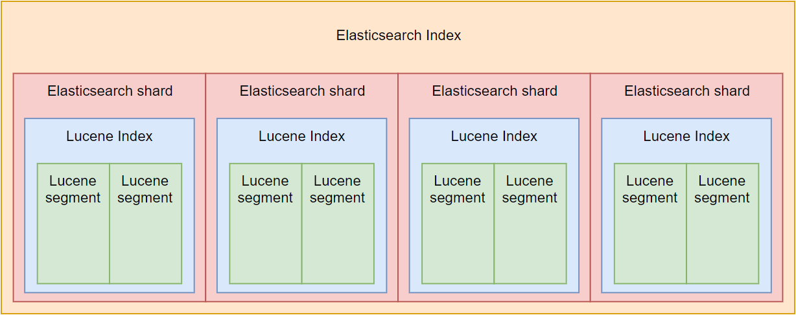

<h1 style="color:orange">Lucene Segment trong elasticsearch shard</h1>

Lucene là tên search engine của Elasticsearch. Là phần mềm mã nguồn mở của Apache. Khi sử dụng elasticsearch không cần phải tương tác với Lucene trực tiếp. Nhưng có 1 số điều cần lưu ý khi chọn cluster storage và file system.
<h1 style="color:orange">Lucene Segment</h1>

Mỗi Elasticsearch index được chia thành các shards. Mỗi shard là 1 Lucene database (Lucene index). Số lượng tối đa document có trong 1 shard là  2,147,483,519. Lucene index được chia thành các file nhỏ hơn được gọi là `segments`. 1 segment là 1 Lucene index nhỏ. Lucene tìm kiếm trong tất cả segments theo thứ tự lần lượt.

 
Lucene tạo 1 segment mỗi khi có 1 tiến trình ghi được thực hiện, khi tiến trình ghi kết thúc ---> Segment sẽ khóa (không thể thêm,sửa,xóa). Mỗi khi add thêm document vào Elasticsearch index, Lucene sẽ tạo 1 segment mới và ghi vào nó. Lucene có thể tạo thêm nhiều segment mỗi khi lượng index vào lớn.

Sau 1 thời gian, Lucene merge các segment nhỏ vào thành 1 segment lớn hơn. Động tác merge này có thể được thực hiện thủ công bằng Elasticsearch API.

Hành động này đi kèm theo 1 số bất lợi.

Càng nhiều segment, thì search càng chậm. Bởi vì Lucene phải search qua tất cả segment lần lượt, không phải song song. Có ít segment sẽ cải thiện hiệu năng.

Tuy vậy, Lucene merge phải trả giá bằng CPU và IOPs. Có nghĩa là sẽ làm giảm tốc độ indexing (hành động ghi các document vào shard). Khi thực hiện việc indexing lớn, chẳng hạn như lần index đầu tiên, khuyến nghị là disable merge hoàn toàn.

Nếu như bạn định chứa nhiều shards và segment trên cùng 1 host, khuyến nghị chon 1 filesystem xử lý tốt với nhiều file nhỏ và không giới hạn số lượng inode.
<h2 style="color:orange">Lucene xóa và update</h2>
Lucene thực hiện copy on write khi update hoặc xóa 1 document. Có nghĩa là document chưa bao giờ được xóa khỏi index. Thay vào đó, Lucene đánh dấu document là xóa và tạo 1 cái khác khi update document.

Copy on write đi kèm theo 1 bất lợi. Khi bạn update hoặc xóa documents, indices sẽ tăng dung lượng lưu trữ trừ khi xóa chúng hoàn toàn. 1 giải pháp để xóa hoàn toàn document được đánh dấu là ép Lucene merge các segments.

Trong khi merge, Lucene lấy 2 segment và chuyển vào segment mới thứ 3. Sau đó, segments cũ bị xóa khỏi disk. Có nghĩa là Lucene cần dung lượng trống đủ trên disk để tạo 1 segment mới có dung lượng chứa đủ các document của 2 segment cũ.

1 vấn đề có thể nảy sinh khi merge 1 segment lớn. Nếu kích thước shard lớn hơn 1/2 dung lượng disk, có thể không merge được hoàn toàn, trừ khi phần lớn data là document được đánh dấu xóa.