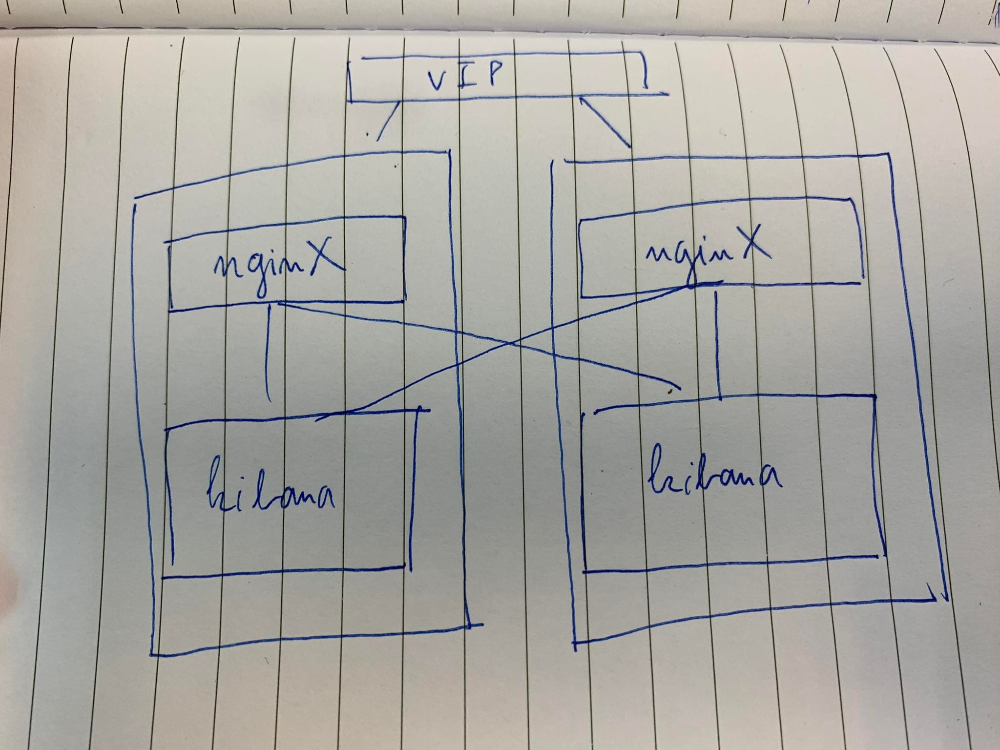

<h1 style="color:orange">Cài nginx cho 2 node kibana</h1>
Mô hình như sau: 
kibana1: 10.254.138.8:5600 
kibana2: 10.254.138.9:5600 
nginx: 10.254.138.8:5601 
nginx: 10.254.138.9:5601 

 
Đã có sẵn 2 con kibana chạy trên port 5600, để sau này cài nginx chạy trên port 5601 (port mặc định của kibana)

Link tham khảo: https://docs.nginx.com/nginx/admin-guide/security-controls/securing-http-traffic-upstream/
<h2 style="color:orange">Cài nginx</h2>

    # yum install -y nginx
Tạo file config cho nginx

    # vim /etc/nginx/conf.d/kibana.conf
paste vào

    upstream appset {
     server 10.254.138.8:5600;
     server 10.254.138.9:5600;
    }

    server {
     listen 5601 ssl;
     ssl_certificate "/u01/logtt/docker-compose/kibana/_data kibana-10254138008/kibana-10254138008.crt";
     ssl_certificate_key "/u01/logtt/docker-compose/kibana/_data/kibana-10254138008/kibana-10254138008.key";
     ssl_client_certificate "/u01/logtt/docker-compose/kibana/_data/ca/ca.crt";
  
     location / {
         proxy_pass https://appset;
     }
    }
Cấu hình nginx dành cho kibana truyền SSL/TLS.
<h2 style="color:orange">Mở firewall</h2>
Mở firewall trên 2 server 10.254.138.8 và 10.254.138.9

    # firewall-cmd --permanent --add-port={5600,5601}
<h2 style="color:orange">Cấu hình chặn ip trên nginx</h2>

    # vim /etc/nginx/conf.d/iptables.conf
paste vào cấu hình mẫu

    #allow IP
    allow 10.30.0.0/16;
    allow 10.40.0.0/16;
    allow 10.58.0.0/16;
    ...
    allow 10.0.0.0/8;
    allow 172.0.0.0/8;

    #deny IP
    deny all;